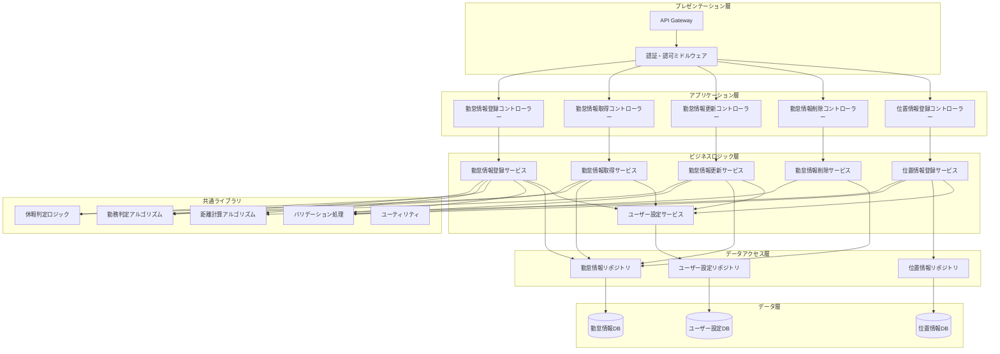
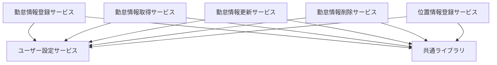
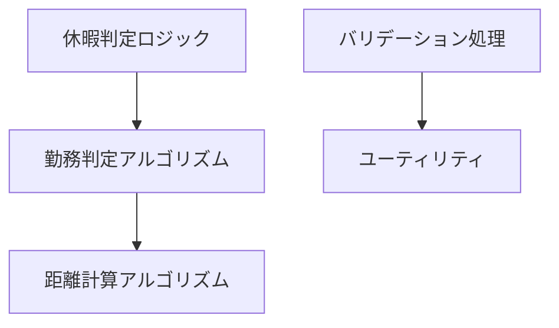
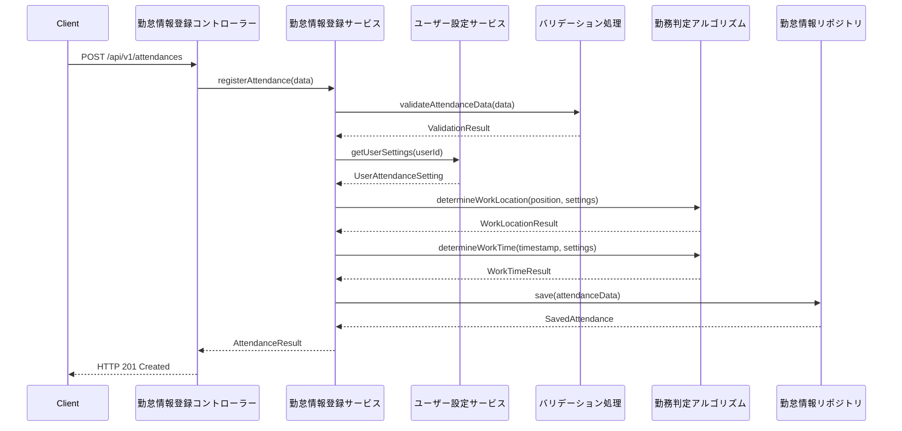
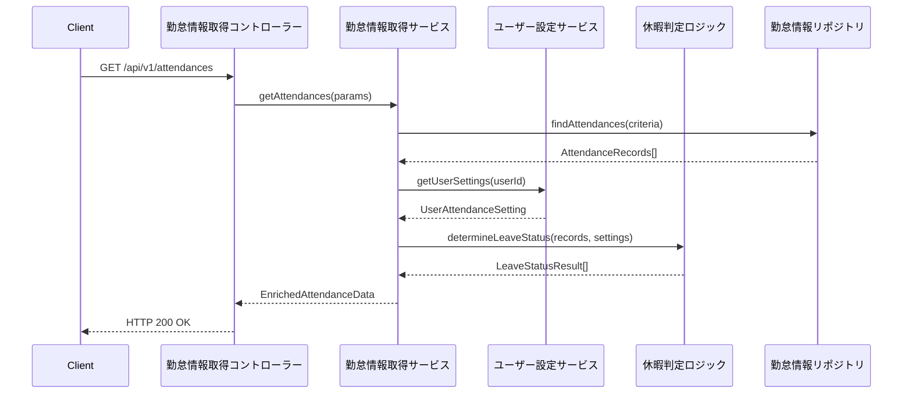

# コンポーネント分割と責務明確化設計書

## 1. 概要

本ドキュメントは、kairosプロジェクトにおける各機能コンポーネントの責務分割と、コンポーネント間の依存関係を明確化したものです。

### 1.1. 目的
- 各機能コンポーネントの責務を明確化
- コンポーネント間の依存関係の可視化
- 保守性・拡張性の向上
- コードの重複削減と再利用性の向上

## 2. アーキテクチャ概要

### 2.1. 全体アーキテクチャ

## 3. 層別責務定義

### 3.1. プレゼンテーション層

#### 3.1.1. API Gateway
**責務**:
- リクエストルーティング
- レート制限
- ロードバランシング
- APIバージョン管理

**担当範囲**:
- HTTP(S)リクエストの受信
- 適切なサービスへのルーティング
- 共通ヘッダーの処理

#### 3.1.2. 認証・認可ミドルウェア
**責務**:
- ユーザー認証
- アクセス権限チェック
- JWTトークン検証
- セキュリティログ出力

**担当範囲**:
- 認証情報の検証
- ユーザー権限の確認
- セキュリティコンテキストの設定

### 3.2. アプリケーション層（コントローラー）

#### 3.2.1. 勤怠情報登録コントローラー
**責務**:
- 勤怠情報登録APIの制御
- リクエスト/レスポンス形式の制御
- エラーハンドリング

**担当範囲**:
- HTTPリクエストパラメータの解析
- ビジネスロジック層への委譲
- HTTPレスポンスの生成
- API仕様に準拠したエラーレスポンス

**依存関係**:
- 勤怠情報登録サービス

#### 3.2.2. 勤怠情報取得コントローラー
**責務**:
- 勤怠情報取得APIの制御
- クエリパラメータの解析
- ページネーション制御

**担当範囲**:
- 検索条件の解析
- レスポンス形式の統一
- キャッシュヘッダーの設定

**依存関係**:
- 勤怠情報取得サービス

#### 3.2.3. 勤怠情報更新コントローラー
**責務**:
- 勤怠情報更新APIの制御
- 更新タイプ（PUT/PATCH）の処理分岐
- バージョン管理

**担当範囲**:
- 部分更新・完全更新の制御
- 楽観的ロック制御
- 更新結果の応答

**依存関係**:
- 勤怠情報更新サービス

#### 3.2.4. 勤怠情報削除コントローラー
**責務**:
- 勤怠情報削除APIの制御
- 削除パターン（物理/論理）の制御
- 削除権限チェック

**担当範囲**:
- 削除タイプの判定
- 削除確認処理
- 削除結果の応答

**依存関係**:
- 勤怠情報削除サービス

#### 3.2.5. 位置情報登録コントローラー
**責務**:
- 位置情報登録APIの制御
- 位置情報の精度チェック
- プライバシー制御

**担当範囲**:
- 位置情報の受信
- 精度・プライバシーレベルの確認
- 登録結果の応答

**依存関係**:
- 位置情報登録サービス

### 3.3. ビジネスロジック層（サービス）

#### 3.3.1. 勤怠情報登録サービス
**責務**:
- 勤怠情報登録のビジネスロジック
- 自動勤怠情報生成
- 重複チェック

**担当範囲**:
- 手動/自動登録の処理分岐
- 勤務地・勤務時間の判定
- 休暇状態の自動判定
- データ整合性チェック
- 登録データの永続化

**依存関係**:
- 勤務判定アルゴリズム
- 距離計算アルゴリズム
- 休暇判定ロジック
- バリデーション処理
- 勤怠情報リポジトリ
- ユーザー設定サービス

**詳細責務**:
- 位置情報からの勤務地判定
- 時刻からの勤務時間判定
- generateOptionsに基づく自動生成
- 重複データの検出・処理
- 関連データの整合性確保

#### 3.3.2. 勤怠情報取得サービス
**責務**:
- 勤怠情報検索・取得のビジネスロジック
- データ集計・加工
- アクセス権限チェック

**担当範囲**:
- 検索条件の適用
- データの集計・グループ化
- 休暇状態の判定結果付与
- ユーザー権限に基づくデータフィルタリング

**依存関係**:
- 勤務判定アルゴリズム
- 休暇判定ロジック
- 勤怠情報リポジトリ
- ユーザー設定サービス

**詳細責務**:
- 期間指定検索
- 勤怠データの休暇判定
- 統計情報の生成
- データの権限フィルタリング

#### 3.3.3. 勤怠情報更新サービス
**責務**:
- 勤怠情報更新のビジネスロジック
- 更新権限チェック
- 関連データの整合性管理

**担当範囲**:
- 部分更新・完全更新の処理
- 更新権限の確認
- 自動再生成の実行
- 更新履歴の管理
- データ整合性の確保

**依存関係**:
- 勤務判定アルゴリズム
- バリデーション処理
- 勤怠情報リポジトリ
- ユーザー設定サービス

**詳細責務**:
- 楽観的ロック制御
- 更新可能性の判定
- 関連データの連動更新
- 変更履歴の記録

#### 3.3.4. 勤怠情報削除サービス
**責務**:
- 勤怠情報削除のビジネスロジック
- 削除権限チェック
- 関連データの削除制御

**担当範囲**:
- 物理削除・論理削除の選択
- 削除権限の確認
- 関連データの削除・無効化
- 削除監査ログの記録

**依存関係**:
- バリデーション処理
- 勤怠情報リポジトリ

**詳細責務**:
- 削除可能性の判定
- カスケード削除の制御
- 削除確認処理
- 監査ログの生成

#### 3.3.5. 位置情報登録サービス
**責務**:
- 位置情報登録のビジネスロジック
- プライバシー制御
- データ保持期間管理

**担当範囲**:
- 位置情報の精度確認
- プライバシーレベルの適用
- データ保持期間の管理
- 履歴データの整理

**依存関係**:
- 距離計算アルゴリズム
- バリデーション処理
- 位置情報リポジトリ
- ユーザー設定サービス

**詳細責務**:
- 位置情報の妥当性検証
- プライバシー設定の適用
- 古いデータの自動削除
- 位置履歴の管理

#### 3.3.6. ユーザー設定サービス
**責務**:
- ユーザー勤怠設定の管理
- 設定の妥当性チェック
- デフォルト値の提供

**担当範囲**:
- ユーザー設定の取得・更新
- 設定値の妥当性確認
- デフォルト設定の適用
- 設定変更の影響範囲分析

**依存関係**:
- バリデーション処理
- ユーザー設定リポジトリ

**詳細責務**:
- 勤務地設定の管理
- 勤務時間設定の管理
- 休日設定の管理
- 権限設定の管理

### 3.4. 共通ライブラリ

#### 3.4.1. 勤務判定アルゴリズム
**責務**:
- 位置情報からの勤務地判定
- 時刻からの勤務時間判定
- 勤務状態の総合判定

**担当範囲**:
- 勤務地との距離計算・判定
- 勤務時間帯の判定
- 勤務タイプの決定

**依存関係**:
- 距離計算アルゴリズム

#### 3.4.2. 距離計算アルゴリズム
**責務**:
- 2点間の距離計算
- 地理空間計算の実行

**担当範囲**:
- Haversine公式による距離計算
- 座標系の変換
- 精度の管理

**依存関係**:
- なし（純粋な計算処理）

#### 3.4.3. 休暇判定ロジック
**責務**:
- 勤怠データからの休暇状態判定
- 休暇タイプの分類
- 休暇理由の生成

**担当範囲**:
- 定休日の判定
- 勤務時間不足の判定
- 無断欠勤の判定
- 部分休暇の判定

**依存関係**:
- 勤務判定アルゴリズム

#### 3.4.4. バリデーション処理
**責務**:
- 入力データの妥当性チェック
- ビジネスルールの検証
- エラーメッセージの生成

**担当範囲**:
- 位置情報の妥当性チェック
- 日時の妥当性チェック
- 設定値の妥当性チェック
- データ形式の検証

**依存関係**:
- なし（純粋な検証処理）

#### 3.4.5. ユーティリティ
**責務**:
- 汎用的な処理機能
- 日時操作
- データ変換

**担当範囲**:
- 日時計算・変換
- データ形式変換
- ログ出力
- 設定値管理

**依存関係**:
- なし（純粋なユーティリティ）

### 3.5. データアクセス層（リポジトリ）

#### 3.5.1. 勤怠情報リポジトリ
**責務**:
- 勤怠情報のCRUD操作
- データの永続化
- クエリの最適化

**担当範囲**:
- 勤怠データの保存・取得
- 検索クエリの実行
- トランザクション管理
- データベース固有の処理

#### 3.5.2. 位置情報リポジトリ
**責務**:
- 位置情報のCRUD操作
- 履歴データの管理
- プライバシー制御

**担当範囲**:
- 位置データの保存・取得
- 履歴データの整理
- データ保持期間の管理

#### 3.5.3. ユーザー設定リポジトリ
**責務**:
- ユーザー設定のCRUD操作
- 設定の階層管理
- デフォルト値の管理

**担当範囲**:
- 設定データの保存・取得
- 設定の継承関係管理
- キャッシュ管理

## 4. コンポーネント間の依存関係

### 4.1. 依存関係の原則

1. **上位層から下位層への依存**: 上位層は下位層に依存できるが、下位層は上位層に依存してはならない
2. **同一層内の依存制限**: 同一層内のコンポーネント間の直接依存は最小限に抑える
3. **共通ライブラリの活用**: 複数コンポーネントで使用される処理は共通ライブラリに集約する
4. **インターフェース駆動**: 具象クラスではなくインターフェースに依存する

### 4.2. 依存関係マトリクス

| 依存元＼依存先 | コントローラー | サービス | 共通ライブラリ | リポジトリ |
|------------|------------|--------|------------|----------|
| コントローラー | ❌ | ✅ | ❌ | ❌ |
| サービス | ❌ | ⚠️ | ✅ | ✅ |
| 共通ライブラリ | ❌ | ❌ | ⚠️ | ❌ |
| リポジトリ | ❌ | ❌ | ❌ | ❌ |

凡例:
- ✅: 推奨される依存関係
- ⚠️: 制限付きで許可される依存関係
- ❌: 禁止される依存関係

### 4.3. サービス間の依存関係

### 4.4. 共通ライブラリ内の依存関係

## 5. データフロー

### 5.1. 勤怠情報登録のデータフロー

### 5.2. 勤怠情報取得のデータフロー

## 6. エラーハンドリング責務

### 6.1. 層別エラーハンドリング

#### 6.1.1. コントローラー層
**責務**:
- HTTPステータスコードの決定
- エラーレスポンス形式の統一
- ログ出力

**処理対象**:
- リクエスト形式エラー
- 認証・認可エラー
- サービス層からの例外

#### 6.1.2. サービス層
**責務**:
- ビジネスロジックエラーの検出
- ドメイン例外の生成
- エラー状況の詳細化

**処理対象**:
- ビジネスルール違反
- データ整合性エラー
- 外部サービス連携エラー

#### 6.1.3. 共通ライブラリ
**責務**:
- アルゴリズム固有のエラー検出
- 計算エラーの報告
- 妥当性検証エラー

**処理対象**:
- 計算エラー
- バリデーションエラー
- アルゴリズム実行エラー

#### 6.1.4. リポジトリ層
**責務**:
- データベースエラーの検出
- データアクセス例外の変換
- 接続エラーの処理

**処理対象**:
- SQL実行エラー
- 接続エラー
- データ制約違反

## 7. パフォーマンス考慮事項

### 7.1. 層別パフォーマンス責務

#### 7.1.1. サービス層
- ビジネスロジックの最適化
- キャッシュ戦略の実装
- バッチ処理の実装

#### 7.1.2. 共通ライブラリ
- アルゴリズムの最適化
- メモリ使用量の最小化
- 計算結果のキャッシュ

#### 7.1.3. リポジトリ層
- クエリの最適化
- インデックスの活用
- コネクションプーリング

### 7.2. 性能要件と責務の対応

| 性能要件 | 担当コンポーネント | 対策 |
|---------|-----------------|------|
| API応答時間5秒以内 | サービス層 | アルゴリズム最適化、キャッシュ活用 |
| 同時1000件位置情報処理 | 共通ライブラリ | バッチ処理、並列処理 |
| 大量データ検索高速化 | リポジトリ層 | インデックス最適化、クエリ改善 |

## 8. セキュリティ責務

### 8.1. 層別セキュリティ責務

#### 8.1.1. プレゼンテーション層
- 認証・認可の実装
- 入力値のサニタイゼーション
- HTTPS通信の強制

#### 8.1.2. サービス層
- ビジネスレベルの権限チェック
- データアクセス権限の確認
- 監査ログの出力

#### 8.1.3. データアクセス層
- SQLインジェクション対策
- データ暗号化
- アクセスログの記録

### 8.2. セキュリティ要件と責務の対応

| セキュリティ要件 | 担当コンポーネント | 実装内容 |
|---------------|-----------------|---------|
| JWT認証 | 認証ミドルウェア | トークン検証、有効期限チェック |
| データアクセス権限 | サービス層 | ユーザー権限に基づくフィルタリング |
| 位置情報プライバシー | 位置情報登録サービス | プライバシーレベルに基づく制御 |
| 監査ログ | 各サービス層 | 操作履歴の記録 |

## 9. テスト責務

### 9.1. 層別テスト責務

#### 9.1.1. コントローラー層
- API仕様テスト
- エラーレスポンステスト
- 認証・認可テスト

#### 9.1.2. サービス層
- ビジネスロジックテスト
- 統合テスト
- エラーハンドリングテスト

#### 9.1.3. 共通ライブラリ
- アルゴリズム精度テスト
- 単体テスト
- パフォーマンステスト

#### 9.1.4. リポジトリ層
- データアクセステスト
- トランザクションテスト
- データ整合性テスト

## 10. 運用監視責務

### 10.1. 監視項目と担当コンポーネント

| 監視項目 | 担当コンポーネント | 実装内容 |
|---------|-----------------|---------|
| API応答時間 | コントローラー層 | レスポンス時間の記録 |
| ビジネス処理エラー率 | サービス層 | エラー発生率の監視 |
| アルゴリズム実行時間 | 共通ライブラリ | 処理時間の測定 |
| データベース性能 | リポジトリ層 | クエリ実行時間の監視 |

### 10.2. ログ出力責務

#### 10.2.1. アクセスログ
- **担当**: コントローラー層
- **内容**: リクエスト/レスポンス情報、処理時間

#### 10.2.2. ビジネスログ
- **担当**: サービス層
- **内容**: ビジネス処理の成功/失敗、重要な判定結果

#### 10.2.3. システムログ
- **担当**: 全コンポーネント
- **内容**: エラー情報、システム状態変化

#### 10.2.4. 監査ログ
- **担当**: サービス層
- **内容**: データ変更履歴、削除操作履歴

## 11. 変更履歴

| 日付 | 変更者 | 変更内容 |
|------|--------|----------|
| 2025/06/09 | カーン | 初版作成 |
