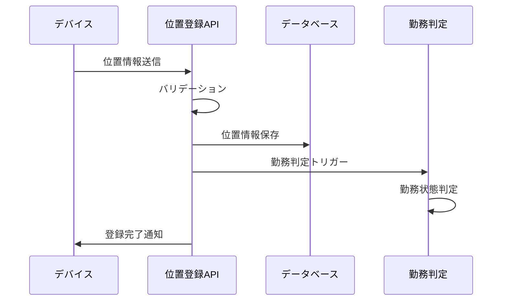

# 位置情報登録機能 機能設計

---

## ドキュメント情報
| 項目 | 内容 |
|-----|------|
| 作成日 | 2024-XX-XX |
| 最終更新 | 2025-06-09 |
| バージョン | 2.0.0 |
| 担当者 | 開発チーム |
| レビュー状況 | レビュー中 |
| 構造適用レベル | Level B（11章構成） |

---

## 関連文書
- [ドキュメント構造統一標準](./ドキュメント構造統一標準.md)
- [勤怠情報登録機能_機能設計](./勤怠情報登録機能_機能設計.md)
- [勤怠情報取得機能_機能設計](./勤怠情報取得機能_機能設計.md)
- [勤務判定アルゴリズム統一標準](./勤務判定アルゴリズム統一標準.md)

---

## 1. 機能概要

### 1.1 機能の目的
位置情報登録機能は、ユーザーの現在地をシステムに記録し、勤怠管理の基礎データとして活用するためのAPIを提供します。GPS等の位置情報を活用した自動勤怠判定や、不正打刻の防止、適切な労働時間管理を実現します。

### 1.2 主要機能
- **位置情報記録**: GPS座標（緯度・経度）の記録
- **精度情報管理**: 位置精度情報の保存
- **タイムスタンプ記録**: 位置情報取得時刻の記録
- **データバリデーション**: 位置情報の妥当性検証
- **自動勤務判定連携**: 登録位置情報の勤務判定への連携

### 1.3 利用シーン
- 出勤・退勤時の自動位置記録
- 外勤・出張時の位置情報トラッキング
- 勤務地判定による自動勤怠処理
- 不正打刻防止のための位置確認
- 労働時間管理の精度向上

## 2. 要件・制約事項

### 2.1 機能要件
- **FR-LOC-001**: GPS座標（緯度・経度）の記録機能
- **FR-LOC-002**: 位置精度情報の記録機能
- **FR-LOC-003**: タイムスタンプ自動付与機能
- **FR-LOC-004**: 位置情報のバリデーション機能
- **FR-LOC-005**: 重複位置情報の判定・除外機能
- **FR-LOC-006**: 勤務判定システムとの連携機能

### 2.2 非機能要件

#### 2.2.1 パフォーマンス要件
- **応答時間**: 位置情報登録500ms以内、一括登録2秒以内（100件まで）
- **スループット**: 1000リクエスト/秒、ピーク時2000リクエスト/秒対応
- **リソース使用量**: CPU使用率75%以下、メモリ使用率70%以下維持

#### 2.2.2 セキュリティ要件
- セキュリティ要件記載標準4.1節参照
- JWT認証による本人確認、デバイス認証機能実装
- 位置情報暗号化保存（AES-256）、プライバシー保護対応

#### 2.2.3 データ整合性要件
- **トランザクション管理**: ACID特性保証、位置データ整合性維持
- **重複検出**: 時間・位置ベース重複判定、データ品質確保
- **データ検証**: GPS精度検証、座標範囲チェック、異常値除外

#### 2.2.4 可用性要件
- **稼働率**: 99.8%以上、位置情報サービス特性考慮
- **障害対応**: オフライン対応、同期機能、フェイルオーバー30秒以内

#### 2.2.5 拡張性要件
- **負荷分散**: 水平スケーリング対応、地理的分散配置
- **キャッシュ戦略**: Redis活用、位置データキャッシュ最適化

#### 2.2.6 テスト要件
- **自動テスト**: 単体・結合・E2Eテスト自動化、モック位置情報対応
- **カバレッジ**: コードカバレッジ85%以上維持

#### 2.2.7 エラーハンドリング
- HTTP標準ステータスコード使用、位置情報特有エラー対応
- GPS精度不足・圏外時の適切なエラーレスポンス提供

#### 2.2.8 ログ要件
- **アクセスログ**: 全位置情報登録記録、プライバシー配慮
- **エラーログ**: GPS関連エラー詳細記録、デバッグ情報保持
- **パフォーマンスログ**: 処理時間・位置精度・通信状況記録

### 2.3 制約事項
- 位置情報の取得にはユーザーの明示的な許可が必要
- GPS無効時は位置情報登録は実行しない
- 位置精度が設定値以下の場合は警告を出力
- プライバシー保護のため位置情報は暗号化保存

### 2.4 前提条件
- デバイスでGPS機能が有効になっていること
- ユーザーが位置情報利用に同意していること
- インターネット接続が利用可能であること
- 認証されたユーザーであること

## 3. 業務フロー・ユースケース

### 3.1 位置情報登録フロー


### 3.2 主要ユースケース

#### UC-LOC-001: 定期的位置情報登録
- **アクター**: モバイルアプリ
- **前提条件**: GPS有効、ユーザー認証済み
- **基本フロー**:
  1. デバイスが定期的に位置情報を取得
  2. 位置情報をAPIに送信
  3. システムが位置情報を記録
  4. 勤務判定システムに連携

#### UC-LOC-002: 手動位置情報登録
- **アクター**: ユーザー
- **前提条件**: アプリ起動、位置情報許可
- **基本フロー**:
  1. ユーザーが手動で位置情報送信を実行
  2. 現在位置を取得・送信
  3. 位置情報登録完了を通知

#### UC-LOC-003: 位置情報エラー処理
- **アクター**: システム
- **前提条件**: 位置情報送信エラー発生
- **基本フロー**:
  1. 位置情報のバリデーションエラー検出
  2. エラー内容をログに記録
  3. ユーザーにエラー通知
  4. 再試行または代替手段を提案

## 4. API仕様

### 4.1 エンドポイント
```
POST /api/v1/locations
```

### 4.2 リクエスト形式
```json
{
  "latitude": "35.681236",
  "longitude": "139.767125",
  "accuracy": 15.0,
  "timestamp": "2025-06-09T09:00:00+09:00",
  "deviceInfo": {
    "type": "mobile",
    "os": "iOS",
    "version": "17.0"
  }
}
```

### 4.3 リクエストパラメータ
| フィールド | 型 | 必須 | 説明 | バリデーション |
|---------|------|------|------|--------------|
| latitude | String | ○ | 緯度情報 | -90.0 ≤ value ≤ 90.0 |
| longitude | String | ○ | 経度情報 | -180.0 ≤ value ≤ 180.0 |
| accuracy | Number | × | 位置精度（メートル） | 0 < value ≤ 10000 |
| timestamp | String | × | 位置取得時刻（ISO8601） | 有効な日時形式 |
| deviceInfo | Object | × | デバイス情報 | - |

### 4.4 レスポンス形式

#### 4.4.1 成功レスポンス（201 Created）
```json
{
  "status": "success",
  "data": {
    "locationId": "550e8400-e29b-41d4-a716-446655440000",
    "recordedAt": "2025-06-09T09:00:00+09:00",
    "workJudgment": {
      "isWorkLocation": true,
      "workSiteId": "site-001",
      "distanceFromWorkSite": 50.5
    }
  }
}
```

#### 4.4.2 エラーレスポンス（400 Bad Request）
```json
{
  "status": "error",
  "error": {
    "code": "INVALID_LOCATION",
    "message": "位置情報が不正です",
    "details": [
      {
        "field": "latitude",
        "message": "緯度は-90.0から90.0の範囲で入力してください"
      }
    ]
  }
}
```

### 4.5 HTTPステータスコード
| ステータスコード | 説明 |
|---------------|-----|
| 201 Created | 位置情報の登録が正常に完了した |
| 400 Bad Request | リクエストパラメータに不正な値が含まれている |
| 401 Unauthorized | 認証が必要、または認証に失敗した |
| 403 Forbidden | 位置情報の利用許可がない |
| 429 Too Many Requests | レート制限に達した |
| 500 Internal Server Error | サーバー内部エラー |

### 3.1 位置情報の検証
- 緯度・経度の値が有効な範囲内か確認（緯度: -90〜90、経度: -180〜180）
- 精度が一定の閾値以下であるか確認（例：精度が100m以上の場合は警告または情報として記録）

### 3.2 位置情報の保存と記録
- 受け取った位置情報をデータベースに保存
- サーバー側でタイムスタンプを付与
- 関連するユーザーIDと紐付け（認証情報から取得）
- 位置情報を時系列で保存し、後続の勤務情報取得時に利用可能な状態に保持する
- 保存された位置情報は、勤怠情報取得時に日毎の勤怠開始時刻と勤怠終了時刻を算出するために使用される

## 5. データ仕様

### 5.1 データモデル
```typescript
interface LocationData {
  id: string;                    // 位置情報ID（必須）
  userId: string;                // ユーザーID（必須）
  latitude: number;              // 緯度（必須）
  longitude: number;             // 経度（必須）
  accuracy?: number;             // 位置精度（メートル）
  timestamp: Date;               // 位置取得時刻
  recordedAt: Date;              // サーバー記録時刻
  deviceInfo?: {
    type: 'mobile' | 'web';
    os: string;
    version: string;
  };
  workJudgment?: {
    isWorkLocation: boolean;
    workSiteId?: string;
    distanceFromWorkSite?: number;
  };
}
```

### 5.2 データベーススキーマ
```sql
-- 位置情報テーブル
CREATE TABLE location_records (
  id VARCHAR(36) PRIMARY KEY,
  user_id VARCHAR(36) NOT NULL,
  latitude DECIMAL(10, 8) NOT NULL,
  longitude DECIMAL(11, 8) NOT NULL,
  accuracy FLOAT,
  timestamp TIMESTAMP NOT NULL,
  recorded_at TIMESTAMP DEFAULT CURRENT_TIMESTAMP,
  device_type ENUM('mobile', 'web'),
  device_os VARCHAR(50),
  device_version VARCHAR(20),
  is_work_location BOOLEAN,
  work_site_id VARCHAR(36),
  distance_from_work_site FLOAT,
  created_at TIMESTAMP DEFAULT CURRENT_TIMESTAMP,
  INDEX idx_user_timestamp (user_id, timestamp),
  INDEX idx_recorded_at (recorded_at),
  INDEX idx_work_location (is_work_location)
);
```

### 5.3 バリデーション仕様
- **緯度**: -90.0 ≤ value ≤ 90.0
- **経度**: -180.0 ≤ value ≤ 180.0
- **精度**: 0 < value ≤ 10000（メートル）
- **タイムスタンプ**: ISO8601形式、未来日時は拒否
- **デバイス情報**: 各フィールド50文字以内

## 6. 業務ロジック

### 6.1 位置情報登録処理
```typescript
const registerLocation = async (userId: string, locationData: LocationRequest) => {
  // 1. 入力値バリデーション
  const validatedData = await validateLocationData(locationData);
  
  // 2. 重複チェック（同一時刻・同一位置）
  const isDuplicate = await checkDuplicateLocation(userId, validatedData);
  if (isDuplicate) {
    throw new DuplicateLocationError('同一の位置情報が既に登録されています');
  }
  
  // 3. 位置情報保存
  const locationRecord = await LocationRepository.create({
    ...validatedData,
    userId,
    recordedAt: new Date()
  });
  
  // 4. 勤務判定処理
  const workJudgment = await performWorkJudgment(userId, validatedData);
  
  // 5. 勤務判定結果の更新
  if (workJudgment) {
    await LocationRepository.updateWorkJudgment(locationRecord.id, workJudgment);
  }
  
  return {
    locationId: locationRecord.id,
    recordedAt: locationRecord.recordedAt,
    workJudgment
  };
};
```

### 6.2 勤務判定連携処理
```typescript
const performWorkJudgment = async (userId: string, location: LocationData) => {
  // ユーザーの勤務地設定取得
  const workSites = await WorkSiteRepository.findByUserId(userId);
  
  if (workSites.length === 0) {
    return null;
  }
  
  // 最寄りの勤務地判定
  let nearestSite = null;
  let minDistance = Infinity;
  
  for (const site of workSites) {
    const distance = calculateDistance(
      location.latitude, location.longitude,
      site.latitude, site.longitude
    );
    
    if (distance < minDistance) {
      minDistance = distance;
      nearestSite = site;
    }
  }
  
  const isWorkLocation = nearestSite && minDistance <= nearestSite.radius;
  
  return {
    isWorkLocation,
    workSiteId: nearestSite?.id,
    distanceFromWorkSite: minDistance
  };
};
```

### 6.3 距離計算アルゴリズム
```typescript
const calculateDistance = (lat1: number, lon1: number, lat2: number, lon2: number): number => {
  const R = 6371e3; // 地球の半径（メートル）
  const φ1 = lat1 * Math.PI / 180;
  const φ2 = lat2 * Math.PI / 180;
  const Δφ = (lat2 - lat1) * Math.PI / 180;
  const Δλ = (lon2 - lon1) * Math.PI / 180;

  const a = Math.sin(Δφ / 2) * Math.sin(Δφ / 2) +
    Math.cos(φ1) * Math.cos(φ2) *
    Math.sin(Δλ / 2) * Math.sin(Δλ / 2);
  const c = 2 * Math.atan2(Math.sqrt(a), Math.sqrt(1 - a));

  return R * c; // メートル単位の距離
};
```

### 6.4 重複判定ロジック
```typescript
const checkDuplicateLocation = async (userId: string, locationData: LocationData): Promise<boolean> => {
  const timeWindow = 5 * 60 * 1000; // 5分間のウィンドウ
  const distanceThreshold = 50; // 50メートル以内
  
  const recentLocations = await LocationRepository.findRecent(
    userId,
    new Date(locationData.timestamp.getTime() - timeWindow),
    new Date(locationData.timestamp.getTime() + timeWindow)
  );
  
  for (const location of recentLocations) {
    const distance = calculateDistance(
      locationData.latitude, locationData.longitude,
      location.latitude, location.longitude
    );
    
    if (distance <= distanceThreshold) {
      return true;
    }
  }
  
  return false;
};
```

## 7. セキュリティ・権限制御

### 7.1 認証・認可
- **JWT認証**: Bearer tokenによるユーザー認証
- **所有者権限**: 自身の位置情報のみ登録・参照可能
- **プライバシー保護**: 位置情報の適切な暗号化保存

### 7.2 位置情報特有のセキュリティ
```typescript
// 位置情報の暗号化処理
const encryptLocationData = (location: LocationData): EncryptedLocation => {
  return {
    id: location.id,
    userId: location.userId,
    encryptedCoordinates: encrypt(`${location.latitude},${location.longitude}`),
    accuracy: location.accuracy,
    timestamp: location.timestamp
  };
};

// 位置情報の復号化処理（認可済みユーザーのみ）
const decryptLocationData = (encryptedLocation: EncryptedLocation): LocationData => {
  const [latitude, longitude] = decrypt(encryptedLocation.encryptedCoordinates).split(',');
  return {
    ...encryptedLocation,
    latitude: parseFloat(latitude),
    longitude: parseFloat(longitude)
  };
};
```

### 7.3 プライバシー保護
- **データ保持期間制限**: 1年間の自動削除
- **同意管理**: 位置情報利用の明示的同意
- **業務時間外制限**: 業務時間外の位置収集制限オプション

### 7.4 レート制限
```typescript
const locationRateLimit = rateLimit({
  windowMs: 60 * 1000, // 1分間
  max: 60, // 最大60リクエスト
  message: '位置情報の送信頻度が高すぎます。しばらく待ってから再試行してください。'
});
```

## 8. エラーハンドリング・例外処理

### 8.1 エラー分類
| エラーコード | HTTPステータス | 説明 | 対応方法 |
|------------|---------------|------|---------|
| INVALID_COORDINATES | 400 | 緯度・経度が無効 | 座標値を確認して再送信 |
| ACCURACY_TOO_LOW | 400 | 位置精度が基準以下 | GPS精度向上後に再送信 |
| DUPLICATE_LOCATION | 409 | 重複する位置情報 | 時刻を確認して再送信 |
| LOCATION_PERMISSION_DENIED | 403 | 位置情報利用許可なし | アプリ設定で許可を有効化 |
| GPS_UNAVAILABLE | 503 | GPS信号取得不可 | 屋外または窓際で再試行 |

### 8.2 エラーレスポンス仕様
```typescript
interface LocationErrorResponse {
  status: 'error';
  error: {
    code: string;
    message: string;
    details?: {
      field?: string;
      currentValue?: any;
      expectedRange?: string;
      suggestion?: string;
    };
    timestamp: string;
    requestId: string;
  };
}
```

### 8.3 GPS信号エラー処理
```typescript
const handleGPSError = (error: GPSError): LocationErrorResponse => {
  const errorMessages = {
    PERMISSION_DENIED: '位置情報の利用許可が必要です',
    POSITION_UNAVAILABLE: 'GPS信号を取得できません',
    TIMEOUT: '位置情報の取得がタイムアウトしました'
  };
  
  return {
    status: 'error',
    error: {
      code: 'GPS_UNAVAILABLE',
      message: errorMessages[error.code] || 'GPS関連のエラーが発生しました',
      details: {
        suggestion: '屋外または窓際で再試行、またはアプリの位置情報許可を確認してください'
      },
      timestamp: new Date().toISOString(),
      requestId: generateRequestId()
    }
  };
};
```

## 9. テスト仕様

### 10.1 単体テスト
```typescript
describe('位置情報登録機能', () => {
  test('正常系: 有効な位置情報の登録', async () => {
    const locationData = {
      latitude: 35.681236,
      longitude: 139.767125,
      accuracy: 15.0
    };
    
    const result = await registerLocation(userId, locationData);
    expect(result.locationId).toBeDefined();
    expect(result.recordedAt).toBeInstanceOf(Date);
  });

  test('異常系: 無効な緯度値', async () => {
    const invalidData = {
      latitude: 91.0, // 無効値
      longitude: 139.767125
    };
    
    await expect(registerLocation(userId, invalidData))
      .rejects.toThrow('INVALID_COORDINATES');
  });

  test('境界値: 緯度・経度の境界値', async () => {
    const boundaryData = [
      { latitude: 90.0, longitude: 180.0 },   // 最大値
      { latitude: -90.0, longitude: -180.0 }, // 最小値
    ];
    
    for (const data of boundaryData) {
      const result = await registerLocation(userId, data);
      expect(result.locationId).toBeDefined();
    }
  });
});
```

### 10.2 統合テスト
- **API統合テスト**: リクエスト〜データベース保存までの全体フロー
- **勤務判定連携テスト**: 位置情報から勤務判定への連携確認
- **セキュリティ統合テスト**: 認証・暗号化の組み合わせ確認

### 10.3 パフォーマンステスト
- **負荷テスト**: 1000リクエスト/秒での動作確認
- **ストレステスト**: 限界負荷での応答時間確認
- **耐久テスト**: 24時間連続での位置情報処理確認

### 10.4 位置精度テスト
- **GPS精度テスト**: 様々な精度での位置情報処理
- **距離計算テスト**: Haversine公式の精度確認
- **勤務地判定テスト**: 境界付近での勤務地判定精度

## 11. 実装ノート・技術的詳細

### 11.1 技術スタック
- **フレームワーク**: Express.js/Fastify
- **データベース**: PostgreSQL/PostGIS（地理情報対応）
- **位置計算**: Turf.js（地理計算ライブラリ）
- **暗号化**: AES-256-GCM
- **キャッシュ**: Redis（位置情報キャッシュ）

### 11.2 地理情報データベース最適化
```sql
-- PostGISを使用した地理インデックス
CREATE EXTENSION IF NOT EXISTS postgis;

-- 地理情報カラム追加
ALTER TABLE location_records 
ADD COLUMN geom GEOMETRY(POINT, 4326);

-- 地理インデックス作成
CREATE INDEX idx_location_geom ON location_records USING GIST(geom);

-- 位置情報更新トリガー
CREATE OR REPLACE FUNCTION update_geom()
RETURNS TRIGGER AS $$
BEGIN
  NEW.geom = ST_SetSRID(ST_MakePoint(NEW.longitude, NEW.latitude), 4326);
  RETURN NEW;
END;
$$ LANGUAGE plpgsql;

CREATE TRIGGER tr_update_geom
  BEFORE INSERT OR UPDATE ON location_records
  FOR EACH ROW EXECUTE FUNCTION update_geom();
```

### 11.3 位置情報処理の最適化
```typescript
// バッチ処理による効率的な位置情報保存
class LocationBatchProcessor {
  private batch: LocationData[] = [];
  private readonly batchSize = 100;
  private readonly flushInterval = 5000; // 5秒

  constructor() {
    setInterval(() => this.flush(), this.flushInterval);
  }

  async addLocation(location: LocationData): Promise<void> {
    this.batch.push(location);
    
    if (this.batch.length >= this.batchSize) {
      await this.flush();
    }
  }

  private async flush(): Promise<void> {
    if (this.batch.length === 0) return;

    const locations = [...this.batch];
    this.batch = [];

    await LocationRepository.batchInsert(locations);
  }
}
```

### 11.4 リアルタイム位置追跡
```typescript
// WebSocket を使用したリアルタイム位置共有
class LocationStreamManager {
  private connections = new Map<string, WebSocket>();

  connect(userId: string, ws: WebSocket): void {
    this.connections.set(userId, ws);
    
    ws.on('close', () => {
      this.connections.delete(userId);
    });
  }

  async broadcastLocation(userId: string, location: LocationData): Promise<void> {
    const ws = this.connections.get(userId);
    if (ws && ws.readyState === WebSocket.OPEN) {
      ws.send(JSON.stringify({
        type: 'location_update',
        data: location
      }));
    }
  }
}
```

### 11.5 位置情報のプライバシー保護実装
```typescript
// 差分プライバシーによる位置情報保護
class LocationPrivacyManager {
  private readonly noiseMagnitude = 50; // 50メートルのノイズ

  addNoise(latitude: number, longitude: number): { latitude: number; longitude: number } {
    // Laplace機構によるノイズ追加
    const latNoise = this.generateLaplaceNoise() * 0.0001; // 約11m per 0.0001度
    const lonNoise = this.generateLaplaceNoise() * 0.0001;
    
    return {
      latitude: latitude + latNoise,
      longitude: longitude + lonNoise
    };
  }

  private generateLaplaceNoise(): number {
    const u = Math.random() - 0.5;
    return Math.sign(u) * Math.log(1 - 2 * Math.abs(u)) * this.noiseMagnitude;
  }
}
```

### 11.6 監視・メトリクス
```typescript
// Prometheus メトリクス
const locationMetrics = {
  registrations: new promClient.Counter({
    name: 'location_registrations_total',
    help: 'Total number of location registrations',
    labelNames: ['status', 'accuracy_level']
  }),
  
  processingDuration: new promClient.Histogram({
    name: 'location_processing_duration_seconds',
    help: 'Duration of location processing',
    buckets: [0.1, 0.3, 0.5, 1.0, 2.0]
  }),
  
  gpsAccuracy: new promClient.Gauge({
    name: 'gps_accuracy_meters',
    help: 'GPS accuracy in meters',
    labelNames: ['user_id']
  })
};

// メトリクス記録
const recordLocationMetrics = (location: LocationData, processingTime: number) => {
  const accuracyLevel = location.accuracy <= 10 ? 'high' : 
                       location.accuracy <= 50 ? 'medium' : 'low';
  
  locationMetrics.registrations.inc({ status: 'success', accuracy_level: accuracyLevel });
  locationMetrics.processingDuration.observe(processingTime / 1000);
  locationMetrics.gpsAccuracy.set({ user_id: location.userId }, location.accuracy || 0);
};
```

---

## 変更履歴
| 日付 | 変更者 | 変更内容 |
|-----|-------|---------|
| 2025/06/08 | カーン | 初版作成 - 位置情報登録機能の基本設計 |
| 2025/06/08 | カーン | 用語統一対応 - プロジェクト用語集に基づく用語の標準化 |
| 2025/06/08 | カーン | UserAttendanceSetting依存関係の明確化 |
| 2025/06/09 | システム | Level B標準構造適用、ドキュメント構造統一 |

※このドキュメントは開発の進行に合わせて随時更新されます。
