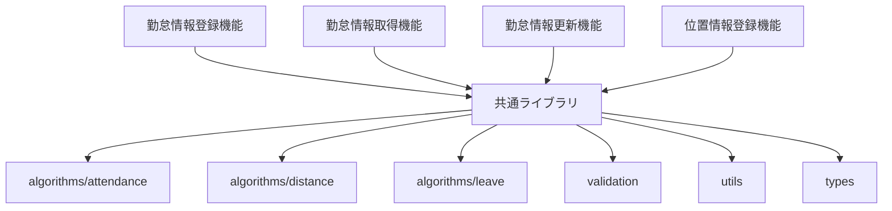

# 共通ライブラリ設計書

## 1. 概要

本ドキュメントは、kairosプロジェクトで複数の機能により共有される共通ライブラリの設計を定義します。

### 1.1. 目的
- 複数機能で使用されるロジックの共通化
- コンポーネント間の責務分離と依存関係の明確化
- 保守性・再利用性の向上

### 1.2. スコープ
以下の共通機能を対象とします：
- 勤務判定アルゴリズム
- 休暇自動判定ロジック
- 距離計算アルゴリズム
- バリデーション共通処理
- 共通ユーティリティ

## 2. アーキテクチャ

### 2.1. ライブラリ構成

```
kairos-common-lib/
├── algorithms/           # アルゴリズム関連
│   ├── attendance/      # 勤務判定アルゴリズム
│   ├── distance/        # 距離計算アルゴリズム
│   └── leave/          # 休暇判定アルゴリズム
├── validation/          # バリデーション処理
├── utils/              # ユーティリティ
└── types/              # 共通型定義
```

### 2.2. 依存関係図



## 3. 共通アルゴリズム詳細

### 3.1. 距離計算アルゴリズム

#### 3.1.1. Haversine公式実装

```typescript
/**
 * 2点間の距離を計算（Haversine公式）
 * @param lat1 地点1の緯度
 * @param lon1 地点1の経度
 * @param lat2 地点2の緯度
 * @param lon2 地点2の経度
 * @returns 距離（メートル）
 */
export function calculateDistance(
  lat1: number,
  lon1: number,
  lat2: number,
  lon2: number
): number {
  const R = 6371000; // 地球の半径（メートル）
  const dLat = toRadians(lat2 - lat1);
  const dLon = toRadians(lon2 - lon1);
  
  const a = Math.sin(dLat / 2) * Math.sin(dLat / 2) +
    Math.cos(toRadians(lat1)) * Math.cos(toRadians(lat2)) *
    Math.sin(dLon / 2) * Math.sin(dLon / 2);
  
  const c = 2 * Math.atan2(Math.sqrt(a), Math.sqrt(1 - a));
  return R * c;
}

function toRadians(degrees: number): number {
  return degrees * (Math.PI / 180);
}
```

#### 3.1.2. 使用方法

```typescript
import { calculateDistance } from '@kairos/common/algorithms/distance';

const distance = calculateDistance(35.6762, 139.6503, 35.6897, 139.6922);
console.log(`距離: ${distance}m`);
```

### 3.2. 勤務判定アルゴリズム

#### 3.2.1. 勤務地判定

```typescript
import { UserAttendanceSetting } from '@kairos/common/types';
import { calculateDistance } from './distance';

/**
 * 位置情報から勤務地を判定
 * @param userPosition ユーザーの位置情報
 * @param userSettings ユーザーの勤怠設定
 * @returns 勤務地判定結果
 */
export function determineWorkLocation(
  userPosition: { latitude: number; longitude: number },
  userSettings: UserAttendanceSetting
): { 
  isAtWorkplace: boolean; 
  workplaceId?: string;
  distance?: number;
} {
  const { allowedWorkplaces } = userSettings;
  
  for (const workplace of allowedWorkplaces) {
    const distance = calculateDistance(
      userPosition.latitude,
      userPosition.longitude,
      workplace.latitude,
      workplace.longitude
    );
    
    if (distance <= workplace.allowedRadius) {
      return {
        isAtWorkplace: true,
        workplaceId: workplace.id,
        distance
      };
    }
  }
  
  return { isAtWorkplace: false };
}
```

#### 3.2.2. 勤務時間判定

```typescript
/**
 * 時刻から勤務時間を判定
 * @param currentTime 現在時刻
 * @param userSettings ユーザーの勤怠設定
 * @returns 勤務時間判定結果
 */
export function determineWorkTime(
  currentTime: Date,
  userSettings: UserAttendanceSetting
): {
  isWorkingHours: boolean;
  attendanceType: 'attendance' | 'leave' | 'break_start' | 'break_end';
} {
  const { workingHours } = userSettings;
  const currentHour = currentTime.getHours();
  const currentMinute = currentTime.getMinutes();
  const currentTimeMinutes = currentHour * 60 + currentMinute;
  
  const startTimeMinutes = timeToMinutes(workingHours.startTime);
  const endTimeMinutes = timeToMinutes(workingHours.endTime);
  
  const isWorkingHours = currentTimeMinutes >= startTimeMinutes && 
                        currentTimeMinutes <= endTimeMinutes;
  
  // 勤務開始時間付近（30分以内）
  if (Math.abs(currentTimeMinutes - startTimeMinutes) <= 30) {
    return { isWorkingHours, attendanceType: 'attendance' };
  }
  
  // 勤務終了時間付近（30分以内）
  if (Math.abs(currentTimeMinutes - endTimeMinutes) <= 30) {
    return { isWorkingHours, attendanceType: 'leave' };
  }
  
  // その他の時間帯（休憩判定）
  return { 
    isWorkingHours, 
    attendanceType: isWorkingHours ? 'break_start' : 'leave'
  };
}

function timeToMinutes(time: string): number {
  const [hours, minutes] = time.split(':').map(Number);
  return hours * 60 + minutes;
}
```

### 3.3. 休暇自動判定ロジック

#### 3.3.1. 休暇判定実装

```typescript
/**
 * 勤怠データから休暇を判定
 * @param attendanceData 勤怠データ
 * @param userSettings ユーザー設定
 * @returns 休暇判定結果
 */
export function determineLeaveStatus(
  attendanceData: AttendanceRecord[],
  userSettings: UserAttendanceSetting
): LeaveStatusResult {
  const { workingDays, requiredWorkingHours } = userSettings;
  
  // 勤務日かどうかの判定
  const today = new Date();
  const isWorkingDay = isWorkDay(today, workingDays);
  
  if (!isWorkingDay) {
    return {
      isLeave: true,
      leaveType: 'scheduled_holiday',
      reason: '定休日'
    };
  }
  
  // 勤怠記録の確認
  const todayAttendance = attendanceData.filter(record => 
    isSameDay(new Date(record.timestamp), today)
  );
  
  // 勤怠記録がない場合
  if (todayAttendance.length === 0) {
    return {
      isLeave: true,
      leaveType: 'absence',
      reason: '勤怠記録なし'
    };
  }
  
  // 勤務時間の計算
  const workedHours = calculateWorkedHours(todayAttendance);
  
  // 所定労働時間に満たない場合
  if (workedHours < requiredWorkingHours) {
    return {
      isLeave: true,
      leaveType: 'partial_leave',
      reason: `勤務時間不足（${workedHours}h < ${requiredWorkingHours}h）`
    };
  }
  
  return {
    isLeave: false,
    leaveType: null,
    reason: '通常勤務'
  };
}
```

## 4. バリデーション共通処理

### 4.1. 位置情報バリデーション

```typescript
export interface LocationValidationOptions {
  latitudeRange?: { min: number; max: number };
  longitudeRange?: { min: number; max: number };
  accuracyThreshold?: number;
}

export function validateLocation(
  latitude: number,
  longitude: number,
  accuracy?: number,
  options: LocationValidationOptions = {}
): ValidationResult {
  const errors: string[] = [];
  
  // 緯度の範囲チェック
  const { latitudeRange = { min: -90, max: 90 } } = options;
  if (latitude < latitudeRange.min || latitude > latitudeRange.max) {
    errors.push(`緯度は${latitudeRange.min}から${latitudeRange.max}の範囲で入力してください`);
  }
  
  // 経度の範囲チェック
  const { longitudeRange = { min: -180, max: 180 } } = options;
  if (longitude < longitudeRange.min || longitude > longitudeRange.max) {
    errors.push(`経度は${longitudeRange.min}から${longitudeRange.max}の範囲で入力してください`);
  }
  
  // 精度チェック
  if (accuracy !== undefined && options.accuracyThreshold) {
    if (accuracy > options.accuracyThreshold) {
      errors.push(`位置情報の精度が不十分です（${accuracy}m > ${options.accuracyThreshold}m）`);
    }
  }
  
  return {
    isValid: errors.length === 0,
    errors
  };
}
```

### 4.2. 日時バリデーション

```typescript
export function validateTimestamp(
  timestamp: string,
  options: {
    allowFuture?: boolean;
    maxPastDays?: number;
  } = {}
): ValidationResult {
  const errors: string[] = [];
  const { allowFuture = false, maxPastDays = 30 } = options;
  
  const date = new Date(timestamp);
  const now = new Date();
  
  // 無効な日時
  if (isNaN(date.getTime())) {
    errors.push('無効な日時形式です');
    return { isValid: false, errors };
  }
  
  // 未来の日時チェック
  if (!allowFuture && date > now) {
    errors.push('未来の日時は指定できません');
  }
  
  // 過去の制限チェック
  const maxPastDate = new Date(now.getTime() - maxPastDays * 24 * 60 * 60 * 1000);
  if (date < maxPastDate) {
    errors.push(`${maxPastDays}日より過去の日時は指定できません`);
  }
  
  return {
    isValid: errors.length === 0,
    errors
  };
}
```

## 5. 共通型定義

### 5.1. 基本型

```typescript
export interface ValidationResult {
  isValid: boolean;
  errors: string[];
}

export interface Location {
  latitude: number;
  longitude: number;
  accuracy?: number;
}

export interface AttendanceRecord {
  id: string;
  userId: string;
  timestamp: string;
  attendanceType: 'attendance' | 'leave' | 'break_start' | 'break_end';
  location?: Location;
}

export interface LeaveStatusResult {
  isLeave: boolean;
  leaveType: 'scheduled_holiday' | 'absence' | 'partial_leave' | null;
  reason: string;
}

export interface UserAttendanceSetting {
  userId: string;
  allowedWorkplaces: Workplace[];
  workingHours: {
    startTime: string;
    endTime: string;
  };
  workingDays: number[]; // 0=日曜, 1=月曜, ...
  requiredWorkingHours: number;
}

export interface Workplace {
  id: string;
  name: string;
  latitude: number;
  longitude: number;
  allowedRadius: number;
}
```

## 6. 使用機能との責務分離

### 6.1. 勤怠情報登録機能での使用

**責務分離**:
- **登録機能**: API処理、データ永続化、ビジネスルール適用
- **共通ライブラリ**: アルゴリズム処理、バリデーション、計算処理

**使用例**:
```typescript
import { 
  determineWorkLocation, 
  determineWorkTime,
  validateLocation 
} from '@kairos/common';

// 位置情報バリデーション
const locationValidation = validateLocation(latitude, longitude, accuracy);
if (!locationValidation.isValid) {
  throw new ValidationError(locationValidation.errors);
}

// 勤務地判定
const workLocationResult = determineWorkLocation(
  { latitude, longitude },
  userSettings
);

// 勤務時間判定
const workTimeResult = determineWorkTime(new Date(), userSettings);
```

### 6.2. 勤怠情報取得機能での使用

**責務分離**:
- **取得機能**: データクエリ、フィルタリング、レスポンス整形
- **共通ライブラリ**: 勤務判定、休暇判定

**使用例**:
```typescript
import { determineLeaveStatus } from '@kairos/common';

// 休暇判定結果の付与
const attendanceWithLeaveStatus = attendanceRecords.map(record => ({
  ...record,
  leaveStatus: determineLeaveStatus([record], userSettings)
}));
```

### 6.3. 勤怠情報更新機能での使用

**責務分離**:
- **更新機能**: データ更新、排他制御、履歴管理
- **共通ライブラリ**: 再判定処理、バリデーション

**使用例**:
```typescript
import { 
  determineWorkLocation,
  validateLocation,
  validateTimestamp 
} from '@kairos/common';

// 更新データのバリデーション
const timestampValidation = validateTimestamp(newTimestamp);
const locationValidation = validateLocation(newLatitude, newLongitude);

// 再判定処理
if (locationChanged) {
  const workLocationResult = determineWorkLocation(newLocation, userSettings);
  // 判定結果を更新データに反映
}
```

## 7. パフォーマンス考慮事項

### 7.1. 計算処理の最適化
- 距離計算: 事前におおよその範囲チェックを行い、詳細計算を削減
- キャッシュ機能: 同一ユーザー・同一日の判定結果をキャッシュ
- バッチ処理: 複数データの一括処理機能を提供

### 7.2. メモリ使用量の最適化
- 大量データ処理時のストリーミング処理
- 不要なオブジェクト生成の削減
- WeakMapを使用した一時的なキャッシュ管理

## 8. テスト戦略

### 8.1. 単体テスト
- 各アルゴリズムの精度テスト
- エッジケースのテスト
- パフォーマンステスト

### 8.2. 統合テスト
- 複数アルゴリズムの連携テスト
- 実データを使用した実用性テスト

### 8.3. テストデータ
- 既知の座標・距離ペアでの精度検証
- 境界値でのテスト
- 異常データでのエラーハンドリングテスト

## 9. 拡張性考慮事項

### 9.1. 新しいアルゴリズムの追加
- プラグイン形式での拡張機能
- インターフェースの標準化
- 設定可能なアルゴリズム選択機能

### 9.2. 国際化対応
- 異なる地域での距離計算精度対応
- タイムゾーン対応
- 地域固有の勤務形態対応

## 10. 変更履歴

| 日付 | 変更者 | 変更内容 |
|------|--------|----------|
| 2025/06/09 | カーン | 初版作成 |
