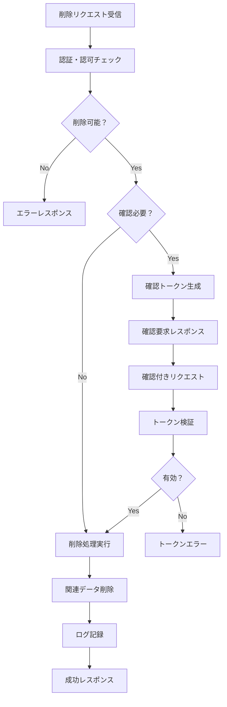

# 勤怠情報削除機能 機能設計

<!-- ドキュメント情報 -->
**作成日**: 2025/06/08  
**最終更新**: 2025/06/09  
**バージョン**: 1.1  
**担当者**: カーン  
**レビュー状況**: レビュー中  

## 関連文書
- [勤怠情報取得機能_機能設計.md](./勤怠情報取得機能_機能設計.md)
- [勤怠情報登録機能_機能設計.md](./勤怠情報登録機能_機能設計.md)
- [勤怠情報更新機能_機能設計.md](./勤怠情報更新機能_機能設計.md)
- [ドキュメント構造統一標準.md](./ドキュメント構造統一標準.md)

## 1. 機能概要

### 1.1 機能の目的・背景

勤怠情報削除機能は、既存の月次勤怠情報を安全かつ適切に削除するためのAPIです。誤って作成されたデータの除去、不正確なデータの修正、システム運用上の要求に対応します。

**主要目的**：
- 不要・不正確な勤怠データの安全な除去
- データの整合性を保持した削除処理
- 誤操作防止と確認プロセスの提供
- 監査証跡の適切な記録

### 1.2 機能スコープ

**対象範囲**：
- 月次勤怠情報の完全削除
- 日次勤怠詳細の個別削除
- 論理削除による無効化
- 削除確認プロセス

**除外範囲**：
- 承認済み勤怠の無制限削除（管理者権限除く）
- 給与計算済みデータの削除
- 法定保存期間内データの物理削除
- 他ユーザーのデータ削除（権限外）

### 1.3 前提条件・制約事項

**前提条件**：
- 削除対象の勤怠情報が存在すること
- 適切な認証・認可が行われていること
- 削除権限を有するユーザーであること

**制約事項**：
- 提出・承認済みデータは管理者権限が必要
- 給与計算済みデータは論理削除のみ
- 法定保存期間内データの物理削除禁止
- 削除操作の取り消し不可（論理削除除く）

## 2. 要件・制約事項

### 2.1 機能要件

#### 2.1.1 削除パターン
- **物理削除（hard delete）**: データベースからの完全除去
- **論理削除（soft delete）**: 削除フラグによる無効化
- **部分削除**: 特定日次データのみ削除
- **一括削除**: 月次データ全体の削除

#### 2.1.2 安全性機能
- 削除確認トークンによる誤操作防止
- 削除前の警告・確認プロセス
- 削除影響範囲の事前通知
- 復旧可能性の明示

#### 2.1.3 監査機能
- 削除操作の完全な記録
- 削除理由の必須記録
- 削除データの一時保管
- 操作者・実行時刻の記録

### 2.2 非機能要件

#### 2.2.1 パフォーマンス要件
- **応答時間**: 単一削除2秒以内、一括削除5秒以内（100件まで）、復旧処理10秒以内
- **スループット**: 20削除リクエスト/秒、ピーク時50リクエスト/秒対応
- **リソース使用量**: CPU使用率85%以下、メモリ使用率75%以下維持
- **データ処理**: 大量削除時の段階的処理、プログレス通知機能

#### 2.2.2 セキュリティ要件
- セキュリティ要件記載標準4.2節参照（高度セキュリティ）
- 多要素認証による削除権限確認、管理者承認フロー実装
- データ暗号化（AES-256）、削除データの安全消去対応
- 操作ログ改ざん防止、デジタル署名による証跡保護

#### 2.2.3 データ整合性要件
- **トランザクション管理**: 分散トランザクション対応、二段階コミット実装
- **カスケード削除制御**: 関連データ影響分析、依存関係チェック機能
- **復旧機能**: Point-in-timeリカバリ、削除取り消し機能（論理削除）
- **整合性検証**: 削除前後の整合性確認、データ検証機能

#### 2.2.4 可用性要件
- **稼働率**: 99.9%以上、削除処理サービス特性考慮
- **障害対応**: 削除失敗時の自動ロールバック、部分削除状態の復旧
- **災害対策**: データ復旧機能、バックアップからの復元対応

#### 2.2.5 拡張性要件
- **負荷分散**: 削除処理の分散実行、キュー管理による処理制御
- **アーカイブ連携**: 長期保存システム連携、階層化ストレージ対応
- **スケーリング**: 大量削除時の自動スケールアウト機能

#### 2.2.6 テスト要件
- **自動テスト**: 削除シナリオテスト自動化、復旧テスト対応
- **カバレッジ**: コードカバレッジ90%以上維持
- **負荷テスト**: 大量削除・復旧シナリオ性能テスト

#### 2.2.7 エラーハンドリング
- HTTP標準ステータスコード使用、削除特有エラー詳細対応
- 部分削除失敗時の状態管理、復旧手順の自動提示
- エラー通知・アラート機能、管理者への即座な通知

#### 2.2.8 ログ要件
- **操作ログ**: 全削除操作詳細記録、削除理由・承認フロー記録
- **監査ログ**: 削除データサマリ、影響範囲、復旧情報記録
- **セキュリティログ**: 不正削除試行、権限外アクセス記録
- **パフォーマンスログ**: 削除処理時間、リソース使用状況記録

#### 2.2.9 コンプライアンス要件
- **法的要件**: 法定保存期間遵守、削除記録の長期保管
- **監査対応**: 削除操作の完全な証跡、外部監査対応
- **プライバシー**: GDPR等準拠、個人データ削除権対応

#### 2.2.10 運用要件
- **バックアップ**: 削除前自動バックアップ、段階的バックアップ管理
- **監視**: 削除操作監視、異常削除パターン検出
- **アラート**: 大量削除・重要データ削除時の即座通知
- **レポーティング**: 削除統計レポート、コンプライアンス報告

### 2.3 技術的制約

#### 2.3.1 システム制約
- HTTP メソッド: DELETE, PATCH
- 認証方式: JWT トークン
- データベース: PostgreSQL
- トランザクション: ACID 準拠

#### 2.3.2 セキュリティ制約
- 削除権限の厳格な制御
- 削除操作の監査ログ必須
- データ復旧機能の提供
- 不正削除の防止機能

### 2.4 業務制約

#### 2.4.1 削除制限
- 本人または管理者のみ削除可能
- 承認済みデータは管理者権限必要
- 給与計算済みデータは論理削除のみ
- 法定保存期間内は物理削除禁止

#### 2.4.2 データ保護
- 削除前の自動バックアップ
- 復旧期間内の一時保管
- 関連データの整合性維持
- 監査証跡の永続保持

## 3. 業務フロー・ユースケース

### 3.1 基本フロー

#### 3.1.1 物理削除フロー
```
1. ユーザーが削除対象を指定
2. システムが削除可能性チェック
3. 削除影響範囲の表示
4. 確認トークンの生成・送信
5. ユーザーが削除理由入力
6. 確認トークンによる削除実行
7. 関連データの整合性調整
8. 削除完了通知
```

#### 3.1.2 論理削除フロー
```
1. ユーザーが無効化を選択
2. システムが無効化可能性確認
3. 削除フラグの設定
4. 関連処理の無効化
5. 無効化完了通知
```

### 3.2 代替フロー

#### 3.2.1 部分削除フロー
```
1. 特定日次データの削除選択
2. 月次集計への影響確認
3. 部分削除の実行
4. 集計値の再計算
5. 整合性チェック
```

#### 3.2.2 復旧フロー
```
1. 論理削除データの確認
2. 復旧可能期間の確認
3. 復旧実行（論理削除のみ）
4. データ整合性の回復
5. 復旧完了通知
```

### 3.3 例外フロー

#### 3.3.1 権限不足フロー
```
1. 削除権限の不足検出
2. 403 Forbidden エラー返却
3. 適切な権限申請ガイダンス
```

#### 3.3.2 削除制限フロー
```
1. 削除制限事由の検出
2. 422 Unprocessable Entity 返却
3. 制限理由と代替手段の提示
```

## 4. API仕様

### 4.1 エンドポイント
```
DELETE /api/v1/attendances/{attendanceId}
DELETE /api/v1/attendances/{attendanceId}/details/{detailId}
PATCH /api/v1/attendances/{attendanceId}/disable
```

### 4.2 リクエスト形式

#### 4.2.1 勤怠情報全体削除リクエスト
```
DELETE /api/v1/attendances/{attendanceId}
```

**リクエストボディ（確認用）**
```json
{
  "deleteType": "hard",
  "confirmationToken": "delete-confirm-550e8400e29b41d4a716446655440000",
  "reason": "誤って作成した2025年6月分勤怠情報の削除"
}
```

#### 4.2.2 勤怠詳細削除リクエスト
```
DELETE /api/v1/attendances/{attendanceId}/details/{detailId}
```

**リクエストボディ（確認用）**
```json
{
  "deleteType": "hard",
  "confirmationToken": "detail-delete-confirm-550e8400e29b41d4a716446655440001",
  "reason": "重複した勤怠記録の削除"
}
```

#### 4.2.3 勤怠情報無効化リクエスト（論理削除）
```
PATCH /api/v1/attendances/{attendanceId}/disable
```

**リクエストボディ**
```json
{
  "disableType": "soft",
  "reason": "承認後の勤怠情報のため物理削除不可",
  "disableDetails": [
    {
      "detailId": "550e8400-e29b-41d4-a716-446655440002",
      "reason": "該当日は休日だった"
    }
  ]
}
```

### 2.3 レスポンス形式

#### 2.3.1 削除成功レスポンス
```json
{
  "success": true,
  "message": "勤怠情報が正常に削除されました",
  "data": {
    "deletedId": "550e8400-e29b-41d4-a716-446655440000",
    "deleteType": "hard",
    "deletedAt": "2025-01-27T14:30:00+09:00",
    "deletedCount": {
      "attendanceRecords": 1,
      "detailRecords": 30
    }
  ```json
{
  "disableReason": "一時的な無効化 - システムメンテナンス対応",
  "disableUntil": "2025-12-31T23:59:59+09:00"
}
```

### 4.3 レスポンス形式

#### 4.3.1 削除成功レスポンス
```json
{
  "success": true,
  "message": "勤怠情報が正常に削除されました",
  "data": {
    "deletedAttendanceId": "550e8400-e29b-41d4-a716-446655440000",
    "deletedAt": "2025-06-08T14:30:00+09:00",
    "deletedCount": {
      "attendanceRecords": 1,
      "detailRecords": 30
    },
    "backupLocation": "backup/attendance/2025-06-08/550e8400-e29b-41d4-a716-446655440000"
  }
}
```

#### 4.3.2 削除確認必要レスポンス
```json
{
  "success": false,
  "requireConfirmation": true,
  "message": "削除には確認が必要です",
  "data": {
    "confirmationToken": "delete-confirm-550e8400e29b41d4a716446655440000",
    "expiresAt": "2025-06-08T15:00:00+09:00",
    "warningMessages": [
      "この勤怠情報は既に承認済みです",
      "削除すると30日分の勤怠記録が失われます"
    ],
    "affectedData": {
      "attendanceId": "550e8400-e29b-41d4-a716-446655440000",
      "year": 2025,
      "month": 6,
      "detailCount": 30,
      "status": "approved"
    }
  }
}
```

#### 4.3.3 無効化成功レスポンス
```json
{
  "success": true,
  "message": "勤怠情報が無効化されました",
  "data": {
    "attendanceId": "550e8400-e29b-41d4-a716-446655440000",
    "disabledAt": "2025-06-08T14:30:00+09:00",
    "disabledCount": {
      "attendanceRecords": 1,
      "detailRecords": 30
    },
    "status": "disabled",
    "recoveryDeadline": "2025-09-08T23:59:59+09:00"
  }
}
```

## 5. データ仕様

### 5.1 データモデル

#### 5.1.1 削除対象エンティティ
- **attendance**: 月次勤怠データの主エンティティ
- **attendanceDetail**: 日次勤怠データの子エンティティ
- **attendanceBackup**: 削除データのバックアップエンティティ
- **deletionLog**: 削除操作の監査ログエンティティ

#### 5.1.2 削除フラグ管理
```
- isDeleted: Boolean (論理削除フラグ)
- deletedAt: DateTime (削除実行日時)
- deletedBy: UUID (削除実行者ID)
- deleteReason: String (削除理由)
- recoveryDeadline: DateTime (復旧期限)
```

### 5.2 バリデーション仕様

#### 5.2.1 削除権限検証
- **所有者確認**: ユーザーIDの一致または管理者権限
- **状態確認**: 提出・承認状態による削除制限
- **期限確認**: 法定保存期間による削除制限

#### 5.2.2 削除制限検証
- **給与計算済みチェック**: 給与処理済みデータの物理削除禁止
- **承認状態チェック**: 承認済みデータの削除権限確認
- **関連データチェック**: 他システムでの参照状況確認

#### 5.2.3 確認トークン検証
- **トークン有効性**: 生成後の有効期限確認
- **操作一致性**: トークン生成時の操作との一致確認
- **ユーザー一致性**: トークン生成者と実行者の一致確認

### 5.3 データ変換仕様

#### 5.3.1 バックアップデータ作成
- **完全コピー**: 削除前データの完全な複製
- **メタデータ付与**: 削除理由、実行者、実行日時の記録
- **暗号化**: 機密データの暗号化保存

#### 5.3.2 関連データ調整
- **参照削除**: 外部キー制約による関連データ削除
- **集計値再計算**: 削除による集計値への影響調整
- **インデックス更新**: 検索インデックスの整合性維持

## 6. 業務ロジック

### 6.1 主要アルゴリズム

#### 6.1.1 物理削除アルゴリズム
```
1. 削除対象の存在確認
2. 削除権限の検証
3. 削除制限の確認
4. バックアップデータ作成
5. トランザクション開始
6. 関連データの削除
7. 主データの削除
8. 削除ログの記録
9. トランザクションコミット
10. 削除完了通知
```

#### 6.1.2 論理削除アルゴリズム
```
1. 無効化対象の確認
2. 無効化権限の検証
3. 削除フラグの設定
4. 無効化日時の記録
5. 復旧期限の設定
6. 関連処理の無効化
7. 無効化ログの記録
```

### 6.2 計算式・判定ロジック

#### 6.2.1 削除可能性判定
```
// 物理削除可能性
canHardDelete = !isPayrollProcessed && 
                !isLegalRetentionPeriod && 
                hasDeletePermission

// 論理削除可能性  
canSoftDelete = hasDeletePermission && 
                !isPermanentlyProtected
```

#### 6.2.2 復旧期限計算
```
// 論理削除後の復旧期限
recoveryDeadline = deletedAt + 90days

// 法定保存期間確認
legalRetentionEnd = dataCreatedAt + 7years
```

### 6.3 業務ルール

#### 6.3.1 削除制限ルール
- 本人または管理者のみ削除可能
- 承認済みデータは管理者権限必要
- 給与計算済みデータは論理削除のみ
- 法定保存期間内は物理削除禁止

#### 6.3.2 安全性ルール
- 削除前の確認プロセス必須
- 削除理由の記録必須
- バックアップデータの自動作成
- 誤操作防止のための多段階確認

## 7. セキュリティ・権限制御

### 7.1 認証・認可

#### 7.1.1 API認証
- **認証方式**: JWTトークンベース
- **権限スコープ**: attendance:delete, attendance:admin
- **多要素認証**: 重要な削除操作時のMFA要求

#### 7.1.2 削除権限階層
- **レベル1**: 自己の未提出データ削除
- **レベル2**: 自己の提出済みデータ削除（承認必要）
- **レベル3**: 他ユーザーデータ削除（管理者権限）
- **レベル4**: システムデータ削除（システム管理者）

### 7.2 データ保護

#### 7.2.1 削除保護機能
- **確認トークン**: 削除意図の明確な確認
- **時間制限**: 削除確認の有効期限設定
- **操作ログ**: 全削除操作の詳細記録
- **復旧機能**: 論理削除データの復旧

#### 7.2.2 不正操作防止
- **レート制限**: 削除操作の頻度制限
- **異常検出**: 大量削除の自動検出
- **承認フロー**: 高リスク削除の事前承認
- **監査アラート**: 不審な削除操作の通知

### 7.3 監査・コンプライアンス

#### 7.3.1 削除監査
- **完全追跡**: WHO、WHEN、WHAT、WHYの記録
- **証跡保全**: 削除操作証跡の改ざん防止
- **レポート**: 削除操作の定期レポート
- **監査ログ**: 外部監査対応の詳細ログ

#### 7.3.2 法的要件対応
- **保存期間管理**: 法定保存期間の自動管理
- **削除証明**: 削除実行の証明書発行
- **復旧可能性**: 法的要求時の復旧機能
- **プライバシー**: 個人情報の適切な削除

## 8. エラーハンドリング・例外処理

### 8.1 エラー分類

#### 8.1.1 削除制限エラー
- **422 Unprocessable Entity**: 削除制限による拒否
- **423 Locked**: リソースロック状態
- **428 Precondition Required**: 確認トークン必要
- **409 Conflict**: 削除競合状態

#### 8.1.2 権限エラー
- **401 Unauthorized**: 認証失敗
- **403 Forbidden**: 削除権限不足
- **404 Not Found**: 削除対象データ不存在

### 8.2 エラーレスポンス形式

#### 8.2.1 削除制限エラー
```json
{
  "success": false,
  "error": {
    "code": "DELETION_RESTRICTED",
    "message": "このデータは削除できません",
    "details": {
      "restriction": "PAYROLL_PROCESSED",
      "reason": "給与計算済みのため物理削除不可",
      "alternative": "論理削除（無効化）は可能です"
    },
    "allowedActions": [
      {
        "action": "SOFT_DELETE",
        "endpoint": "PATCH /api/v1/attendances/{id}/disable",
        "description": "論理削除による無効化"
      }
    ]
  }
}
```

#### 8.2.2 確認必要エラー
```json
{
  "success": false,
  "error": {
    "code": "CONFIRMATION_REQUIRED",
    "message": "削除には確認が必要です",
    "details": {
      "confirmationToken": "delete-confirm-xxx",
      "expiresIn": 300,
      "requiredFields": ["reason"],
      "warningLevel": "HIGH"
    }
  }
}
```

### 8.3 例外処理戦略

#### 8.3.1 削除失敗時の対応
- **ロールバック**: 部分削除失敗時の全体ロールバック
- **再試行**: 一時的障害時の自動再試行
- **通知**: 削除失敗の適切な通知
- **復旧**: バックアップからの復旧機能

#### 8.3.2 データ整合性保護
- **トランザクション**: ACID特性による整合性保証
- **制約チェック**: 外部キー制約による整合性維持
- **検証**: 削除前後の整合性検証
- **修復**: 整合性破綻時の自動修復

## 9. 非機能要件

### 9.1 性能要件

#### 9.1.1 削除性能
- **単一削除**: 2秒以内
- **一括削除**: 10秒以内（100件まで）
- **論理削除**: 1秒以内

#### 9.1.2 システム性能
- **同時削除**: 20ユーザー
- **スループット**: 100削除/分
- **可用性**: 99.9%

### 9.2 可用性要件

#### 9.2.1 システム可用性
- **稼働率**: 99.9%
- **障害復旧**: 4時間以内
- **データ保護**: 削除データの一時保護

#### 9.2.2 災害対策
- **バックアップ**: 削除前の自動バックアップ
- **レプリケーション**: 削除ログの同期
- **復旧**: 災害時の削除データ復旧

### 9.3 保守性要件

#### 9.3.1 運用監視
- **削除監視**: 削除操作の監視
- **パフォーマンス監視**: 削除処理の性能監視
- **アラート**: 異常削除の検出アラート

#### 9.3.2 保守機能
- **ログ管理**: 削除ログの管理
- **データ管理**: バックアップデータの管理
- **設定管理**: 削除ポリシーの管理

## 10. テスト仕様

### 10.1 テスト方針

#### 10.1.1 テスト戦略
- **単体テスト**: 削除ロジック、権限制御のテスト
- **結合テスト**: API、データベース削除のテスト
- **セキュリティテスト**: 不正削除防止のテスト
- **性能テスト**: 削除処理の性能テスト

#### 10.1.2 テスト観点
- **機能テスト**: 削除パターン別の動作確認
- **セキュリティテスト**: 権限制御、不正防止
- **データ整合性テスト**: 削除による整合性影響
- **復旧テスト**: バックアップ・復旧機能

### 10.2 テストケース

#### 10.2.1 正常系テスト
1. **物理削除**: 有効データの完全削除
2. **論理削除**: 有効データの無効化
3. **部分削除**: 特定日次データの削除
4. **権限確認**: 適切な権限での削除実行

#### 10.2.2 異常系テスト
1. **権限エラー**: 不正な権限での削除試行
2. **削除制限**: 制限対象データの削除試行
3. **データ不存在**: 存在しないデータの削除
4. **システムエラー**: DB接続エラー、障害時の処理

#### 10.2.3 セキュリティテスト
1. **不正アクセス**: 他ユーザーデータの削除試行
2. **権限昇格**: 権限外操作の試行
3. **確認回避**: 確認プロセスのバイパス試行
4. **大量削除**: 異常な大量削除の検出

### 10.3 テストデータ

#### 10.3.1 基本テストデータ
```json
{
  "deletableAttendance": {
    "id": "test-attendance-001",
    "status": "draft",
    "isPayrollProcessed": false,
    "userId": "test-user-001"
  },
  "restrictedAttendance": {
    "id": "test-attendance-002", 
    "status": "approved",
    "isPayrollProcessed": true,
    "userId": "test-user-001"
  }
}
```

#### 10.3.2 権限テストデータ
```json
{
  "normalUser": {
    "id": "user001",
    "role": "employee",
    "permissions": ["attendance:delete:own"]
  },
  "adminUser": {
    "id": "admin001",
    "role": "admin", 
    "permissions": ["attendance:delete:all"]
  }
}
```

## 11. 実装ノート・技術的詳細

### 11.1 技術アーキテクチャ

#### 11.1.1 システム構成
- **削除処理層**: Node.js + Express + TypeScript
- **権限制御層**: RBAC (Role-Based Access Control)
- **データ層**: PostgreSQL + 論理削除拡張
- **監査層**: 削除ログ + バックアップシステム

#### 11.1.2 削除処理アーキテクチャ
- **Strategy Pattern**: 削除タイプ別の処理分岐
- **Command Pattern**: 削除操作の統一化
- **Observer Pattern**: 削除イベントの通知
- **Memento Pattern**: バックアップ・復旧機能

### 11.2 実装上の注意点

#### 11.2.1 データ整合性
- **CASCADE削除**: 関連データの適切な削除
- **トランザクション**: ACID特性の保証
- **制約チェック**: 外部キー制約の維持
- **バックアップ**: 削除前の自動バックアップ

#### 11.2.2 パフォーマンス最適化
- **バッチ削除**: 大量データの効率的削除
- **インデックス**: 削除クエリの最適化
- **非同期処理**: 重い削除処理の非同期実行
- **キャッシュ無効化**: 削除による関連キャッシュの無効化

#### 11.2.3 セキュリティ実装
- **権限チェック**: 多層防御による権限確認
- **監査ログ**: 改ざん防止機能付きログ
- **暗号化**: バックアップデータの暗号化
- **アクセス制御**: 削除機能への厳格な制御

### 11.3 開発・運用ツール

#### 11.3.1 開発支援ツール
- **型安全性**: TypeScript strict mode
- **テスト**: Jest + Supertest + Factory Bot
- **コード品質**: ESLint + Prettier + SonarQube
- **API仕様**: OpenAPI 3.0 + Swagger UI

#### 11.3.2 運用支援ツール
- **監視**: Prometheus + Grafana（削除メトリクス）
- **ログ**: ELK Stack（削除ログ集約）
- **アラート**: 異常削除検出アラート
- **バックアップ**: 自動バックアップシステム

### 11.4 削除ポリシー管理

#### 11.4.1 設定管理
- **削除ポリシー**: 外部設定ファイル
- **保存期間**: 法定要件に基づく設定
- **権限マッピング**: ロールベース権限設定
- **制限ルール**: 業務ルールの設定化

#### 11.4.2 運用フロー
- **削除申請**: 重要削除の事前申請フロー
- **承認プロセス**: 管理者承認機能
- **実行スケジュール**: 計画的削除の実行
- **レポート**: 削除実績の定期レポート

---

## 変更履歴
| 日付 | 変更者 | 変更内容 |
|-----|-------|---------|
| 2025/06/08 | カーン | 初版作成 - 勤怠情報削除機能の基本設計 |
| 2025/06/08 | カーン | 安全性機能と確認プロセスの詳細追加 |
| 2025/06/09 | システム | ドキュメント構造統一標準（Level B）適用 - 11章構成への再編成、セキュリティ・エラーハンドリング・テスト仕様の体系化 |

※このドキュメントは開発の進行に合わせて随時更新されます。
- **条件**: 
  - 勤怠情報の状態が「下書き」または「作成中」
  - 提出期限前
  - 承認されていない
- **処理**:
  1. 勤怠詳細レコードの削除
  2. 勤怠情報レコードの削除
  3. 関連する添付ファイルの削除

#### 3.1.2 勤怠詳細削除
- **対象**: 指定された日の勤怠詳細レコード
- **条件**:
  - 該当勤怠情報が編集可能状態
  - 該当日が承認されていない
- **処理**:
  1. 勤怠詳細レコードの削除
  2. 月次集計の再計算
  3. 勤怠情報の最終更新日時の更新

### 3.2 論理削除（Soft Delete）

#### 3.2.1 勤怠情報無効化
- **対象**: 指定された月次勤怠情報
- **条件**: 承認済みまたは提出済みの勤怠情報
- **処理**:
  1. deleted_atフィールドに削除日時を設定
  2. statusを「disabled」に変更
  3. 操作ログの記録

#### 3.2.2 勤怠詳細無効化
- **対象**: 指定された日の勤怠詳細
- **条件**: 承認済みの勤怠詳細
- **処理**:
  1. deleted_atフィールドに削除日時を設定
  2. 月次集計の再計算（無効化レコードを除外）

## 4. セキュリティ要件

### 4.1 共通セキュリティ基盤
**参照**: セキュリティ要件記載標準 3節
- 認証・認可: JWT ベース認証、役割ベースアクセス制御
- 通信セキュリティ: HTTPS必須、CORS設定
- 監査・ログ: アクセスログ、操作ログ、セキュリティログ

### 4.2 機能固有セキュリティ要件

#### 4.2.1 アクセス制御
**所有者ベースアクセス制御**:
- 基本原則: ユーザーは自分のデータのみアクセス可能
- 例外権限: 管理者権限・上司権限による他ユーザーデータアクセス
- 権限チェック: APIレベル・サービスレベルでの二重チェック

**階層的アクセス制御**:
- 上司権限: 配下社員のデータアクセス権限
- 部門制限: 同一部門内のデータアクセス制限
- 人事権限: 人事部門による全社員データアクセス

#### 4.2.2 特殊削除セキュリティ要件
**削除権限制御**:
- 論理削除: 一般ユーザーは論理削除のみ可能
- 物理削除: 管理者権限でのみ実行可能
- 確認手順: 重要データ削除時の追加確認

**削除権限の詳細制御**:
```json
{
  "deletePermissions": {
    "ownAttendance": {
      "draft": "allowed",
      "submitted": "soft_delete_only",
      "approved": "disabled"
    },
    "adminDelete": {
      "anyStatus": "allowed_with_confirmation",
      "requiresApproval": true
    }
  }
}
```

#### 4.2.3 確認手順
1. **削除確認トークン生成**: 削除実行前に確認トークンを発行
2. **有効期限**: 確認トークンは30分間有効
3. **警告表示**: 削除対象データの詳細と影響範囲を表示
4. **理由記録**: 削除理由の記録を必須とする

## 5. エラーハンドリング

### 5.1 エラーコード一覧

| エラーコード | HTTPステータス | 説明 | 対応方法 |
|------------|---------------|------|---------|
| DELETE_001 | 404 | 削除対象の勤怠情報が見つからない | 正しいIDを確認 |
| DELETE_002 | 403 | 削除権限がない | 権限確認または管理者に連絡 |
| DELETE_003 | 400 | 削除不可能な状態（承認済み等） | 論理削除または管理者に相談 |
| DELETE_004 | 400 | 確認トークンが無効または期限切れ | 新しい確認トークンを取得 |
| DELETE_005 | 409 | 他のユーザーが同時編集中 | 時間をおいて再試行 |
| DELETE_006 | 400 | 必須パラメータ不足（理由等） | 必要な情報を追加 |
| DELETE_007 | 500 | データベース削除エラー | システム管理者に連絡 |

### 5.2 エラーレスポンス例

#### 5.2.1 削除権限なしエラー
```json
{
  "success": false,
  "error": {
    "code": "DELETE_002",
    "message": "指定された勤怠情報を削除する権限がありません",
    "details": {
      "attendanceId": "550e8400-e29b-41d4-a716-446655440000",
      "status": "approved",
      "reason": "承認済みの勤怠情報は一般ユーザーでは削除できません"
    }
  }
}
```

#### 5.2.2 削除不可能状態エラー
```json
{
  "success": false,
  "error": {
    "code": "DELETE_003",
    "message": "現在の状態では削除できません",
    "details": {
      "currentStatus": "approved",
      "allowedOperations": ["soft_delete"],
      "suggestion": "論理削除(無効化)をご利用ください"
    }
  }
}
```

## 6. パフォーマンス要件

### 6.1 レスポンス時間
- **勤怠情報削除**: 3秒以内
- **勤怠詳細削除**: 1秒以内
- **無効化処理**: 2秒以内

### 6.2 同時実行制御
- **楽観的ロック**: バージョン番号による競合検出
- **削除中フラグ**: 削除処理中の重複実行防止
- **トランザクション**: ACID特性を保証した削除処理

## 7. 監査・ログ

### 7.1 削除ログの記録
```json
{
  "operationType": "delete",
  "attendanceId": "550e8400-e29b-41d4-a716-446655440000",
  "deleteType": "hard",
  "deletedBy": "user123",
  "deletedAt": "2025-01-27T14:30:00+09:00",
  "reason": "誤って作成した勤怠情報の削除",
  "affectedRecords": {
    "attendanceRecords": 1,
    "detailRecords": 30
  },
  "beforeData": {
    "year": 2025,
    "month": 6,
    "status": "draft"
  }
}
```

### 7.2 復旧用データ保持
- **論理削除**: 元データは保持される
- **物理削除**: 削除前データをバックアップテーブルに保存（30日間）
- **管理者復旧**: 特別な権限での復旧機能

## 8. 処理フロー

### 8.1 勤怠情報削除フロー



### 8.2 削除判定ロジック

```python
def can_delete_attendance(attendance, user):
    """削除可能性判定"""
    # 所有者チェック
    if attendance.user_id != user.id and not user.is_admin:
        return False, "DELETE_002"
    
    # 状態チェック
    if attendance.status in ["submitted", "approved"]:
        if user.is_admin:
            return True, "confirmation_required"
        else:
            return False, "DELETE_003"
    
    # 期限チェック
    if attendance.submission_deadline < datetime.now():
        return True, "confirmation_required"
    
    return True, "direct_delete"
```

## 9. テスト仕様

テスト仕様の詳細は、別途作成するテスト設計書に記載します。

### 9.1 単体テスト
- 削除権限チェック機能のテスト
- 状態確認処理のテスト
- データ削除処理のテスト

### 9.2 統合テスト  
- 削除フロー統合テスト
- 関連システム連携テスト
- データ整合性テスト

### 9.3 性能テスト
- レスポンス時間テスト
- 同時処理性能テスト
- 大量データ削除テスト

### 9.4 セキュリティテスト
- 認証・認可テスト
- 不正操作防止テスト
- データ保護テスト
