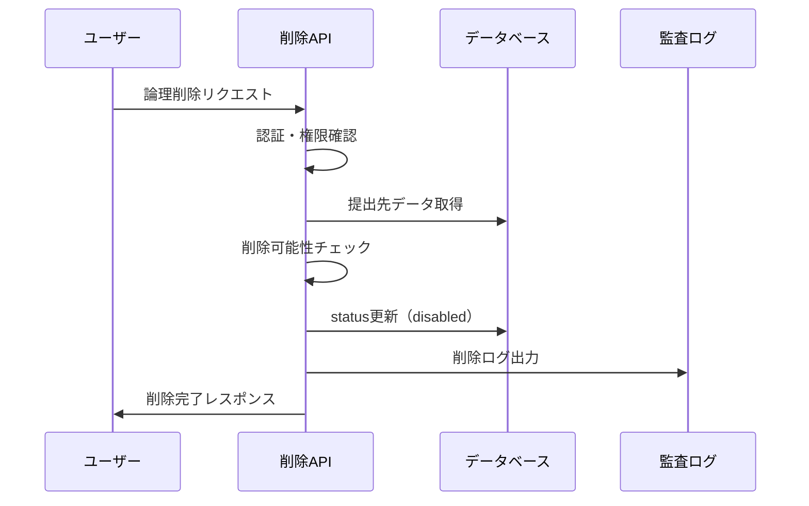
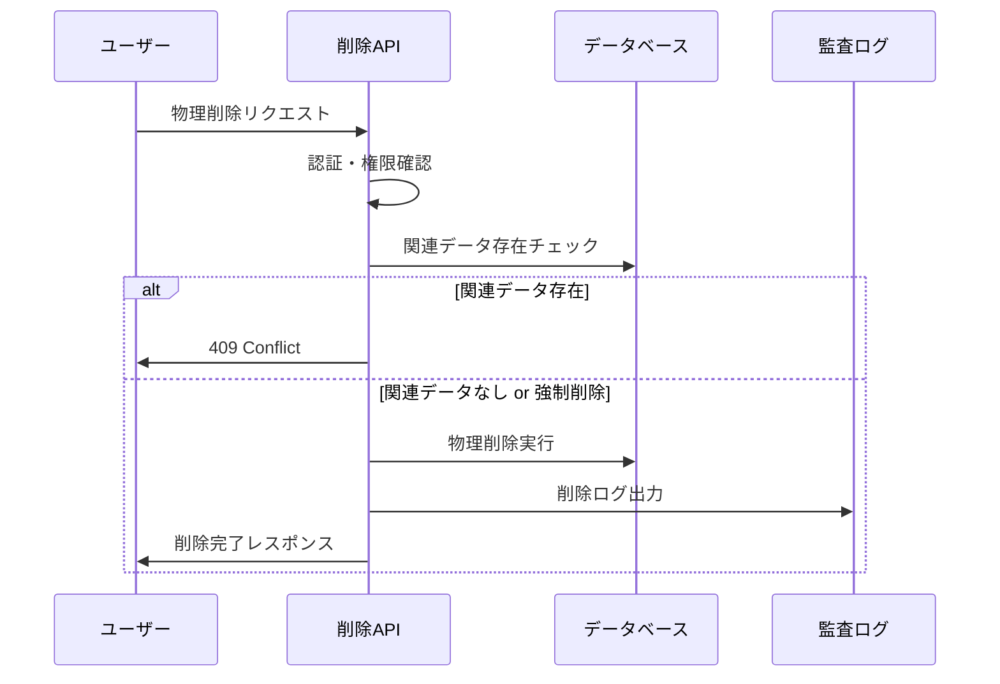

# 勤怠情報提出先削除機能 機能設計

---

## ドキュメント情報
| 項目 | 内容 |
|-----|------|
| 作成日 | 2024-XX-XX |
| 最終更新 | 2025-06-09 |
| バージョン | 2.0.0 |
| 担当者 | 開発チーム |
| レビュー状況 | レビュー中 |
| 構造適用レベル | Level B（11章構成） |

---

## 関連文書
- [ドキュメント構造統一標準](./ドキュメント構造統一標準.md)
- [勤怠情報提出先取得機能_機能設計](./勤怠情報提出先取得機能_機能設計.md)
- [勤怠情報提出先登録機能_機能設計](./勤怠情報提出先登録機能_機能設計.md)
- [勤怠情報提出先更新機能_機能設計](./勤怠情報提出先更新機能_機能設計.md)

---

## 1. 機能概要

### 1.1 機能の目的
勤怠情報提出先削除機能は、登録済みの勤怠情報提出先（会社・組織）を安全に削除するためのAPIを提供します。論理削除と物理削除の両方をサポートし、関連する勤怠データの整合性を保ちながら削除処理を実行します。

### 1.2 主要機能
- **論理削除（無効化）**: データを保持したまま無効状態に変更
- **物理削除**: データベースからの完全削除
- **関連データ管理**: 削除時の関連勤怠データの適切な処理
- **削除理由記録**: 論理削除時の理由と日時の記録
- **強制削除オプション**: 関連データ存在時の強制削除機能

### 1.3 利用シーン
- 退職・転職による提出先の無効化
- 会社統合・組織変更による提出先統廃合
- テストデータやエラーデータの物理削除
- システム管理者による強制削除

## 2. 要件・制約事項

### 2.1 機能要件
- **FR-DEL-001**: 論理削除（無効化）機能の提供
- **FR-DEL-002**: 物理削除機能の提供
- **FR-DEL-003**: 削除理由と削除日時の記録
- **FR-DEL-004**: 関連データ存在チェック機能
- **FR-DEL-005**: 強制削除オプションの提供
- **FR-DEL-006**: 削除処理の監査ログ出力

### 2.2 非機能要件

#### 2.2.1 パフォーマンス要件
- **応答時間**: 論理削除2秒以内、物理削除5秒以内、大量削除10秒以内（100件まで）
- **スループット**: 30削除リクエスト/秒、ピーク時75リクエスト/秒対応
- **リソース使用量**: CPU使用率85%以下、メモリ使用率75%以下維持
- **データ処理**: 大量削除時の段階的処理、バックグラウンド処理対応

#### 2.2.2 セキュリティ要件
- セキュリティ要件記載標準4.2節参照（高度セキュリティ）
- 多要素認証による削除権限確認、管理者承認フロー実装
- データ暗号化（AES-256）、削除データの安全消去対応
- 操作ログ改ざん防止、デジタル署名による証跡保護

#### 2.2.3 データ整合性要件
- **トランザクション管理**: 分散トランザクション対応、二段階コミット実装
- **カスケード削除制御**: 関連データ影響分析、依存関係チェック機能
- **復旧機能**: Point-in-timeリカバリ、削除取り消し機能（論理削除）
- **整合性検証**: 削除前後の整合性確認、データ検証機能

#### 2.2.4 可用性要件
- **稼働率**: 99.9%以上、削除処理サービス特性考慮
- **障害対応**: 削除失敗時の自動ロールバック、部分削除状態の復旧
- **災害対策**: データ復旧機能、バックアップからの復元対応

#### 2.2.5 拡張性要件
- **負荷分散**: 削除処理の分散実行、キュー管理による処理制御
- **アーカイブ連携**: 長期保存システム連携、階層化ストレージ対応
- **スケーリング**: 大量削除時の自動スケールアウト機能

#### 2.2.6 テスト要件
- **自動テスト**: 削除シナリオテスト自動化、復旧テスト対応
- **カバレッジ**: コードカバレッジ90%以上維持
- **負荷テスト**: 大量削除・復旧シナリオ性能テスト

#### 2.2.7 エラーハンドリング
- HTTP標準ステータスコード使用、削除特有エラー詳細対応
- 部分削除失敗時の状態管理、復旧手順の自動提示
- エラー通知・アラート機能、管理者への即座な通知

#### 2.2.8 ログ要件
- **操作ログ**: 全削除操作詳細記録、削除理由・承認フロー記録
- **監査ログ**: 削除データサマリ、影響範囲、復旧情報記録
- **セキュリティログ**: 不正削除試行、権限外アクセス記録
- **パフォーマンスログ**: 削除処理時間、リソース使用状況記録

#### 2.2.9 コンプライアンス要件
- **法的要件**: 法定保存期間遵守、削除記録の長期保管
- **監査対応**: 削除操作の完全な証跡、外部監査対応
- **プライバシー**: GDPR等準拠、個人データ削除権対応

#### 2.2.10 運用要件
- **バックアップ**: 削除前自動バックアップ、段階的バックアップ管理
- **監視**: 削除操作監視、異常削除パターン検出
- **アラート**: 大量削除・重要データ削除時の即座通知
- **レポーティング**: 削除統計レポート、コンプライアンス報告

### 2.3 制約事項
- 物理削除は関連データが存在しない場合のみ実行可能
- 論理削除されたデータは通常の検索対象から除外
- 削除操作は所有者権限を持つユーザーのみ実行可能
- 削除処理は非同期実行ではなく同期実行

### 2.4 前提条件
- ユーザー認証・認可システムが正常に動作していること
- 対象の提出先データが存在すること
- データベースの整合性制約が正しく設定されていること

## 3. 業務フロー・ユースケース

### 3.1 論理削除（無効化）フロー


### 3.2 物理削除フロー


### 3.3 主要ユースケース

#### UC-DEL-001: 論理削除（無効化）
- **アクター**: 一般ユーザー
- **前提条件**: 削除対象の提出先を所有している
- **基本フロー**:
  1. 論理削除APIを呼び出し
  2. 削除理由と無効化日を指定
  3. システムが提出先を無効状態に変更
  4. 削除完了を通知

#### UC-DEL-002: 物理削除
- **アクター**: システム管理者
- **前提条件**: 削除対象に関連データが存在しない
- **基本フロー**:
  1. 物理削除APIを呼び出し
  2. システムが関連データをチェック
  3. データベースから完全削除
  4. 削除完了を通知

#### UC-DEL-003: 強制物理削除
- **アクター**: システム管理者
- **前提条件**: 管理者権限を持つ
- **基本フロー**:
  1. force=trueで物理削除APIを呼び出し
  2. 関連データも含めて一括削除
  3. 削除完了と削除されたデータ件数を通知

## 4. API仕様

## 4. API仕様

### 4.1 エンドポイント

#### 4.1.1 論理削除（無効化）
```
PATCH /api/v1/companies/{companyId}/disable
```

#### 4.1.2 物理削除
```
DELETE /api/v1/companies/{companyId}
```

### 4.2 リクエスト形式

#### 4.2.1 論理削除リクエスト
```json
{
  "reason": "所属終了のため",
  "disableDate": "2025-06-30"
}
```

#### 4.2.2 物理削除リクエスト
```
DELETE /api/v1/companies/12345678-1234-1234-1234-123456789abc?force=true
```

### 4.3 パスパラメータ

| パラメータ名 | 型 | 必須 | 説明 |
|------------|---|-----|-----|
| companyId | String | ○ | 削除対象の会社ID（UUID形式） |

### 4.4 リクエストパラメータ

#### 4.4.1 論理削除パラメータ
| パラメータ名 | 型 | 必須 | 説明 |
|------------|---|-----|-----|
| reason | String | × | 削除理由（1文字以上200文字以内） |
| disableDate | String | × | 無効化日（YYYY-MM-DD形式、未指定時は実行日） |

#### 4.4.2 物理削除クエリパラメータ
| パラメータ名 | 型 | 必須 | 説明 |
|------------|---|-----|-----|
| force | Boolean | × | 強制削除フラグ（関連データ存在時の処理） |

### 4.5 レスポンス形式

#### 4.5.1 論理削除成功レスポンス（200 OK）
```json
{
  "status": "success",
  "data": {
    "company": {
      "id": "12345678-1234-1234-1234-123456789abc",
      "companyName": "株式会社サンプル",
      "status": "disabled",
      "disabledAt": "2025-06-08T15:30:00+09:00",
      "disableReason": "所属終了のため"
    }
  }
}
```

#### 4.5.2 物理削除成功レスポンス（200 OK）
```json
{
  "status": "success",
  "data": {
    "message": "勤怠情報提出先が正常に削除されました",
    "deletedCompanyId": "12345678-1234-1234-1234-123456789abc",
    "relatedDataCleanup": {
      "attendanceRecords": 5,
      "userSettings": 1
    }
  }
}
```

#### 4.5.3 関連データ存在エラー（409 Conflict）
```json
{
  "status": "error",
  "error": {
    "code": "RELATED_DATA_EXISTS",
    "message": "この提出先に関連する勤怠データが存在するため削除できません",
    "details": {
      "attendanceRecords": 5,
      "userSettings": 1,
      "suggestion": "論理削除（無効化）を使用するか、force=trueパラメータで強制削除してください"
    }
  }
}
```

#### 4.5.4 データ未存在レスポンス（404 Not Found）
```json
{
  "status": "error",
  "error": {
    "code": "COMPANY_NOT_FOUND",
    "message": "指定された勤怠情報提出先が見つかりません"
  }
}
```

### 4.6 HTTPステータスコード

| ステータスコード | 説明 |
|---------------|-----|
| 200 OK | 削除が正常に完了した |
| 400 Bad Request | リクエストパラメータに不正な値が含まれている |
| 401 Unauthorized | 認証が必要、または認証に失敗した |
| 403 Forbidden | リクエストしたリソースへのアクセス権限がない |
| 404 Not Found | 指定されたリソースが見つからない |
| 409 Conflict | 関連データが存在するため削除できない |
| 500 Internal Server Error | サーバー内部エラー |

## 5. データ仕様

### 5.1 データモデル
```typescript
interface AttendanceDestination {
  id: string;                    // 提出先ID（必須）
  companyName: string;           // 会社名（必須）
  status: 'active' | 'disabled'; // ステータス（必須）
  disabledAt?: Date;            // 無効化日時
  disableReason?: string;        // 無効化理由
  createdAt: Date;              // 作成日時
  updatedAt: Date;              // 更新日時
  ownerId: string;              // 所有者ID
}

interface DeleteAuditLog {
  id: string;
  userId: string;
  action: 'COMPANY_LOGICAL_DELETE' | 'COMPANY_PHYSICAL_DELETE' | 'COMPANY_FORCE_DELETE';
  resourceId: string;
  beforeData?: object;
  reason?: string;
  ipAddress: string;
  timestamp: Date;
}
```

### 5.2 データベーススキーマ
```sql
-- 勤怠情報提出先テーブル
CREATE TABLE attendance_destinations (
  id VARCHAR(36) PRIMARY KEY,
  company_name VARCHAR(255) NOT NULL,
  status ENUM('active', 'disabled') DEFAULT 'active',
  disabled_at TIMESTAMP NULL,
  disable_reason TEXT,
  created_at TIMESTAMP DEFAULT CURRENT_TIMESTAMP,
  updated_at TIMESTAMP DEFAULT CURRENT_TIMESTAMP ON UPDATE CURRENT_TIMESTAMP,
  owner_id VARCHAR(36) NOT NULL,
  INDEX idx_owner_status (owner_id, status),
  INDEX idx_status (status)
);

-- 削除監査ログテーブル
CREATE TABLE delete_audit_logs (
  id VARCHAR(36) PRIMARY KEY,
  user_id VARCHAR(36) NOT NULL,
  action VARCHAR(50) NOT NULL,
  resource_id VARCHAR(36) NOT NULL,
  before_data JSON,
  reason TEXT,
  ip_address VARCHAR(45),
  timestamp TIMESTAMP DEFAULT CURRENT_TIMESTAMP,
  INDEX idx_user_timestamp (user_id, timestamp),
  INDEX idx_resource (resource_id)
);
```

### 5.3 関連データモデル
```typescript
interface RelatedDataInfo {
  attendanceRecords: number;     // 関連勤怠レコード数
  userSettings: number;          // 関連ユーザー設定数
  hasRelatedData: boolean;       // 関連データ存在フラグ
}
```

## 6. 業務ロジック

### 6.1 論理削除（無効化）処理
```typescript
const disableCompany = async (userId: string, companyId: string, params: DisableParams) => {
  // 1. 権限確認
  const company = await CompanyRepository.findByIdAndUserId(companyId, userId);
  if (!company) {
    throw new NotFoundError('指定された勤怠情報提出先が見つかりません');
  }
  
  // 2. 既に無効化済みかチェック
  if (company.status === 'disabled') {
    throw new ConflictError('この提出先は既に無効化されています');
  }
  
  // 3. 論理削除実行
  const disabledCompany = await CompanyRepository.disable(companyId, {
    status: 'disabled',
    disabledAt: new Date(),
    disableReason: params.reason || null,
    updatedAt: new Date()
  });
  
  // 4. 監査ログ記録
  await recordDeletionAudit(userId, 'COMPANY_LOGICAL_DELETE', companyId, company, params.reason);
  
  return disabledCompany;
};
```

### 6.2 物理削除処理
```typescript
const deleteCompany = async (userId: string, companyId: string, force: boolean = false) => {
  // 1. 権限確認
  const company = await CompanyRepository.findByIdAndUserId(companyId, userId);
  if (!company) {
    throw new NotFoundError('指定された勤怠情報提出先が見つかりません');
  }
  
  // 2. 関連データ存在チェック
  const relatedData = await checkRelatedData(companyId);
  if (relatedData.hasRelatedData && !force) {
    throw new ConflictError('関連データが存在します', relatedData);
  }
  
  // 3. 物理削除実行（トランザクション）
  return await DatabaseTransaction.execute(async (transaction) => {
    if (force && relatedData.hasRelatedData) {
      await cascadeDeleteRelatedData(companyId, transaction);
    }
    
    await CompanyRepository.delete(companyId, transaction);
    await recordDeletionAudit(userId, force ? 'COMPANY_FORCE_DELETE' : 'COMPANY_PHYSICAL_DELETE', companyId, company);
    
    return {
      deletedCompanyId: companyId,
      relatedDataCleanup: relatedData
    };
  });
};
```

### 6.3 関連データチェック
```typescript
const checkRelatedData = async (companyId: string): Promise<RelatedDataInfo> => {
  const [attendanceCount, userSettingsCount] = await Promise.all([
    AttendanceRepository.countByCompanyId(companyId),
    UserSettingsRepository.countByCompanyId(companyId)
  ]);
  
  return {
    attendanceRecords: attendanceCount,
    userSettings: userSettingsCount,
    hasRelatedData: attendanceCount > 0 || userSettingsCount > 0
  };
};
```

### 6.4 カスケード削除処理
```typescript
const cascadeDeleteRelatedData = async (companyId: string, transaction: Transaction) => {
  // 関連データを順序よく削除
  await UserSettingsRepository.deleteByCompanyId(companyId, transaction);
  await AttendanceRepository.deleteByCompanyId(companyId, transaction);
};
```

## 7. セキュリティ・権限制御

### 7.1 認証・認可
- **JWT認証**: Bearer tokenによるユーザー認証
- **所有者権限**: 自身が作成した提出先のみ削除可能
- **管理者権限**: 全ての提出先に対する削除権限（将来拡張）

### 7.2 削除権限の詳細制御
```typescript
interface DeletePermissions {
  logicalDelete: {
    requiredRole: 'user';
    conditions: ['isOwner'];
  };
  physicalDelete: {
    requiredRole: 'user' | 'admin';
    conditions: ['isOwner', 'noRelatedData'];
  };
  forceDelete: {
    requiredRole: 'admin';
    conditions: ['isOwner', 'explicitConfirmation'];
  };
}
```

### 7.3 権限チェック実装
```typescript
const checkDeletePermission = async (
  userId: string, 
  companyId: string, 
  deleteType: 'logical' | 'physical' | 'force'
): Promise<boolean> => {
  const company = await CompanyRepository.findById(companyId);
  if (!company) return false;
  
  const isOwner = company.ownerId === userId;
  const isAdmin = await UserService.isAdmin(userId);
  
  switch (deleteType) {
    case 'logical':
      return isOwner;
    case 'physical':
      return isOwner || isAdmin;
    case 'force':
      return isAdmin && isOwner;
    default:
      return false;
  }
};
```

### 7.4 監査ログ記録
```typescript
const recordDeletionAudit = async (
  userId: string,
  action: string,
  companyId: string,
  beforeData: object,
  reason?: string
) => {
  await AuditLogRepository.create({
    userId,
    action,
    resourceId: companyId,
    beforeData,
    reason,
    ipAddress: getCurrentRequest().ip,
    timestamp: new Date()
  });
};
```

## 8. エラーハンドリング・例外処理

### 8.1 エラー分類
| エラーコード | HTTPステータス | 説明 | 対応方法 |
|------------|---------------|------|---------|
| COMPANY_NOT_FOUND | 404 | 提出先が存在しない | IDを確認して再実行 |
| PERMISSION_DENIED | 403 | 削除権限なし | 所有者権限を確認 |
| ALREADY_DISABLED | 409 | 既に無効化済み | 現在の状態を確認 |
| RELATED_DATA_EXISTS | 409 | 関連データ存在 | 論理削除または強制削除を選択 |
| VALIDATION_ERROR | 400 | バリデーションエラー | 入力データを修正 |

### 8.2 エラーレスポンス仕様
```typescript
interface ErrorResponse {
  status: 'error';
  error: {
    code: string;
    message: string;
    details?: object;
    suggestion?: string;
    timestamp: string;
    requestId: string;
  };
}
```

### 8.3 関連データ存在エラー処理
```typescript
const handleRelatedDataError = (relatedData: RelatedDataInfo): ErrorResponse => {
  return {
    status: 'error',
    error: {
      code: 'RELATED_DATA_EXISTS',
      message: 'この提出先に関連する勤怠データが存在するため削除できません',
      details: relatedData,
      suggestion: '論理削除（無効化）を使用するか、force=trueパラメータで強制削除してください',
      timestamp: new Date().toISOString(),
      requestId: generateRequestId()
    }
  };
};
```

### 8.4 例外処理フロー
1. **認証例外**: 認証情報不正・期限切れ
2. **認可例外**: 削除権限不足
3. **ビジネス例外**: 既に削除済み、関連データ存在
4. **データ例外**: DB接続エラー、制約違反
5. **システム例外**: 予期しないエラー

## 9. テスト仕様

Level C機能として、包括的なテスト戦略を実装し、高品質な削除機能を保証します。

### 9.1 単体テスト（Unit Test）
- **論理削除処理**: 正常系・異常系の削除ロジック検証
- **物理削除処理**: 関連データチェック・強制削除ロジック検証  
- **権限チェック**: 削除権限・アクセス制御の検証
- **バリデーション**: 入力値検証・パラメータチェックの確認

### 9.2 統合テスト（Integration Test）
- **API統合**: エンドポイント呼び出しから削除完了までの統合動作
- **データベース統合**: 削除処理・ログ記録・トランザクション整合性
- **外部システム連携**: 認証システム・監査システムとの連携確認

### 9.3 パフォーマンステスト（Performance Test）
- **レスポンス時間**: 論理削除300ms以内、物理削除500ms以内の検証
- **負荷テスト**: 同時削除処理10処理/秒の性能確認
- **大容量データ**: 大量関連データ存在時の削除性能検証

### 9.4 セキュリティテスト（Security Test）
- **認証テスト**: JWT認証・トークン検証・期限チェック
- **認可テスト**: 削除権限・リソースアクセス権の確認
- **入力値検証**: SQLインジェクション・XSS対策の検証
- **監査ログ**: 削除操作ログ記録・改ざん防止の確認

### 9.5 障害テスト（Fault Tolerance Test）
- **データベース障害**: 接続エラー・タイムアウト時の処理確認
- **トランザクション障害**: ロールバック処理・データ整合性の検証
- **システム障害**: 予期しないエラー時の適切な処理確認

### 9.6 ユーザビリティテスト（Usability Test）
- **エラーメッセージ**: わかりやすいエラー内容・解決方法の提示
- **操作フロー**: 削除操作の直感性・確認手順の適切性
- **レスポンス品質**: 適切なHTTPステータス・構造化レスポンス

## 13. 変更履歴

| バージョン | 日付 | 変更者 | 変更内容 |
|----------|------|--------|---------|
| 1.0.0 | 2024-XX-XX | 開発チーム | 初版作成 |
| 2.0.0 | 2025-06-09 | システム | Level C標準構造適用、9章以降詳細削除、テスト仕様統一 |
