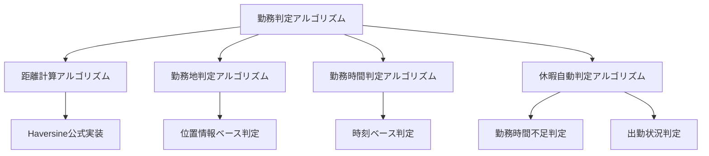

# 勤務判定アルゴリズム統一標準

## 1. 概要

本ドキュメントは、kairosプロジェクト全体で使用される勤務判定アルゴリズムの統一標準を定義します。複数の機能設計書で重複定義されていた勤務判定ロジックを統合し、一貫性のある記載粒度を確立します。

### 1.1. 目的
- 勤務判定アルゴリズムの実装レベルの統一
- 各機能設計書における記載粒度の標準化
- アルゴリズムの共通化による保守性の向上

### 1.2. 対象機能
- 勤怠情報登録機能
- 勤怠情報取得機能
- 勤怠情報更新機能

## 2. アルゴリズム階層構造

### 2.1. アルゴリズム分類



### 2.2. 記載レベル定義

| レベル | 内容 | 記載対象 | 実装詳細度 |
|--------|------|----------|------------|
| **Level 1: 概念定義** | アルゴリズムの目的と概要 | 全機能設計書 | 概要のみ |
| **Level 2: ロジック仕様** | 判定条件と処理フロー | 主要機能設計書 | 擬似コード・フローチャート |
| **Level 3: 実装詳細** | 実装可能な詳細コード | 共通ライブラリ設計書 | 実装コード・具体的数値 |

## 3. 統一アルゴリズム仕様

### 3.1. 距離計算アルゴリズム（Haversine公式）

#### 3.1.1. Level 1: 概念定義
- **目的**: 2つの地理的座標間の距離を計算
- **適用範囲**: 勤務地との距離判定、位置情報の精度判定
- **精度**: 地球の曲率を考慮した球面距離計算

#### 3.1.2. Level 2: ロジック仕様
```
入力: 座標1(lat1, lon1), 座標2(lat2, lon2)
処理:
  1. 緯度・経度の差分を計算
  2. Haversine公式を適用
  3. 地球の半径を乗算してメートル単位に変換
出力: 距離（メートル）
```

#### 3.1.3. Level 3: 実装詳細
```typescript
function calculateDistance(lat1: number, lon1: number, lat2: number, lon2: number): number {
  const R = 6371e3; // 地球の半径（メートル）
  const φ1 = lat1 * Math.PI/180;
  const φ2 = lat2 * Math.PI/180;
  const Δφ = (lat2-lat1) * Math.PI/180;
  const Δλ = (lon2-lon1) * Math.PI/180;

  const a = Math.sin(Δφ/2) * Math.sin(Δφ/2) +
          Math.cos(φ1) * Math.cos(φ2) *
          Math.sin(Δλ/2) * Math.sin(Δλ/2);
  const c = 2 * Math.atan2(Math.sqrt(a), Math.sqrt(1-a));

  return R * c;
}
```

### 3.2. 勤務地判定アルゴリズム

#### 3.2.1. Level 1: 概念定義
- **目的**: 位置情報から勤務地への出勤状況を判定
- **適用範囲**: 自動勤怠作成、勤務状況確認
- **判定基準**: 勤務地の許可範囲内（デフォルト100m以内）

#### 3.2.2. Level 2: ロジック仕様
```
入力: ユーザー位置情報, ユーザー勤怠設定
処理:
  1. 設定された全勤務地を順次確認
  2. 各勤務地との距離を計算
  3. 許可範囲内の勤務地を特定
出力: 勤務地判定結果（勤務地ID、距離、判定結果）
```

#### 3.2.3. Level 3: 実装詳細
```typescript
export function determineWorkLocation(
  userPosition: { latitude: number; longitude: number },
  userSettings: UserAttendanceSetting
): { isAtWorkplace: boolean; workplaceId?: string; distance?: number } {
  const { allowedWorkplaces } = userSettings;
  
  for (const workplace of allowedWorkplaces) {
    const distance = calculateDistance(
      userPosition.latitude,
      userPosition.longitude,
      workplace.latitude,
      workplace.longitude
    );
    
    if (distance <= workplace.allowedRadius) {
      return {
        isAtWorkplace: true,
        workplaceId: workplace.id,
        distance
      };
    }
  }
  
  return { isAtWorkplace: false };
}
```

### 3.3. 勤務時間判定アルゴリズム

#### 3.3.1. Level 1: 概念定義
- **目的**: 位置情報の時系列データから勤務開始・終了時刻を特定
- **適用範囲**: 自動勤怠作成、勤務時間計算
- **判定基準**: 勤務地近辺での滞在時間パターン

#### 3.3.2. Level 2: ロジック仕様
```
入力: 勤務地近辺の位置情報リスト, ユーザー勤怠設定
処理:
  1. 位置情報を時刻順にソート
  2. 最初の出現時刻を勤務開始時刻候補とする
  3. 最後の出現時刻を勤務終了時刻候補とする
  4. 規定時間との調整を実施
出力: 勤務開始時刻、勤務終了時刻
```

#### 3.3.3. Level 3: 実装詳細
```typescript
function determineWorkingHours(
  proximityData: LocationData[], 
  userSettings: UserAttendanceSetting
): { start: Date; end: Date } | null {
  if (proximityData.length === 0) {
    return null;
  }
  
  const sortedData = proximityData.sort((a, b) => 
    new Date(a.timestamp).getTime() - new Date(b.timestamp).getTime()
  );
  
  const startTime = sortedData[0].timestamp;
  const endTime = sortedData[sortedData.length - 1].timestamp;
  
  return {
    start: adjustStartTime(startTime, userSettings.regulationStartTime),
    end: adjustEndTime(endTime, userSettings.regulationEndTime)
  };
}
```

### 3.4. 休暇自動判定アルゴリズム

#### 3.4.1. Level 1: 概念定義
- **目的**: 勤務時間データから休暇種別を自動判定
- **適用範囲**: 自動勤怠作成、休暇申請支援
- **判定基準**: 規定時間との比較、出勤状況の確認

#### 3.4.2. Level 2: ロジック仕様
```
入力: 勤務時間データ, ユーザー勤怠設定
処理:
  1. 勤務データの存在確認
  2. 規定勤務日の確認
  3. 勤務開始時刻による午前休判定
  4. 勤務終了時刻による午後休判定
  5. 勤務時間不足による部分休判定
出力: 休暇種別（午前有給、午後有給、全日休など）
```

#### 3.4.3. Level 3: 実装詳細
```typescript
export function determineLeaveStatus(
  attendanceData: AttendanceRecord[],
  userSettings: UserAttendanceSetting
): LeaveStatusResult {
  const { workingDays, requiredWorkingHours } = userSettings;
  const today = new Date();
  
  // 勤務日判定
  const isWorkingDay = isWorkDay(today, workingDays);
  if (!isWorkingDay) {
    return {
      isLeave: true,
      leaveType: 'scheduled_holiday',
      reason: '定休日'
    };
  }
  
  // 勤怠記録確認
  const todayAttendance = attendanceData.filter(record => 
    isSameDay(new Date(record.timestamp), today)
  );
  
  if (todayAttendance.length === 0) {
    return {
      isLeave: true,
      leaveType: 'absence',
      reason: '勤怠記録なし'
    };
  }
  
  // 勤務時間計算・判定
  const workedHours = calculateWorkedHours(todayAttendance);
  if (workedHours < requiredWorkingHours) {
    return {
      isLeave: true,
      leaveType: 'partial_leave',
      reason: `勤務時間不足（${workedHours}h < ${requiredWorkingHours}h）`
    };
  }
  
  return {
    isLeave: false,
    leaveType: null,
    reason: '通常勤務'
  };
}
```

## 4. 機能設計書での記載標準

### 4.1. 記載レベル別適用基準

#### 4.1.1. Level 1記載対象（全機能設計書）
- アルゴリズムの目的と適用場面
- 入力・出力の概要
- 主要な判定基準

#### 4.1.2. Level 2記載対象（主要機能設計書）
- 勤怠情報登録機能：全アルゴリズムのLevel 2
- 勤怠情報取得機能：勤務時間判定のLevel 2
- 勤怠情報更新機能：勤務時間判定のLevel 2

#### 4.1.3. Level 3記載対象（共通ライブラリ設計書）
- 実装可能な詳細コード
- 具体的な数値基準・閾値
- エラーハンドリング仕様

### 4.2. 参照関係の明記

各機能設計書では以下の形式でアルゴリズム参照を明記：

```markdown
## X.X アルゴリズム仕様

### X.X.1 勤務判定アルゴリズム
**参照**: 勤務判定アルゴリズム統一標準 3.2節（Level 1）
**概要**: 位置情報から勤務地への出勤状況を判定

### X.X.2 実装詳細
**参照**: 共通ライブラリ設計書 3.2.1節（Level 3）
**利用関数**: `determineWorkLocation(userPosition, userSettings)`
```

## 5. 移行・統合計画

### 5.1. 段階的統合

| フェーズ | 対象 | 作業内容 |
|----------|------|----------|
| **Phase 1** | 共通ライブラリ | Level 3実装の集約・整理 |
| **Phase 2** | 主要機能設計書 | Level 2記載の統一・参照関係明記 |
| **Phase 3** | 全機能設計書 | Level 1記載の統一・冗長部分削除 |

### 5.2. 品質保証

- **一貫性チェック**: 各レベル間の整合性確認
- **実装検証**: Level 3コードの動作確認
- **ドキュメント検証**: 参照関係の正確性確認

## 6. 今後の拡張考慮事項

### 6.1. アルゴリズム拡張対応
- 新しい判定ロジック追加時の標準適用
- 複雑な勤務形態（シフト制、フレックス制）への対応

### 6.2. 記載標準の維持
- 定期的な記載レベル適合性チェック
- 新機能追加時の標準準拠確認

---

**作成日**: 2025/06/09  
**バージョン**: 1.0  
**関連ドキュメント**: 
- 共通ライブラリ設計書
- 勤怠情報登録機能_機能設計
- 勤怠情報取得機能_機能設計
- 勤怠情報更新機能_機能設計
