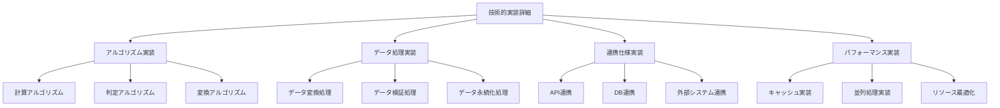

# 技術的実装詳細記載標準

## 1. 概要

本ドキュメントは、kairosプロジェクトにおける技術的実装詳細の記載基準を統一するための標準を定義します。機能設計書間で技術実装詳細の記載有無や深度が大きく異なる課題を解決し、一貫性のある記載レベルを確立します。

### 1.1. 目的
- 技術的実装詳細の記載レベルの統一
- 機能設計書と共通ライブラリ設計書の責務分離明確化
- 実装詳細の記載基準と品質向上

### 1.2. 対象機能
- 全機能設計書における技術的実装詳細記載
- アルゴリズム実装の記載レベル統一
- データ連携仕様の記載標準化

### 1.3. 現状の課題
- **詳細記載**: 位置情報登録機能（アルゴリズム実装例、データ連携仕様）
- **基本記載**: 勤怠情報関連機能（概要レベルの技術説明）
- **記載なし**: 勤怠情報提出先関連機能

## 2. 技術的実装詳細分類体系

### 2.1. 実装詳細カテゴリ



### 2.2. 記載レベル定義

| レベル | 内容 | 記載対象 | 実装詳細度 |
|--------|------|----------|------------|
| **Level A: 概要記載** | 技術仕様の概要と目的 | 全機能設計書 | 目的・概要のみ |
| **Level B: 仕様記載** | 技術仕様の詳細と処理フロー | 主要機能設計書 | 処理フロー・制約条件 |
| **Level C: 実装記載** | 実装可能な詳細コード | 共通ライブラリ設計書 | 実装コード・具体的設定 |

### 2.3. 機能複雑度による分類

| 複雑度 | 判定基準 | 適用レベル | 記載範囲 |
|--------|----------|------------|----------|
| **Simple** | 基本CRUD、単純計算 | Level A | 概要のみ |
| **Standard** | 業務ロジック、データ変換 | Level B | 仕様詳細 |
| **Complex** | アルゴリズム、外部連携 | Level C | 実装詳細 |

## 3. Level A（概要記載）- 全機能共通

### 3.1. 必須記載項目
- **技術概要**: 使用技術と目的の概要
- **処理概要**: 主要な処理の概要説明
- **外部依存**: 外部ライブラリ・サービスへの依存関係

### 3.2. 記載形式
```markdown
## X. 技術的実装詳細

### X.1 技術概要
**使用技術**: [技術スタック概要]
**目的**: [実装目的と背景]

### X.2 処理概要
**主要処理**: [処理の概要説明]
**参照**: [関連ドキュメント・共通ライブラリへの参照]

### X.3 外部依存関係
**依存ライブラリ**: [外部ライブラリ一覧]
**外部サービス**: [連携する外部サービス]
```

### 3.3. 記載例
```markdown
## 5. 技術的実装詳細

### 5.1 技術概要
**使用技術**: REST API、位置情報処理
**目的**: 位置情報の登録と基本的な妥当性検証

### 5.2 処理概要
**主要処理**: 位置情報受信、基本バリデーション、DB保存
**参照**: 共通ライブラリ設計書 4.1節（位置情報バリデーション）

### 5.3 外部依存関係
**依存ライブラリ**: @kairos/common（バリデーション処理）
**外部サービス**: なし
```

## 4. Level B（仕様記載）- 主要機能

### 4.1. 追加記載項目
- **詳細処理フロー**: 処理ステップの詳細
- **技術的制約**: パフォーマンス・リソース制約
- **エラーハンドリング**: 技術的エラーの処理方針
- **データ変換仕様**: データ変換・加工の詳細

### 4.2. 記載形式拡張
```markdown
### X.4 詳細処理フロー
[処理ステップの詳細説明]

### X.5 技術的制約
**パフォーマンス制約**: [応答時間・スループット制約]
**リソース制約**: [メモリ・CPU使用量制約]

### X.6 エラーハンドリング
**技術的エラー**: [システムエラーの処理方針]
**復旧処理**: [エラー復旧の処理フロー]

### X.7 データ変換仕様
**入力データ変換**: [入力データの変換仕様]
**出力データ変換**: [出力データの変換仕様]
```

### 4.3. 記載例
```markdown
### 5.4 詳細処理フロー
1. 位置情報受信・基本妥当性確認
2. 地理的制約チェック（緯度経度範囲）
3. 精度閾値チェック（設定値との比較）
4. データベース保存処理
5. 関連機能への通知処理

### 5.5 技術的制約
**パフォーマンス制約**: 位置情報処理 100ms以内
**リソース制約**: メモリ使用量 10MB以内/リクエスト

### 5.6 エラーハンドリング
**技術的エラー**: DB接続エラー、位置情報精度不足エラー
**復旧処理**: 自動リトライ（3回まで）、エラーログ出力

### 5.7 データ変換仕様
**入力データ変換**: 度分秒形式→十進度数形式変換
**出力データ変換**: 位置情報精度レベルの数値化
```

## 5. Level C（実装記載）- 複雑機能

### 5.1. 実装レベル仕様

#### 5.1.1. アルゴリズム実装コード
```typescript
// 距離計算アルゴリズム実装例
export function calculateDistance(
  lat1: number, lon1: number, 
  lat2: number, lon2: number
): number {
  const R = 6371000; // 地球の半径（メートル）
  const φ1 = lat1 * Math.PI/180;
  const φ2 = lat2 * Math.PI/180;
  const Δφ = (lat2-lat1) * Math.PI/180;
  const Δλ = (lon2-lon1) * Math.PI/180;

  const a = Math.sin(Δφ/2) * Math.sin(Δφ/2) +
          Math.cos(φ1) * Math.cos(φ2) *
          Math.sin(Δλ/2) * Math.sin(Δλ/2);
  const c = 2 * Math.atan2(Math.sqrt(a), Math.sqrt(1-a));

  return R * c;
}
```

#### 5.1.2. データ連携仕様実装
```typescript
// データ連携インターフェース実装
interface LocationDataProcessor {
  validateLocation(data: LocationInput): ValidationResult;
  transformCoordinates(data: LocationInput): LocationData;
  persistLocation(data: LocationData): Promise<SaveResult>;
}

class LocationService implements LocationDataProcessor {
  async validateLocation(data: LocationInput): Promise<ValidationResult> {
    // バリデーション実装
    const errors: ValidationError[] = [];
    
    if (!isValidLatitude(data.latitude)) {
      errors.push(createValidationError('latitude', 'INVALID_RANGE'));
    }
    
    return { isValid: errors.length === 0, errors };
  }
}
```

### 5.2. パフォーマンス実装詳細

#### 5.2.1. キャッシュ実装
```typescript
// 計算結果キャッシュ実装
class DistanceCalculationCache {
  private cache = new Map<string, number>();
  private readonly TTL = 300000; // 5分

  getCachedDistance(key: string): number | null {
    const cached = this.cache.get(key);
    return cached || null;
  }

  setCachedDistance(key: string, distance: number): void {
    this.cache.set(key, distance);
    setTimeout(() => this.cache.delete(key), this.TTL);
  }
}
```

#### 5.2.2. 並列処理実装
```typescript
// バッチ処理の並列実行
async function processBatchLocations(
  locations: LocationInput[]
): Promise<ProcessResult[]> {
  const batchSize = 100;
  const batches = chunkArray(locations, batchSize);
  
  const results = await Promise.allSettled(
    batches.map(batch => processLocationBatch(batch))
  );
  
  return results.flatMap(result => 
    result.status === 'fulfilled' ? result.value : []
  );
}
```

## 6. 機能別記載レベル指針

### 6.1. Level A記載対象（全機能）
- 勤怠情報取得機能
- 勤怠情報提出先取得機能
- ユーザー勤怠設定参照機能
- その他参照系機能

### 6.2. Level B記載対象（主要機能）
- 勤怠情報登録機能
- 勤怠情報更新機能
- 勤怠情報提出先登録・更新機能
- 位置情報登録機能

### 6.3. Level C記載対象（複雑機能・共通ライブラリ）
- 勤務判定アルゴリズム（共通ライブラリ）
- 距離計算アルゴリズム（共通ライブラリ）
- 位置情報処理ライブラリ
- バッチ処理機能

## 7. 機能設計書記載フォーマット

### 7.1. Level A機能の標準フォーマット
```markdown
## X. 技術的実装詳細

### X.1 技術概要
**使用技術**: [技術スタック概要]
**目的**: [実装目的]

### X.2 処理概要
**主要処理**: [処理概要]
**参照**: [関連ドキュメント参照]

### X.3 外部依存関係
**依存ライブラリ**: [外部ライブラリ]
**外部サービス**: [外部サービス]
```

### 7.2. Level B機能の標準フォーマット
```markdown
## X. 技術的実装詳細

### X.1-X.3 [Level A の全項目]

### X.4 詳細処理フロー
[処理ステップの詳細]

### X.5 技術的制約
**パフォーマンス制約**: [制約事項]
**リソース制約**: [リソース制約]

### X.6 エラーハンドリング
**技術的エラー**: [エラー処理方針]
**復旧処理**: [復旧フロー]

### X.7 データ変換仕様
[データ変換の詳細]
```

### 7.3. Level C機能の標準フォーマット
```markdown
## X. 技術的実装詳細

### X.1-X.7 [Level B の全項目]

### X.8 実装コード仕様
[アルゴリズム・処理の実装コード]

### X.9 パフォーマンス実装
[キャッシュ・並列処理等の実装詳細]

### X.10 テスト実装仕様
[単体テスト・統合テストの実装仕様]
```

## 8. 共通ライブラリとの責務分離

### 8.1. 機能設計書の責務
- **Level A/B**: 機能固有の技術仕様
- **共通処理参照**: 共通ライブラリへの参照関係明記
- **統合仕様**: 共通処理との統合方法

### 8.2. 共通ライブラリ設計書の責務
- **Level C**: アルゴリズム・共通処理の実装詳細
- **実装コード**: 再利用可能な実装コード提供
- **テスト仕様**: 共通処理のテスト仕様

### 8.3. 参照関係の記載標準
```markdown
### X.2 処理概要
**主要処理**: [機能固有の処理概要]
**参照**: 共通ライブラリ設計書 3.1節（距離計算アルゴリズム）
**利用関数**: `calculateDistance()`, `validateLocation()`
```

## 9. 実装品質チェックリスト

### 9.1. Level A要件チェック
- [ ] 技術概要が明確に記載されている
- [ ] 処理概要が適切なレベルで説明されている
- [ ] 外部依存関係が漏れなく記載されている
- [ ] 共通ライブラリへの参照が適切である

### 9.2. Level B要件チェック
- [ ] Level A要件がすべて満たされている
- [ ] 詳細処理フローが明確に定義されている
- [ ] 技術的制約が具体的に記載されている
- [ ] エラーハンドリングが適切に定義されている

### 9.3. Level C要件チェック
- [ ] Level B要件がすべて満たされている
- [ ] 実装コードが動作可能な詳細度である
- [ ] パフォーマンス実装が適切に設計されている
- [ ] テスト実装仕様が明確に定義されている

## 10. 段階的適用計画

### 10.1. Phase 1: 基本統一（2週間）
- 全機能設計書のLevel A要件を統一フォーマットに更新
- 共通ライブラリへの参照関係を明確化
- 技術概要の記載標準化

### 10.2. Phase 2: 詳細整理（3週間）
- Level B要件の記載標準化
- 処理フローの詳細化と統一
- エラーハンドリング仕様の統一

### 10.3. Phase 3: 実装統合（2週間）
- Level C要件の実装コード統一
- 共通ライブラリとの整合性確保
- パフォーマンス実装の最適化

### 10.4. Phase 4: 品質保証（1週間）
- 実装品質チェックリストによる検証
- クロスレビューによる一貫性確認
- ドキュメント間の整合性確保

## 11. 関連ドキュメント

- 共通ライブラリ設計書
- 勤務判定アルゴリズム統一標準
- 非機能要件記載標準
- バリデーション仕様記載標準
- API設計統一ガイドライン

---

**作成日**: 2025/06/09  
**バージョン**: 1.0  
**関連課題**: Issue 10.7 - 技術的実装詳細の記載有無と深度の格差
