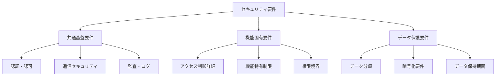

# セキュリティ要件記載標準

## 1. 概要

本ドキュメントは、kairosプロジェクト全体でのセキュリティ要件記載の統一標準を定義します。各機能設計書間で発生していたセキュリティ要件の記載レベル格差を解消し、一貫性のあるセキュリティ仕様を確立します。

### 1.1. 目的
- セキュリティ要件記載レベルの統一
- 共通セキュリティ要件と機能固有要件の明確な分離
- セキュリティ実装の漏れ防止と品質向上

### 1.2. 適用範囲
- 全機能設計書のセキュリティ要件章
- API仕様書のセキュリティ関連記載
- システム間連携のセキュリティ仕様

## 2. セキュリティ要件分類

### 2.1. 要件分類体系



### 2.2. 記載レベル定義

| レベル | 内容 | 記載対象 | 詳細度 |
|--------|------|----------|--------|
| **Level A: 参照方式** | 共通セキュリティ基盤への参照 | 全機能設計書 | 参照先のみ明記 |
| **Level B: 概要記載** | 機能固有要件の概要 | 主要機能設計書 | 要件概要・制限事項 |
| **Level C: 詳細実装** | 実装レベルの詳細仕様 | 特定機能設計書 | 実装例・設定詳細 |

## 3. 共通セキュリティ基盤要件

### 3.1. 認証・認可基盤

#### 3.1.1. 基本認証要件（Level A - 全機能共通）
```markdown
**認証要件**:
- JWT認証: 全APIアクセスでJWTトークンによる認証必須
- トークン有効期限: 30分
- リフレッシュトークン: 7日間有効

**参照**: アクセス権限管理設計書 4.1節（JWT ベース認証・認可）
```

#### 3.1.2. 認可制御要件（Level A - 全機能共通）
```markdown
**認可要件**:
- 最小権限の原則: ユーザーは必要最小限の権限のみ保持
- 役割ベースアクセス制御: User/Manager/Admin/HR/Auditor役割
- スコープ制御: self/subordinates/all のアクセススコープ

**参照**: アクセス権限管理設計書 2節（ユーザー役割定義）
```

### 3.2. 通信セキュリティ

#### 3.2.1. 基本通信要件（Level A - 全機能共通）
```markdown
**通信セキュリティ**:
- HTTPS必須: 全通信でTLS 1.2以上使用
- APIセキュリティ: REST API セキュリティベストプラクティス準拠
- CORS設定: 許可オリジンの明示的設定

**参照**: kairos_要件整理 5.2節（セキュリティ要件）
```

### 3.3. 監査・ログ要件

#### 3.3.1. 基本監査要件（Level A - 全機能共通）
```markdown
**監査・ログ**:
- アクセスログ: 全API呼び出しの記録
- 操作ログ: データ変更操作の記録
- セキュリティログ: 認証失敗・権限エラーの記録

**参照**: コンポーネント分割と責務明確化設計書 8節（セキュリティ責務）
```

## 4. 機能固有セキュリティ要件

### 4.1. データアクセス制御（Level B）

#### 4.1.1. 所有者ベースアクセス制御
```markdown
**アクセス制御**:
- 基本原則: ユーザーは自分のデータのみアクセス可能
- 例外権限: 管理者権限・上司権限による他ユーザーデータアクセス
- 権限チェック: APIレベル・サービスレベルでの二重チェック

**適用機能**: 勤怠情報操作、勤怠設定操作、提出先操作
```

#### 4.1.2. 階層的アクセス制御
```markdown
**階層制御**:
- 上司権限: 配下社員のデータアクセス権限
- 部門制限: 同一部門内のデータアクセス制限
- 人事権限: 人事部門による全社員データアクセス

**適用機能**: 勤怠情報取得・更新・削除
```

### 4.2. データ保護要件（Level B）

#### 4.2.1. 機密データ分類
| データ分類 | 機密レベル | 保護要件 | 適用データ |
|------------|------------|----------|------------|
| **高機密** | レベル3 | 暗号化保存必須 | 位置情報、個人識別情報 |
| **機密** | レベル2 | アクセス制御強化 | 勤怠データ、給与情報 |
| **社内限定** | レベル1 | 基本アクセス制御 | 会社情報、設定データ |

#### 4.2.2. 暗号化要件
```markdown
**暗号化対象**:
- 位置情報: AES-256による暗号化保存
- 個人情報: データベース暗号化・アプリケーション暗号化
- 通信データ: TLS 1.2以上による暗号化

**鍵管理**: 暗号化キーの適切な管理・ローテーション
```

### 4.3. 特殊セキュリティ要件（Level C）

#### 4.3.1. 位置情報プライバシー要件
```markdown
**プライバシー保護**:
- データ保持期間: 収集から最大2年間
- アクセス制限: 本人・権限を付与された者のみ
- 利用目的制限: 勤怠管理目的のみ使用

**実装詳細**:
- 位置データの自動削除バッチ処理
- プライバシーレベル設定による制御
- 同意撤回機能の提供
```

#### 4.3.2. 削除機能セキュリティ要件
```markdown
**削除権限制御**:
- 論理削除: 一般ユーザーは論理削除のみ可能
- 物理削除: 管理者権限でのみ実行可能
- 確認手順: 重要データ削除時の追加確認

**実装例**:
```json
{
  "delete_type": "logical",
  "confirmation_required": true,
  "admin_approval": false,
  "retention_period": "90_days"
}
```

## 5. 機能設計書での記載標準

### 5.1. 標準記載フォーマット

#### 5.1.1. セキュリティ要件章の構成
```markdown
## X. セキュリティ要件

### X.1 共通セキュリティ基盤
**参照**: セキュリティ要件記載標準 3節
- 認証・認可: JWT ベース認証、役割ベースアクセス制御
- 通信セキュリティ: HTTPS必須、CORS設定
- 監査・ログ: アクセスログ、操作ログ、セキュリティログ

### X.2 機能固有セキュリティ要件
#### X.2.1 アクセス制御
[機能固有のアクセス制御要件を記載]

#### X.2.2 データ保護
[機能固有のデータ保護要件を記載]

### X.3 実装考慮事項
[Level C要件がある場合のみ記載]
```

#### 5.1.2. API仕様でのセキュリティ記載
```markdown
### X.X セキュリティ

**認証**: JWT Bearer Token必須
**認可**: `{resource}:{action}:{scope}` 形式の権限チェック
**必要権限**: `attendance:read:self` または `attendance:read:subordinates`

**エラーレスポンス**:
- 401: 認証エラー（無効・期限切れトークン）
- 403: 認可エラー（権限不足）

**参照**: API設計統一ガイドライン 5.2節（エラーレスポンス）
```

### 5.2. 機能別記載レベル指針

#### 5.2.1. Level A記載対象（全機能）
- 勤怠情報取得機能
- 勤怠設定参照機能
- 提出先取得機能
- その他読み取り系機能

#### 5.2.2. Level B記載対象（主要機能）
- 勤怠情報登録・更新機能
- 提出先登録・更新機能
- 位置情報登録機能

#### 5.2.3. Level C記載対象（特殊機能）
- 勤怠情報削除機能
- 提出先削除機能
- 位置情報管理機能

## 6. エラーレスポンス統一基準

### 6.1. セキュリティエラーの統一フォーマット

#### 6.1.1. 認証エラー（401）
```json
{
  "success": false,
  "error": {
    "code": "AUTHENTICATION_ERROR",
    "message": "認証が必要です。有効なJWTトークンを提供してください",
    "details": {
      "token_status": "expired|invalid|missing",
      "auth_endpoint": "/api/v1/auth/login"
    }
  }
}
```

#### 6.1.2. 認可エラー（403）
```json
{
  "success": false,
  "error": {
    "code": "AUTHORIZATION_ERROR",
    "message": "この操作を実行する権限がありません",
    "details": {
      "required_permission": "attendance:read:subordinates",
      "current_permissions": ["attendance:read:self"],
      "resource": "attendance",
      "action": "read",
      "target_user": "user_12345"
    }
  }
}
```

### 6.2. セキュリティログ出力要件

#### 6.2.1. 認証失敗ログ
```json
{
  "timestamp": "2025-06-09T10:30:00Z",
  "level": "WARN",
  "category": "SECURITY",
  "event": "AUTHENTICATION_FAILED",
  "details": {
    "ip_address": "192.168.1.100",
    "user_agent": "Mozilla/5.0...",
    "endpoint": "/api/v1/attendances",
    "token_status": "expired"
  }
}
```

#### 6.2.2. 認可失敗ログ
```json
{
  "timestamp": "2025-06-09T10:31:00Z",
  "level": "WARN", 
  "category": "SECURITY",
  "event": "AUTHORIZATION_FAILED",
  "details": {
    "user_id": "user_12345",
    "required_permission": "attendance:delete:all",
    "current_role": "user",
    "resource": "attendance",
    "target_resource_id": "att_67890"
  }
}
```

## 7. 実装チェックリスト

### 7.1. 共通基盤要件チェック
- [ ] JWT認証ミドルウェアの実装
- [ ] 役割ベースアクセス制御の実装
- [ ] HTTPS通信の強制
- [ ] セキュリティログ出力の実装

### 7.2. 機能固有要件チェック
- [ ] 所有者ベースアクセス制御の実装
- [ ] データ暗号化の実装（必要な機能）
- [ ] プライバシー保護機能の実装（位置情報関連）
- [ ] 削除権限制御の実装（削除機能）

### 7.3. ドキュメント記載チェック
- [ ] セキュリティ要件章の標準フォーマット準拠
- [ ] 参照関係の正確な記載
- [ ] エラーレスポンス仕様の統一
- [ ] 実装考慮事項の適切な記載レベル

## 8. 段階的適用計画

### 8.1. Phase 1: 共通基盤統一
- 全機能設計書のLevel A要件を統一フォーマットに更新
- 参照関係の明確化
- エラーレスポンス形式の統一

### 8.2. Phase 2: 機能固有要件整理
- Level B要件の記載標準化
- 重複記載の削除・共通化
- 機能間の整合性確認

### 8.3. Phase 3: 詳細実装要件統合
- Level C要件の詳細仕様統一
- 実装チェックリストの作成
- セキュリティテスト要件の定義

---

**作成日**: 2025/06/09  
**バージョン**: 1.0  
**関連ドキュメント**:
- アクセス権限管理設計書
- API設計統一ガイドライン
- コンポーネント分割と責務明確化設計書
- kairos_要件整理
