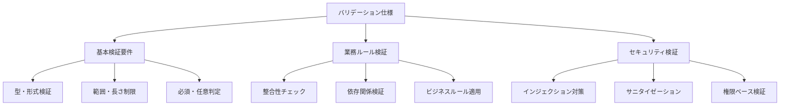

# バリデーション仕様記載標準

## 1. 概要

本ドキュメントは、kairosプロジェクト全体でのバリデーション仕様記載の統一標準を定義します。各機能設計書間で発生していたバリデーション仕様の記載詳細度格差を解消し、一貫性のあるバリデーション仕様を確立します。

### 1.1. 目的
- バリデーション仕様記載レベルの統一
- 入力値検証要件と実装レベル仕様の明確な分離
- バリデーション実装の漏れ防止と品質向上

### 1.2. 適用範囲
- 全機能設計書のバリデーション関連記載
- API仕様書の入力パラメータ検証
- データベース制約仕様との整合性確保

## 2. バリデーション仕様分類

### 2.1. 分類体系



### 2.2. 記載レベル定義

| レベル | 内容 | 記載対象 | 詳細度 |
|--------|------|----------|--------|
| **Level A: 基本記載** | 必須項目・型・基本制約 | 全機能設計書 | 要件レベル |
| **Level B: 標準記載** | 詳細制約・エラーメッセージ | 主要機能設計書 | 仕様レベル |
| **Level C: 詳細記載** | 実装コード・処理フロー | 複雑機能・共通処理 | 実装レベル |

## 3. Level A（基本記載）- 全機能共通

### 3.1. 必須記載項目

#### 3.1.1. パラメータ基本情報
```markdown
| パラメータ名 | 型 | 必須 | 制約 | 説明 |
|-------------|----|----- |------|------|
| companyName | string | ✅ | 1-100文字 | 会社名 |
| latitude | number | ✅ | -90.0～90.0 | 緯度 |
| startTime | string | ✅ | HH:mm形式 | 開始時刻 |
| email | string | ❌ | メール形式 | メールアドレス |
```

#### 3.1.2. エラーレスポンス基本形式
```json
{
  "success": false,
  "error": {
    "code": "VALIDATION_ERROR",
    "message": "入力値に不正な値が含まれています",
    "details": [
      {
        "field": "companyName",
        "message": "会社名は必須項目です",
        "value": null
      }
    ]
  }
}
```

### 3.2. 共通バリデーションルール

#### 3.2.1. 基本データ型
- **文字列**: 最大長制限必須
- **数値**: 範囲制限必須  
- **日時**: 形式指定必須
- **真偽値**: true/false のみ
- **配列**: 要素数制限必須

#### 3.2.2. 位置情報系
- **緯度**: -90.0 ～ 90.0 の数値
- **経度**: -180.0 ～ 180.0 の数値
- **精度**: 0以上の数値（メートル単位）

#### 3.2.3. 時刻・日付系
- **時刻**: HH:mm形式（24時間制）
- **日付**: YYYY-MM-DD形式
- **日時**: ISO8601形式

## 4. Level B（標準記載）- 主要機能

### 4.1. 詳細制約仕様

#### 4.1.1. 文字列バリデーション詳細
```markdown
### 入力値検証

#### 会社名（companyName）
- **型**: string
- **必須**: ✅
- **文字数**: 1-100文字
- **文字制限**: 英数字・ひらがな・カタカナ・漢字・記号（一部）
- **禁止文字**: <, >, &, ", ', \
- **エラーメッセージ**: 
  - 未入力時: "会社名は必須項目です"
  - 文字数超過時: "会社名は100文字以内で入力してください"
  - 禁止文字使用時: "会社名に使用できない文字が含まれています"
```

#### 4.1.2. 数値バリデーション詳細
```markdown
#### 緯度（latitude）
- **型**: number
- **必須**: ✅
- **範囲**: -90.0 ～ 90.0
- **精度**: 小数点以下6桁まで
- **境界値処理**: -90.0, 90.0 を含む
- **エラーメッセージ**:
  - 未入力時: "緯度は必須項目です"
  - 範囲外時: "緯度は-90.0から90.0の範囲で入力してください"
  - 型不正時: "緯度は数値で入力してください"
```

### 4.2. 業務ルールバリデーション

#### 4.2.1. 整合性チェック
```markdown
#### 時刻整合性チェック
- **検証内容**: 開始時刻 < 終了時刻
- **対象フィールド**: regulationStartTime, regulationEndTime
- **エラー条件**: startTime >= endTime
- **エラーメッセージ**: "開始時刻は終了時刻より前に設定してください"

#### 日付整合性チェック
- **検証内容**: 開始日 <= 終了日
- **対象フィールド**: effectiveFrom, effectiveTo
- **エラー条件**: fromDate > toDate
- **エラーメッセージ**: "開始日は終了日以前に設定してください"
```

#### 4.2.2. 重複チェック
```markdown
#### 同一日付重複チェック
- **検証内容**: details配列内の日付重複
- **対象フィールド**: details[].date
- **エラー条件**: 同一日付が複数存在
- **エラーメッセージ**: "同一日付の勤怠情報が重複しています"
```

### 4.3. エラーハンドリング標準

#### 4.3.1. エラーレスポンス詳細形式
```json
{
  "success": false,
  "error": {
    "code": "VALIDATION_ERROR",
    "message": "入力データに不正な値が含まれています",
    "details": [
      {
        "field": "companyName",
        "message": "会社名は1文字以上100文字以内で入力してください",
        "value": "",
        "constraint": {
          "type": "length",
          "min": 1,
          "max": 100
        }
      },
      {
        "field": "regulationStartTime",
        "message": "規定勤務開始時刻は終了時刻より前に設定してください",
        "value": "18:00",
        "relatedField": "regulationEndTime",
        "relatedValue": "09:00"
      }
    ]
  }
}
```

## 5. Level C（詳細記載）- 複雑機能

### 5.1. 実装レベル仕様

#### 5.1.1. バリデーション関数実装例
```typescript
const validateCompanyData = (data: CompanyUpdateData) => {
  const errors: ValidationError[] = [];
  
  // 必須項目チェック
  if (!data.companyName || data.companyName.trim() === '') {
    errors.push({
      field: 'companyName',
      message: '会社名は必須項目です',
      code: 'REQUIRED_FIELD'
    });
  }
  
  // 文字数制限チェック
  if (data.companyName && data.companyName.length > 100) {
    errors.push({
      field: 'companyName',
      message: '会社名は100文字以内で入力してください',
      code: 'LENGTH_EXCEEDED',
      constraint: { max: 100, actual: data.companyName.length }
    });
  }
  
  // 禁止文字チェック
  const forbiddenChars = /<|>|&|"|'|\\/g;
  if (data.companyName && forbiddenChars.test(data.companyName)) {
    errors.push({
      field: 'companyName',
      message: '会社名に使用できない文字が含まれています',
      code: 'INVALID_CHARACTERS'
    });
  }
  
  // 位置情報検証
  if (!isValidLocation(data.location)) {
    errors.push(...validateLocation(data.location));
  }
  
  // 時刻整合性検証
  if (data.regulationStartTime >= data.regulationEndTime) {
    errors.push({
      field: 'regulationStartTime',
      message: '規定勤務開始時刻は終了時刻より前に設定してください',
      code: 'TIME_INCONSISTENCY',
      relatedField: 'regulationEndTime'
    });
  }
  
  if (errors.length > 0) {
    throw new ValidationError('入力データに不正な値が含まれています', errors);
  }
};
```

#### 5.1.2. 共通バリデーション関数
```typescript
// 位置情報バリデーション
const validateLocation = (location: LocationData) => {
  const errors: ValidationError[] = [];
  
  if (!isValidLatitude(location.latitude)) {
    errors.push({
      field: 'location.latitude',
      message: '緯度は-90.0から90.0の範囲で入力してください',
      code: 'LATITUDE_OUT_OF_RANGE',
      constraint: { min: -90.0, max: 90.0 }
    });
  }
  
  if (!isValidLongitude(location.longitude)) {
    errors.push({
      field: 'location.longitude',
      message: '経度は-180.0から180.0の範囲で入力してください',
      code: 'LONGITUDE_OUT_OF_RANGE',
      constraint: { min: -180.0, max: 180.0 }
    });
  }
  
  return errors;
};

// 時刻形式バリデーション
const validateTimeFormat = (time: string, fieldName: string) => {
  const timePattern = /^([01]?[0-9]|2[0-3]):[0-5][0-9]$/;
  
  if (!timePattern.test(time)) {
    return {
      field: fieldName,
      message: '時刻はHH:mm形式で入力してください',
      code: 'INVALID_TIME_FORMAT',
      pattern: 'HH:mm'
    };
  }
  
  return null;
};
```

### 5.2. パフォーマンス考慮事項

#### 5.2.1. バリデーション実行順序
```markdown
**最適化順序**:
1. 型チェック（最軽量）
2. 必須項目チェック
3. 範囲・形式チェック
4. 業務ルールチェック（最重）

**早期リターン**: 基本チェックで失敗した場合、業務ルールチェックを省略
```

#### 5.2.2. 大量データ処理
```typescript
// バッチ処理用バリデーション
const validateBatchData = (dataArray: AttendanceData[]) => {
  const batchErrors: BatchValidationError[] = [];
  
  // 配列サイズチェック
  if (dataArray.length > 1000) {
    throw new ValidationError('一度に処理できるデータは1000件までです');
  }
  
  // 並列バリデーション（CPU集約的でない場合）
  dataArray.forEach((data, index) => {
    try {
      validateAttendanceData(data);
    } catch (error) {
      batchErrors.push({
        index,
        data,
        errors: error.details
      });
    }
  });
  
  return batchErrors;
};
```

## 6. 機能設計書記載フォーマット

### 6.1. Level A機能の標準フォーマット

```markdown
## X. 入力値検証

### X.1 パラメータ仕様
[表形式での基本制約記載]

### X.2 エラーレスポンス
**参照**: API設計統一ガイドライン 5.2節
- 400 Bad Request: バリデーションエラー
- 422 Unprocessable Entity: 業務ルールエラー
```

### 6.2. Level B機能の標準フォーマット

```markdown
## X. 入力値検証

### X.1 パラメータ詳細仕様
[詳細制約とエラーメッセージ]

### X.2 業務ルール検証
[整合性チェック・重複チェック等]

### X.3 エラーハンドリング
[詳細エラーレスポンス形式]

### X.4 バリデーション処理フロー
[検証手順の概要]
```

### 6.3. Level C機能の標準フォーマット

```markdown
## X. 入力値検証

### X.1-X.4 [Level B の全項目]

### X.5 実装仕様
[バリデーション関数の実装コード]

### X.6 パフォーマンス考慮事項
[処理順序・最適化方針]

### X.7 テスト仕様
[バリデーションテストケース]
```

## 7. 機能別記載レベル指針

### 7.1. Level A記載対象（全機能）
- 勤怠情報取得機能
- 勤怠設定参照機能
- 提出先取得機能
- その他参照系機能

### 7.2. Level B記載対象（主要機能）
- 勤怠情報登録・更新機能
- 提出先登録・更新機能
- 位置情報登録機能
- ユーザー情報管理機能

### 7.3. Level C記載対象（複雑機能）
- 勤怠情報削除機能（物理・論理削除）
- 提出先削除機能（関連データ処理）
- バッチ処理機能
- データインポート機能

## 8. エラーコード体系

### 8.1. バリデーション関連エラーコード

| エラーコード | HTTPステータス | 説明 | 用途 |
|-------------|---------------|------|------|
| VALIDATION_ERROR | 400 | 基本バリデーションエラー | 型・形式・制約違反 |
| BUSINESS_RULE_ERROR | 422 | 業務ルールエラー | 整合性・依存関係違反 |
| REQUIRED_FIELD | 400 | 必須項目未入力 | 必須フィールドの不足 |
| LENGTH_EXCEEDED | 400 | 文字数超過 | 最大長制限違反 |
| OUT_OF_RANGE | 400 | 範囲外値 | 数値範囲制限違反 |
| INVALID_FORMAT | 400 | 形式不正 | 日時・メール等の形式違反 |
| DUPLICATE_VALUE | 422 | 重複値エラー | 一意制約違反 |
| INCONSISTENT_DATA | 422 | 整合性エラー | 関連データの整合性違反 |

### 8.2. セキュリティ関連エラーコード

| エラーコード | HTTPステータス | 説明 | 用途 |
|-------------|---------------|------|------|
| INVALID_CHARACTERS | 400 | 禁止文字使用 | SQLインジェクション等対策 |
| SANITIZATION_ERROR | 400 | サニタイゼーションエラー | XSS対策 |
| SIZE_LIMIT_EXCEEDED | 413 | データサイズ超過 | DoS攻撃対策 |

## 9. 実装チェックリスト

### 9.1. 基本要件チェック
- [ ] 全パラメータの型・制約が明記されている
- [ ] 必須・任意の区別が明確である
- [ ] エラーメッセージが統一フォーマットに準拠
- [ ] セキュリティ考慮事項が適切に記載

### 9.2. 詳細要件チェック
- [ ] 業務ルール検証が適切に定義されている
- [ ] エラーレスポンスが詳細化されている
- [ ] バリデーション処理フローが明確である
- [ ] パフォーマンス考慮事項が記載されている

### 9.3. 実装レベルチェック
- [ ] バリデーション関数の実装例が提供されている
- [ ] 共通処理との整合性が確保されている
- [ ] テストケースが適切に定義されている
- [ ] ドキュメントと実装の一致性が確認されている

## 10. 段階的適用計画

### 10.1. Phase 1: 基本統一（2週間）
- 全機能設計書のLevel A要件を統一フォーマットに更新
- エラーレスポンス形式の統一
- パラメータ記載形式の標準化

### 10.2. Phase 2: 詳細整理（3週間）
- Level B要件の記載標準化
- 業務ルール検証の詳細化
- エラーハンドリングの詳細仕様統一

### 10.3. Phase 3: 実装統合（2週間）
- Level C要件の実装コード統一
- 共通ライブラリとの整合性確保
- テスト要件の統一

---

**作成日**: 2025/06/09  
**バージョン**: 1.0  
**関連ドキュメント**:
- API設計統一ガイドライン
- 共通ライブラリ設計書
- セキュリティ要件記載標準
- 非機能要件記載標準
