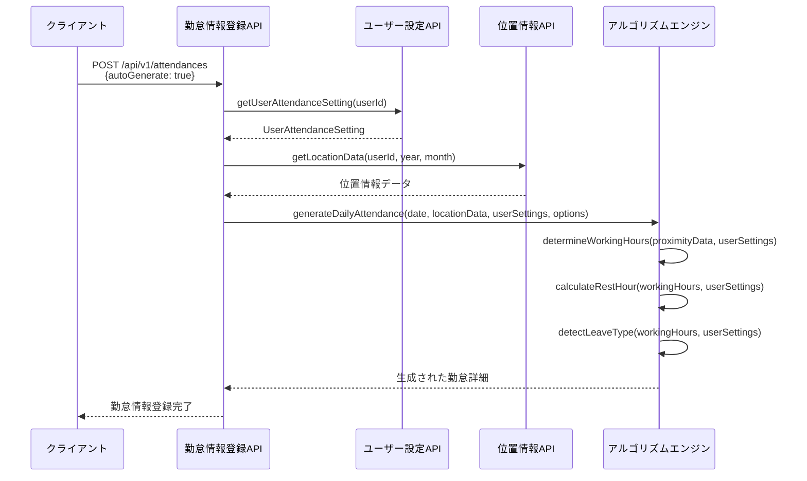
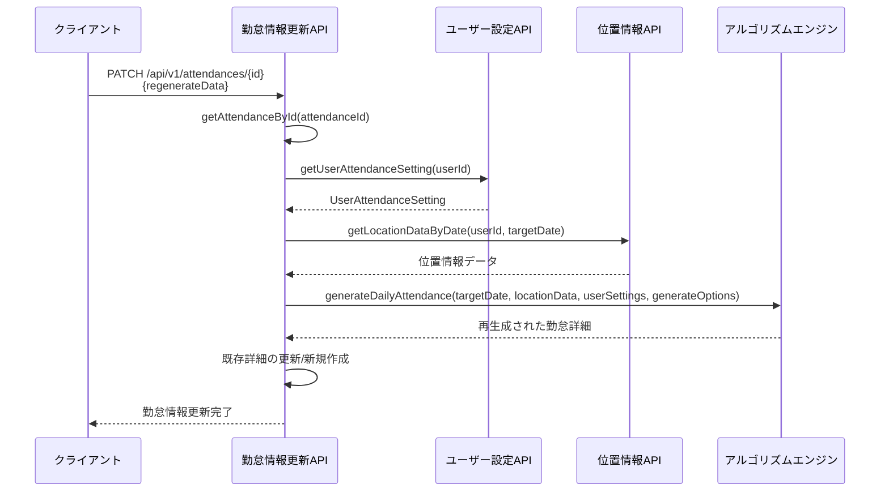
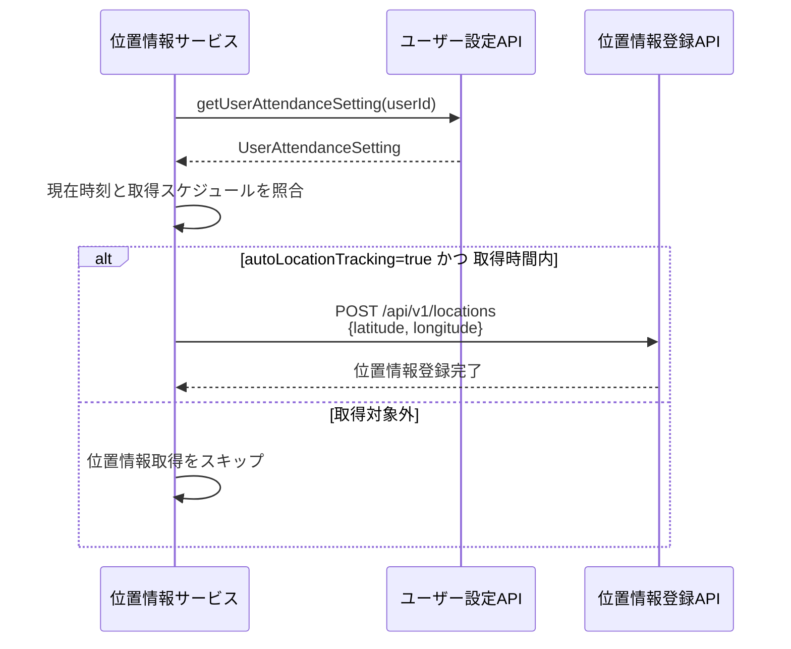

# ユーザー勤怠設定参照仕様 機能設計

## 1. 概要

このドキュメントは、kairosプロジェクトにおけるUserAttendanceSettingモデルの参照方法と、各機能間でのユーザー勤怠設定データの連携フローを明確化するものです。課題3.1「ユーザーの勤怠設定の参照不足」の対応として作成されました。

## 2. UserAttendanceSettingモデル定義

### 2.1 データ構造
```typescript
interface UserAttendanceSetting {
  id: string;                          // UUID
  userId: string;                      // ユーザーID（UUID）
  companyId: string;                   // 勤怠情報提出先ID（UUID）※保留機能
  isDefault: boolean;                  // デフォルトの提出先かどうか
  autoLocationTracking: boolean;       // 自動位置情報取得の有効/無効
  trackingSchedule: {                  // 位置情報取得スケジュール
    startTime: string;                 // 開始時刻（HH:mm形式）
    endTime: string;                   // 終了時刻（HH:mm形式）
    daysOfWeek: number[];              // 対象曜日（0:日曜～6:土曜）
  };
  notificationSettings: {              // 通知設定
    reminderEnabled: boolean;          // リマインダー有効フラグ
    reminderTime: string;              // リマインダー時刻（HH:mm形式）
    summaryEnabled: boolean;           // サマリ通知有効フラグ
  };
  // 勤怠自動生成で使用される規定時間設定
  regulationStartTime: string;         // 規定勤務開始時刻（HH:mm形式）
  regulationEndTime: string;           // 規定勤務終了時刻（HH:mm形式）
  regulationRestStartTime: string;     // 規定休憩開始時刻（HH:mm形式）
  regulationRestEndTime: string;       // 規定休憩終了時刻（HH:mm形式）
  regulationWorkHours: number;         // 規定労働時間（時間）
  createdAt: string;                   // 作成日時（ISO 8601形式）
  updatedAt: string;                   // 更新日時（ISO 8601形式）
}
```

### 2.2 取得API仕様
```
GET /api/v1/users/{userId}/attendance-settings
```

**レスポンス例**：
```json
{
  "success": true,
  "setting": {
    "id": "550e8400-e29b-41d4-a716-446655440010",
    "userId": "550e8400-e29b-41d4-a716-446655441234",
    "companyId": "550e8400-e29b-41d4-a716-446655442000",
    "isDefault": true,
    "autoLocationTracking": true,
    "trackingSchedule": {
      "startTime": "08:30",
      "endTime": "18:30",
      "daysOfWeek": [1, 2, 3, 4, 5]
    },
    "notificationSettings": {
      "reminderEnabled": true,
      "reminderTime": "08:00",
      "summaryEnabled": true
    },
    "regulationStartTime": "09:00",
    "regulationEndTime": "18:00",
    "regulationRestStartTime": "12:00",
    "regulationRestEndTime": "13:00",
    "regulationWorkHours": 8,
    "createdAt": "2025-06-01T10:00:00+09:00",
    "updatedAt": "2025-06-08T14:30:00+09:00"
  }
}
```

## 3. 機能別UserAttendanceSetting参照仕様

### 3.1 勤怠情報登録機能での参照

#### 3.1.1 参照タイミング
- 自動勤怠情報作成時（`autoGenerate: true`）
- アルゴリズム関数での規定時間取得時

#### 3.1.2 参照データ項目
| 項目 | 用途 | 必須 |
|------|------|------|
| regulationStartTime | 規定勤務開始時刻の取得 | はい |
| regulationEndTime | 規定勤務終了時刻の取得 | はい |
| regulationRestStartTime | 休暇判定での休憩開始時刻 | はい |
| regulationRestEndTime | 休暇判定での休憩終了時刻 | はい |
| regulationWorkHours | 勤務時間計算のベース | はい |
| autoLocationTracking | 位置情報使用可否の判定 | いいえ |

#### 3.1.3 参照メソッド
```javascript
// 勤怠情報登録機能内での使用例
function generateAttendanceFromLocation(userId, year, month, options) {
  // ユーザー勤怠設定を取得
  const userSettings = getUserAttendanceSetting(userId);
  
  // 設定から規定時間を取得して使用
  const workingHours = determineWorkingHours(proximityData, userSettings);
  const restHour = calculateRestHour(workingHours, userSettings);
  const leave = detectLeaveType(workingHours, userSettings);
}
```

### 3.2 勤怠情報更新機能での参照

#### 3.2.1 参照タイミング
- 自動再生成更新時（`regenerateData.generateOptions`使用時）
  - **参照先**: [generateOptions統一仕様.md](./generateOptions統一仕様.md)
- 勤怠詳細の再計算時

#### 3.2.2 参照データ項目
| 項目 | 用途 | 必須 |
|------|------|------|
| regulationStartTime | 再生成時の規定開始時刻 | はい |
| regulationEndTime | 再生成時の規定終了時刻 | はい |
| regulationRestStartTime | 再生成時の休暇判定 | はい |
| regulationRestEndTime | 再生成時の休暇判定 | はい |
| regulationWorkHours | 再計算時のベース労働時間 | はい |

#### 3.2.3 参照メソッド
```javascript
// 勤怠情報更新機能内での使用例
function updateAttendanceRegenerate(attendanceId, regenerateData) {
  const existingAttendance = getAttendanceById(attendanceId);
  
  // ユーザー勤怠設定を取得
  const userSettings = getUserAttendanceSetting(existingAttendance.userId);
  
  // 再生成処理で設定を使用
  // generateOptionsの詳細については generateOptions統一仕様.md を参照
  const newDetail = generateDailyAttendance(
    new Date(targetDate),
    locationData,
    userSettings,
    regenerateData.generateOptions
  );
}
```

### 3.3 勤怠情報取得機能での参照

#### 3.3.1 参照タイミング
- 自動作成フラグが有効で既存データがない場合
- 勤務判定アルゴリズム実行時

#### 3.3.2 参照データ項目
| 項目 | 用途 | 必須 |
|------|------|------|
| regulationStartTime | デフォルト勤務開始時刻 | はい |
| regulationEndTime | デフォルト勤務終了時刻 | はい |
| regulationWorkHours | 勤務時間の基準値 | はい |

#### 3.3.3 参照メソッド
```javascript
// 勤怠情報取得機能内での使用例
function determineWorkHoursFromProximity(proximityPeriods, userSettings) {
  // 位置情報がない場合のフォールバック処理
  if (proximityPeriods.length === 0) {
    return {
      start: userSettings.regulationStartTime,
      end: userSettings.regulationEndTime
    };
  }
  // 位置情報ベースの判定処理...
}
```

### 3.4 位置情報登録機能での参照

#### 3.4.1 参照タイミング
- 位置情報取得スケジュールの確認時
- 自動追跡有効性の判定時

#### 3.4.2 参照データ項目
| 項目 | 用途 | 必須 |
|------|------|------|
| autoLocationTracking | 位置情報自動取得の有効性判定 | はい |
| trackingSchedule.startTime | 取得開始時刻の確認 | はい |
| trackingSchedule.endTime | 取得終了時刻の確認 | はい |
| trackingSchedule.daysOfWeek | 取得対象曜日の確認 | はい |

## 4. 機能間連携フロー

### 4.1 勤怠情報自動生成における連携フロー



### 4.2 勤怠情報更新における連携フロー



### 4.3 位置情報収集における連携フロー



## 5. エラーハンドリング

### 5.1 UserAttendanceSetting取得エラー

#### 5.1.1 設定データ未存在エラー
```json
{
  "success": false,
  "error": {
    "code": "USER_SETTING_NOT_FOUND",
    "message": "ユーザーの勤怠設定が見つかりません",
    "details": {
      "userId": "550e8400-e29b-41d4-a716-446655441234",
      "suggestion": "ユーザー設定の初期化が必要です"
    }
  }
}
```

#### 5.1.2 必須設定項目不足エラー
```json
{
  "success": false,
  "error": {
    "code": "INCOMPLETE_USER_SETTING",
    "message": "勤怠設定に必須項目が不足しています",
    "details": {
      "missingFields": ["regulationStartTime", "regulationEndTime"],
      "suggestion": "管理者にユーザー設定の完成を依頼してください"
    }
  }
}
```

### 5.2 設定値検証エラー

#### 5.2.1 時刻形式エラー
```json
{
  "success": false,
  "error": {
    "code": "INVALID_TIME_FORMAT",
    "message": "時刻の形式が不正です",
    "details": {
      "field": "regulationStartTime",
      "value": "25:00",
      "expectedFormat": "HH:mm (00:00-23:59)"
    }
  }
}
```

#### 5.2.2 論理矛盾エラー
```json
{
  "success": false,
  "error": {
    "code": "LOGICAL_INCONSISTENCY",
    "message": "設定値に論理的矛盾があります",
    "details": {
      "issue": "勤務開始時刻が終了時刻より遅い",
      "startTime": "18:00",
      "endTime": "09:00"
    }
  }
}
```

## 6. パフォーマンス要件

### 6.1 UserAttendanceSetting取得性能
- 単一ユーザー設定取得：100ms以内
- 設定キャッシュ有効期間：30分
- キャッシュミス時の取得：500ms以内

### 6.2 機能間連携性能
- 勤怠情報自動生成における設定参照：全体処理時間の10%以内
- 更新処理における設定参照：50ms以内
- 位置情報取得判定における設定参照：10ms以内

## 7. セキュリティ要件

### 7.1 アクセス制御
- **本人のみアクセス**: ユーザーは自分の勤怠設定のみ参照可能
- **管理者権限**: システム管理者は全ユーザーの設定を参照可能
- **API認証**: 全ての設定API呼び出しでJWT認証が必須

### 7.2 データ保護
- 設定データの暗号化保存
- 設定変更時の監査ログ記録
- 機密性の高い設定項目（通知設定等）の適切な権限管理

## 8. 運用考慮事項

### 8.1 設定の初期化
- 新規ユーザー登録時のデフォルト設定自動作成
- 既存ユーザーへの設定マイグレーション手順
- 設定不備時の自動復旧機能

### 8.2 設定変更の影響範囲
- 勤怠計算への即座反映
- 既存勤怠データへの遡及適用ポリシー
- 設定変更時のユーザー通知

## 9. 今後の拡張性

### 9.1 複数設定パターン対応
- ユーザー毎の複数勤怠設定の管理
- 期間限定設定の適用機能
- 設定プリセットの管理機能

### 9.2 高度な自動化
- AI学習による個人最適化設定
- 勤務パターン分析による設定提案
- 動的設定調整機能

---

## 変更履歴
| 日付 | 変更者 | 変更内容 |
|-----|-------|---------|
| 2025/06/08 | カーン | 初版作成 - UserAttendanceSetting参照仕様と機能間連携フローの明確化 |

※このドキュメントは課題3.1「ユーザーの勤怠設定の参照不足」の対応として作成されました。
