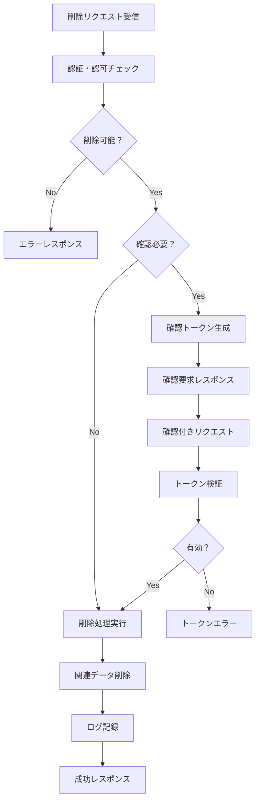

# 勤怠情報削除機能 機能設計

## 1. 機能概要

勤怠情報削除機能は、既存の月次勤怠情報を安全に削除するためのAPIです。この機能は勤怠情報全体の削除、特定日の勤怠詳細の削除、および論理削除による無効化をサポートします。データの整合性を保ちながら、誤操作防止機能も提供します。

## 2. API仕様

### 2.1 エンドポイント
```
DELETE /api/v1/attendances/{attendanceId}
DELETE /api/v1/attendances/{attendanceId}/details/{detailId}
PATCH /api/v1/attendances/{attendanceId}/disable
```

### 2.2 リクエスト形式

#### 2.2.1 勤怠情報全体削除リクエスト
```
DELETE /api/v1/attendances/{attendanceId}
```

**リクエストボディ（確認用）**
```json
{
  "deleteType": "hard",
  "confirmationToken": "delete-confirm-550e8400e29b41d4a716446655440000",
  "reason": "誤って作成した2025年6月分勤怠情報の削除"
}
```

#### 2.2.2 勤怠詳細削除リクエスト
```
DELETE /api/v1/attendances/{attendanceId}/details/{detailId}
```

**リクエストボディ（確認用）**
```json
{
  "deleteType": "hard",
  "confirmationToken": "detail-delete-confirm-550e8400e29b41d4a716446655440001",
  "reason": "重複した勤怠記録の削除"
}
```

#### 2.2.3 勤怠情報無効化リクエスト（論理削除）
```
PATCH /api/v1/attendances/{attendanceId}/disable
```

**リクエストボディ**
```json
{
  "disableType": "soft",
  "reason": "承認後の勤怠情報のため物理削除不可",
  "disableDetails": [
    {
      "detailId": "550e8400-e29b-41d4-a716-446655440002",
      "reason": "該当日は休日だった"
    }
  ]
}
```

### 2.3 レスポンス形式

#### 2.3.1 削除成功レスポンス
```json
{
  "success": true,
  "message": "勤怠情報が正常に削除されました",
  "data": {
    "deletedId": "550e8400-e29b-41d4-a716-446655440000",
    "deleteType": "hard",
    "deletedAt": "2025-01-27T14:30:00+09:00",
    "deletedCount": {
      "attendanceRecords": 1,
      "detailRecords": 30
    }
  }
}
```

#### 2.3.2 削除確認必要レスポンス
```json
{
  "success": false,
  "requireConfirmation": true,
  "message": "削除には確認が必要です",
  "data": {
    "confirmationToken": "delete-confirm-550e8400e29b41d4a716446655440000",
    "expiresAt": "2025-01-27T15:00:00+09:00",
    "warningMessages": [
      "この勤怠情報は既に承認済みです",
      "削除すると30日分の勤怠記録が失われます"
    ],
    "affectedData": {
      "attendanceId": "550e8400-e29b-41d4-a716-446655440000",
      "year": 2025,
      "month": 6,
      "detailCount": 30,
      "status": "approved"
    }
  }
}
```

#### 2.3.3 無効化成功レスポンス
```json
{
  "success": true,
  "message": "勤怠情報が無効化されました",
  "data": {
    "attendanceId": "550e8400-e29b-41d4-a716-446655440000",
    "disabledAt": "2025-01-27T14:30:00+09:00",
    "disabledCount": {
      "attendanceRecords": 1,
      "detailRecords": 2
    },
    "status": "disabled"
  }
}
```

## 3. 削除パターン別仕様

### 3.1 物理削除（Hard Delete）

#### 3.1.1 勤怠情報全体削除
- **対象**: 指定された月次勤怠情報とそれに紐づく全ての日別詳細
- **条件**: 
  - 勤怠情報の状態が「下書き」または「作成中」
  - 提出期限前
  - 承認されていない
- **処理**:
  1. 勤怠詳細レコードの削除
  2. 勤怠情報レコードの削除
  3. 関連する添付ファイルの削除

#### 3.1.2 勤怠詳細削除
- **対象**: 指定された日の勤怠詳細レコード
- **条件**:
  - 該当勤怠情報が編集可能状態
  - 該当日が承認されていない
- **処理**:
  1. 勤怠詳細レコードの削除
  2. 月次集計の再計算
  3. 勤怠情報の最終更新日時の更新

### 3.2 論理削除（Soft Delete）

#### 3.2.1 勤怠情報無効化
- **対象**: 指定された月次勤怠情報
- **条件**: 承認済みまたは提出済みの勤怠情報
- **処理**:
  1. deleted_atフィールドに削除日時を設定
  2. statusを「disabled」に変更
  3. 操作ログの記録

#### 3.2.2 勤怠詳細無効化
- **対象**: 指定された日の勤怠詳細
- **条件**: 承認済みの勤怠詳細
- **処理**:
  1. deleted_atフィールドに削除日時を設定
  2. 月次集計の再計算（無効化レコードを除外）

## 4. セキュリティ要件

### 4.1 共通セキュリティ基盤
**参照**: セキュリティ要件記載標準 3節
- 認証・認可: JWT ベース認証、役割ベースアクセス制御
- 通信セキュリティ: HTTPS必須、CORS設定
- 監査・ログ: アクセスログ、操作ログ、セキュリティログ

### 4.2 機能固有セキュリティ要件

#### 4.2.1 アクセス制御
**所有者ベースアクセス制御**:
- 基本原則: ユーザーは自分のデータのみアクセス可能
- 例外権限: 管理者権限・上司権限による他ユーザーデータアクセス
- 権限チェック: APIレベル・サービスレベルでの二重チェック

**階層的アクセス制御**:
- 上司権限: 配下社員のデータアクセス権限
- 部門制限: 同一部門内のデータアクセス制限
- 人事権限: 人事部門による全社員データアクセス

#### 4.2.2 特殊削除セキュリティ要件
**削除権限制御**:
- 論理削除: 一般ユーザーは論理削除のみ可能
- 物理削除: 管理者権限でのみ実行可能
- 確認手順: 重要データ削除時の追加確認

**削除権限の詳細制御**:
```json
{
  "deletePermissions": {
    "ownAttendance": {
      "draft": "allowed",
      "submitted": "soft_delete_only",
      "approved": "disabled"
    },
    "adminDelete": {
      "anyStatus": "allowed_with_confirmation",
      "requiresApproval": true
    }
  }
}
```

#### 4.2.3 確認手順
1. **削除確認トークン生成**: 削除実行前に確認トークンを発行
2. **有効期限**: 確認トークンは30分間有効
3. **警告表示**: 削除対象データの詳細と影響範囲を表示
4. **理由記録**: 削除理由の記録を必須とする

## 5. エラーハンドリング

### 5.1 エラーコード一覧

| エラーコード | HTTPステータス | 説明 | 対応方法 |
|------------|---------------|------|---------|
| DELETE_001 | 404 | 削除対象の勤怠情報が見つからない | 正しいIDを確認 |
| DELETE_002 | 403 | 削除権限がない | 権限確認または管理者に連絡 |
| DELETE_003 | 400 | 削除不可能な状態（承認済み等） | 論理削除または管理者に相談 |
| DELETE_004 | 400 | 確認トークンが無効または期限切れ | 新しい確認トークンを取得 |
| DELETE_005 | 409 | 他のユーザーが同時編集中 | 時間をおいて再試行 |
| DELETE_006 | 400 | 必須パラメータ不足（理由等） | 必要な情報を追加 |
| DELETE_007 | 500 | データベース削除エラー | システム管理者に連絡 |

### 5.2 エラーレスポンス例

#### 5.2.1 削除権限なしエラー
```json
{
  "success": false,
  "error": {
    "code": "DELETE_002",
    "message": "指定された勤怠情報を削除する権限がありません",
    "details": {
      "attendanceId": "550e8400-e29b-41d4-a716-446655440000",
      "status": "approved",
      "reason": "承認済みの勤怠情報は一般ユーザーでは削除できません"
    }
  }
}
```

#### 5.2.2 削除不可能状態エラー
```json
{
  "success": false,
  "error": {
    "code": "DELETE_003",
    "message": "現在の状態では削除できません",
    "details": {
      "currentStatus": "approved",
      "allowedOperations": ["soft_delete"],
      "suggestion": "論理削除(無効化)をご利用ください"
    }
  }
}
```

## 6. パフォーマンス要件

### 6.1 レスポンス時間
- **勤怠情報削除**: 3秒以内
- **勤怠詳細削除**: 1秒以内
- **無効化処理**: 2秒以内

### 6.2 同時実行制御
- **楽観的ロック**: バージョン番号による競合検出
- **削除中フラグ**: 削除処理中の重複実行防止
- **トランザクション**: ACID特性を保証した削除処理

## 7. 監査・ログ

### 7.1 削除ログの記録
```json
{
  "operationType": "delete",
  "attendanceId": "550e8400-e29b-41d4-a716-446655440000",
  "deleteType": "hard",
  "deletedBy": "user123",
  "deletedAt": "2025-01-27T14:30:00+09:00",
  "reason": "誤って作成した勤怠情報の削除",
  "affectedRecords": {
    "attendanceRecords": 1,
    "detailRecords": 30
  },
  "beforeData": {
    "year": 2025,
    "month": 6,
    "status": "draft"
  }
}
```

### 7.2 復旧用データ保持
- **論理削除**: 元データは保持される
- **物理削除**: 削除前データをバックアップテーブルに保存（30日間）
- **管理者復旧**: 特別な権限での復旧機能

## 8. 処理フロー

### 8.1 勤怠情報削除フロー



### 8.2 削除判定ロジック

```python
def can_delete_attendance(attendance, user):
    """削除可能性判定"""
    # 所有者チェック
    if attendance.user_id != user.id and not user.is_admin:
        return False, "DELETE_002"
    
    # 状態チェック
    if attendance.status in ["submitted", "approved"]:
        if user.is_admin:
            return True, "confirmation_required"
        else:
            return False, "DELETE_003"
    
    # 期限チェック
    if attendance.submission_deadline < datetime.now():
        return True, "confirmation_required"
    
    return True, "direct_delete"
```

## 9. テスト戦略

### 9.1 単体テスト
- **削除権限チェック**: 各権限レベルでの削除可否
- **状態チェック**: 勤怠情報の状態別削除可否
- **確認トークン**: トークン生成・検証・期限切れ
- **エラーハンドリング**: 各エラーケースの適切な処理

### 9.2 結合テスト
- **削除フロー**: 確認から削除完了までの一連の流れ
- **データ整合性**: 削除後のデータベース状態確認
- **ログ記録**: 操作ログの正確な記録
- **権限連携**: 認証・認可システムとの連携

### 9.3 E2Eテスト
- **UI削除操作**: フロントエンドからの削除操作
- **確認ダイアログ**: 削除確認画面の表示・操作
- **エラー表示**: エラー時の適切なメッセージ表示
- **削除結果反映**: 削除後の画面更新

## 10. 依存関係

### 10.1 内部システム依存
- **認証サービス**: ユーザー認証・権限確認
- **勤怠管理サービス**: 勤怠データ取得・更新
- **ログサービス**: 操作ログ記録
- **通知サービス**: 削除完了通知

### 10.2 外部システム依存
- **データベース**: PostgreSQL（トランザクション処理）
- **ファイルストレージ**: 添付ファイル削除
- **監査システム**: 削除ログの外部記録

## 11. 運用考慮事項

### 11.1 データ保護
- **誤削除防止**: 確認手順の必須化
- **復旧手順**: 削除データの復旧方法
- **バックアップ**: 定期的なデータバックアップ

### 11.2 監視項目
- **削除頻度**: 異常な削除操作の検出
- **エラー率**: 削除エラーの監視
- **パフォーマンス**: 削除処理時間の監視

### 11.3 メンテナンス
- **削除ログ**: 古いログの定期削除
- **バックアップデータ**: 保持期間経過後の削除
- **確認トークン**: 期限切れトークンのクリーンアップ

## 12. 今後の拡張計画

### 12.1 機能拡張
- **一括削除**: 複数月の勤怠情報同時削除
- **条件削除**: 条件を指定した勤怠詳細の一括削除
- **スケジュール削除**: 指定日時での自動削除

### 12.2 運用改善
- **削除理由テンプレート**: よく使用される削除理由の定型化
- **削除承認フロー**: 管理者承認を要する削除の仕組み
- **削除統計**: 削除操作の分析・レポート機能
