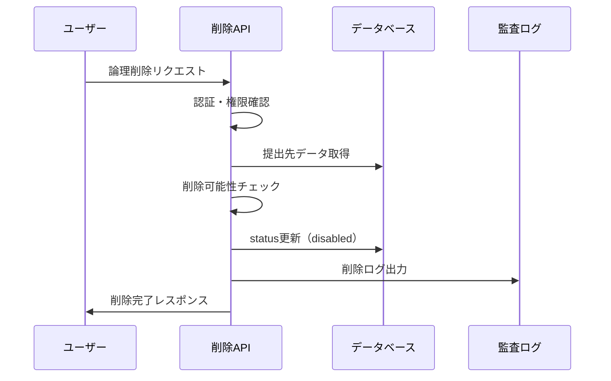
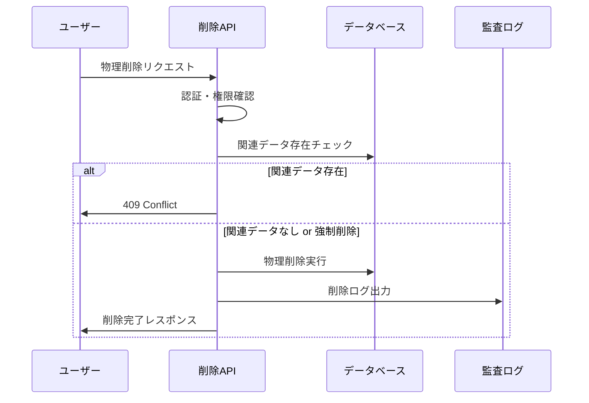

# 勤怠情報提出先削除機能 機能設計

---

## ドキュメント情報
| 項目 | 内容 |
|-----|------|
| 作成日 | 2024-XX-XX |
| 最終更新 | 2025-06-09 |
| バージョン | 2.0.0 |
| 担当者 | 開発チーム |
| レビュー状況 | レビュー中 |
| 構造適用レベル | Level B（11章構成） |

---

## 関連文書
- [ドキュメント構造統一標準](./ドキュメント構造統一標準.md)
- [勤怠情報提出先取得機能_機能設計](./勤怠情報提出先取得機能_機能設計.md)
- [勤怠情報提出先登録機能_機能設計](./勤怠情報提出先登録機能_機能設計.md)
- [勤怠情報提出先更新機能_機能設計](./勤怠情報提出先更新機能_機能設計.md)

---

## 1. 機能概要

### 1.1 機能の目的
勤怠情報提出先削除機能は、登録済みの勤怠情報提出先（会社・組織）を安全に削除するためのAPIを提供します。論理削除と物理削除の両方をサポートし、関連する勤怠データの整合性を保ちながら削除処理を実行します。

### 1.2 主要機能
- **論理削除（無効化）**: データを保持したまま無効状態に変更
- **物理削除**: データベースからの完全削除
- **関連データ管理**: 削除時の関連勤怠データの適切な処理
- **削除理由記録**: 論理削除時の理由と日時の記録
- **強制削除オプション**: 関連データ存在時の強制削除機能

### 1.3 利用シーン
- 退職・転職による提出先の無効化
- 会社統合・組織変更による提出先統廃合
- テストデータやエラーデータの物理削除
- システム管理者による強制削除

## 2. 要件・制約事項

### 2.1 機能要件
- **FR-DEL-001**: 論理削除（無効化）機能の提供
- **FR-DEL-002**: 物理削除機能の提供
- **FR-DEL-003**: 削除理由と削除日時の記録
- **FR-DEL-004**: 関連データ存在チェック機能
- **FR-DEL-005**: 強制削除オプションの提供
- **FR-DEL-006**: 削除処理の監査ログ出力

### 2.2 非機能要件
- **NFR-DEL-001**: 削除処理のレスポンス時間は2秒以内
- **NFR-DEL-002**: 削除処理のトランザクション整合性保証
- **NFR-DEL-003**: 削除操作の不可逆性に対する警告表示
- **NFR-DEL-004**: 論理削除データの復元可能性

### 2.3 制約事項
- 物理削除は関連データが存在しない場合のみ実行可能
- 論理削除されたデータは通常の検索対象から除外
- 削除操作は所有者権限を持つユーザーのみ実行可能
- 削除処理は非同期実行ではなく同期実行

### 2.4 前提条件
- ユーザー認証・認可システムが正常に動作していること
- 対象の提出先データが存在すること
- データベースの整合性制約が正しく設定されていること

## 3. 業務フロー・ユースケース

### 3.1 論理削除（無効化）フロー


### 3.2 物理削除フロー


### 3.3 主要ユースケース

#### UC-DEL-001: 論理削除（無効化）
- **アクター**: 一般ユーザー
- **前提条件**: 削除対象の提出先を所有している
- **基本フロー**:
  1. 論理削除APIを呼び出し
  2. 削除理由と無効化日を指定
  3. システムが提出先を無効状態に変更
  4. 削除完了を通知

#### UC-DEL-002: 物理削除
- **アクター**: システム管理者
- **前提条件**: 削除対象に関連データが存在しない
- **基本フロー**:
  1. 物理削除APIを呼び出し
  2. システムが関連データをチェック
  3. データベースから完全削除
  4. 削除完了を通知

#### UC-DEL-003: 強制物理削除
- **アクター**: システム管理者
- **前提条件**: 管理者権限を持つ
- **基本フロー**:
  1. force=trueで物理削除APIを呼び出し
  2. 関連データも含めて一括削除
  3. 削除完了と削除されたデータ件数を通知

## 4. API仕様

## 4. API仕様

### 4.1 エンドポイント

#### 4.1.1 論理削除（無効化）
```
PATCH /api/v1/companies/{companyId}/disable
```

#### 4.1.2 物理削除
```
DELETE /api/v1/companies/{companyId}
```

### 4.2 リクエスト形式

#### 4.2.1 論理削除リクエスト
```json
{
  "reason": "所属終了のため",
  "disableDate": "2025-06-30"
}
```

#### 4.2.2 物理削除リクエスト
```
DELETE /api/v1/companies/12345678-1234-1234-1234-123456789abc?force=true
```

### 4.3 パスパラメータ

| パラメータ名 | 型 | 必須 | 説明 |
|------------|---|-----|-----|
| companyId | String | ○ | 削除対象の会社ID（UUID形式） |

### 4.4 リクエストパラメータ

#### 4.4.1 論理削除パラメータ
| パラメータ名 | 型 | 必須 | 説明 |
|------------|---|-----|-----|
| reason | String | × | 削除理由（1文字以上200文字以内） |
| disableDate | String | × | 無効化日（YYYY-MM-DD形式、未指定時は実行日） |

#### 4.4.2 物理削除クエリパラメータ
| パラメータ名 | 型 | 必須 | 説明 |
|------------|---|-----|-----|
| force | Boolean | × | 強制削除フラグ（関連データ存在時の処理） |

### 4.5 レスポンス形式

#### 4.5.1 論理削除成功レスポンス（200 OK）
```json
{
  "status": "success",
  "data": {
    "company": {
      "id": "12345678-1234-1234-1234-123456789abc",
      "companyName": "株式会社サンプル",
      "status": "disabled",
      "disabledAt": "2025-06-08T15:30:00+09:00",
      "disableReason": "所属終了のため"
    }
  }
}
```

#### 4.5.2 物理削除成功レスポンス（200 OK）
```json
{
  "status": "success",
  "data": {
    "message": "勤怠情報提出先が正常に削除されました",
    "deletedCompanyId": "12345678-1234-1234-1234-123456789abc",
    "relatedDataCleanup": {
      "attendanceRecords": 5,
      "userSettings": 1
    }
  }
}
```

#### 4.5.3 関連データ存在エラー（409 Conflict）
```json
{
  "status": "error",
  "error": {
    "code": "RELATED_DATA_EXISTS",
    "message": "この提出先に関連する勤怠データが存在するため削除できません",
    "details": {
      "attendanceRecords": 5,
      "userSettings": 1,
      "suggestion": "論理削除（無効化）を使用するか、force=trueパラメータで強制削除してください"
    }
  }
}
```

#### 4.5.4 データ未存在レスポンス（404 Not Found）
```json
{
  "status": "error",
  "error": {
    "code": "COMPANY_NOT_FOUND",
    "message": "指定された勤怠情報提出先が見つかりません"
  }
}
```

### 4.6 HTTPステータスコード

| ステータスコード | 説明 |
|---------------|-----|
| 200 OK | 削除が正常に完了した |
| 400 Bad Request | リクエストパラメータに不正な値が含まれている |
| 401 Unauthorized | 認証が必要、または認証に失敗した |
| 403 Forbidden | リクエストしたリソースへのアクセス権限がない |
| 404 Not Found | 指定されたリソースが見つからない |
| 409 Conflict | 関連データが存在するため削除できない |
| 500 Internal Server Error | サーバー内部エラー |

## 5. データ仕様

### 5.1 データモデル
```typescript
interface AttendanceDestination {
  id: string;                    // 提出先ID（必須）
  companyName: string;           // 会社名（必須）
  status: 'active' | 'disabled'; // ステータス（必須）
  disabledAt?: Date;            // 無効化日時
  disableReason?: string;        // 無効化理由
  createdAt: Date;              // 作成日時
  updatedAt: Date;              // 更新日時
  ownerId: string;              // 所有者ID
}

interface DeleteAuditLog {
  id: string;
  userId: string;
  action: 'COMPANY_LOGICAL_DELETE' | 'COMPANY_PHYSICAL_DELETE' | 'COMPANY_FORCE_DELETE';
  resourceId: string;
  beforeData?: object;
  reason?: string;
  ipAddress: string;
  timestamp: Date;
}
```

### 5.2 データベーススキーマ
```sql
-- 勤怠情報提出先テーブル
CREATE TABLE attendance_destinations (
  id VARCHAR(36) PRIMARY KEY,
  company_name VARCHAR(255) NOT NULL,
  status ENUM('active', 'disabled') DEFAULT 'active',
  disabled_at TIMESTAMP NULL,
  disable_reason TEXT,
  created_at TIMESTAMP DEFAULT CURRENT_TIMESTAMP,
  updated_at TIMESTAMP DEFAULT CURRENT_TIMESTAMP ON UPDATE CURRENT_TIMESTAMP,
  owner_id VARCHAR(36) NOT NULL,
  INDEX idx_owner_status (owner_id, status),
  INDEX idx_status (status)
);

-- 削除監査ログテーブル
CREATE TABLE delete_audit_logs (
  id VARCHAR(36) PRIMARY KEY,
  user_id VARCHAR(36) NOT NULL,
  action VARCHAR(50) NOT NULL,
  resource_id VARCHAR(36) NOT NULL,
  before_data JSON,
  reason TEXT,
  ip_address VARCHAR(45),
  timestamp TIMESTAMP DEFAULT CURRENT_TIMESTAMP,
  INDEX idx_user_timestamp (user_id, timestamp),
  INDEX idx_resource (resource_id)
);
```

### 5.3 関連データモデル
```typescript
interface RelatedDataInfo {
  attendanceRecords: number;     // 関連勤怠レコード数
  userSettings: number;          // 関連ユーザー設定数
  hasRelatedData: boolean;       // 関連データ存在フラグ
}
```

## 6. 業務ロジック

### 6.1 論理削除（無効化）処理
```typescript
const disableCompany = async (userId: string, companyId: string, params: DisableParams) => {
  // 1. 権限確認
  const company = await CompanyRepository.findByIdAndUserId(companyId, userId);
  if (!company) {
    throw new NotFoundError('指定された勤怠情報提出先が見つかりません');
  }
  
  // 2. 既に無効化済みかチェック
  if (company.status === 'disabled') {
    throw new ConflictError('この提出先は既に無効化されています');
  }
  
  // 3. 論理削除実行
  const disabledCompany = await CompanyRepository.disable(companyId, {
    status: 'disabled',
    disabledAt: new Date(),
    disableReason: params.reason || null,
    updatedAt: new Date()
  });
  
  // 4. 監査ログ記録
  await recordDeletionAudit(userId, 'COMPANY_LOGICAL_DELETE', companyId, company, params.reason);
  
  return disabledCompany;
};
```

### 6.2 物理削除処理
```typescript
const deleteCompany = async (userId: string, companyId: string, force: boolean = false) => {
  // 1. 権限確認
  const company = await CompanyRepository.findByIdAndUserId(companyId, userId);
  if (!company) {
    throw new NotFoundError('指定された勤怠情報提出先が見つかりません');
  }
  
  // 2. 関連データ存在チェック
  const relatedData = await checkRelatedData(companyId);
  if (relatedData.hasRelatedData && !force) {
    throw new ConflictError('関連データが存在します', relatedData);
  }
  
  // 3. 物理削除実行（トランザクション）
  return await DatabaseTransaction.execute(async (transaction) => {
    if (force && relatedData.hasRelatedData) {
      await cascadeDeleteRelatedData(companyId, transaction);
    }
    
    await CompanyRepository.delete(companyId, transaction);
    await recordDeletionAudit(userId, force ? 'COMPANY_FORCE_DELETE' : 'COMPANY_PHYSICAL_DELETE', companyId, company);
    
    return {
      deletedCompanyId: companyId,
      relatedDataCleanup: relatedData
    };
  });
};
```

### 6.3 関連データチェック
```typescript
const checkRelatedData = async (companyId: string): Promise<RelatedDataInfo> => {
  const [attendanceCount, userSettingsCount] = await Promise.all([
    AttendanceRepository.countByCompanyId(companyId),
    UserSettingsRepository.countByCompanyId(companyId)
  ]);
  
  return {
    attendanceRecords: attendanceCount,
    userSettings: userSettingsCount,
    hasRelatedData: attendanceCount > 0 || userSettingsCount > 0
  };
};
```

### 6.4 カスケード削除処理
```typescript
const cascadeDeleteRelatedData = async (companyId: string, transaction: Transaction) => {
  // 関連データを順序よく削除
  await UserSettingsRepository.deleteByCompanyId(companyId, transaction);
  await AttendanceRepository.deleteByCompanyId(companyId, transaction);
};
```

## 7. セキュリティ・権限制御

### 7.1 認証・認可
- **JWT認証**: Bearer tokenによるユーザー認証
- **所有者権限**: 自身が作成した提出先のみ削除可能
- **管理者権限**: 全ての提出先に対する削除権限（将来拡張）

### 7.2 削除権限の詳細制御
```typescript
interface DeletePermissions {
  logicalDelete: {
    requiredRole: 'user';
    conditions: ['isOwner'];
  };
  physicalDelete: {
    requiredRole: 'user' | 'admin';
    conditions: ['isOwner', 'noRelatedData'];
  };
  forceDelete: {
    requiredRole: 'admin';
    conditions: ['isOwner', 'explicitConfirmation'];
  };
}
```

### 7.3 権限チェック実装
```typescript
const checkDeletePermission = async (
  userId: string, 
  companyId: string, 
  deleteType: 'logical' | 'physical' | 'force'
): Promise<boolean> => {
  const company = await CompanyRepository.findById(companyId);
  if (!company) return false;
  
  const isOwner = company.ownerId === userId;
  const isAdmin = await UserService.isAdmin(userId);
  
  switch (deleteType) {
    case 'logical':
      return isOwner;
    case 'physical':
      return isOwner || isAdmin;
    case 'force':
      return isAdmin && isOwner;
    default:
      return false;
  }
};
```

### 7.4 監査ログ記録
```typescript
const recordDeletionAudit = async (
  userId: string,
  action: string,
  companyId: string,
  beforeData: object,
  reason?: string
) => {
  await AuditLogRepository.create({
    userId,
    action,
    resourceId: companyId,
    beforeData,
    reason,
    ipAddress: getCurrentRequest().ip,
    timestamp: new Date()
  });
};
```

## 8. エラーハンドリング・例外処理

### 8.1 エラー分類
| エラーコード | HTTPステータス | 説明 | 対応方法 |
|------------|---------------|------|---------|
| COMPANY_NOT_FOUND | 404 | 提出先が存在しない | IDを確認して再実行 |
| PERMISSION_DENIED | 403 | 削除権限なし | 所有者権限を確認 |
| ALREADY_DISABLED | 409 | 既に無効化済み | 現在の状態を確認 |
| RELATED_DATA_EXISTS | 409 | 関連データ存在 | 論理削除または強制削除を選択 |
| VALIDATION_ERROR | 400 | バリデーションエラー | 入力データを修正 |

### 8.2 エラーレスポンス仕様
```typescript
interface ErrorResponse {
  status: 'error';
  error: {
    code: string;
    message: string;
    details?: object;
    suggestion?: string;
    timestamp: string;
    requestId: string;
  };
}
```

### 8.3 関連データ存在エラー処理
```typescript
const handleRelatedDataError = (relatedData: RelatedDataInfo): ErrorResponse => {
  return {
    status: 'error',
    error: {
      code: 'RELATED_DATA_EXISTS',
      message: 'この提出先に関連する勤怠データが存在するため削除できません',
      details: relatedData,
      suggestion: '論理削除（無効化）を使用するか、force=trueパラメータで強制削除してください',
      timestamp: new Date().toISOString(),
      requestId: generateRequestId()
    }
  };
};
```

### 8.4 例外処理フロー
1. **認証例外**: 認証情報不正・期限切れ
2. **認可例外**: 削除権限不足
3. **ビジネス例外**: 既に削除済み、関連データ存在
4. **データ例外**: DB接続エラー、制約違反
5. **システム例外**: 予期しないエラー

## 9. 非機能要件

### 9.1 パフォーマンス要件
- **論理削除レスポンス時間**: 平均300ms以下、最大1秒以内
- **物理削除レスポンス時間**: 平均500ms以下、最大2秒以内
- **強制削除レスポンス時間**: 平均2秒以下、最大5秒以内
- **同時削除処理**: 10処理/秒まで対応

### 9.2 可用性要件
- **稼働率**: 99.9%以上
- **障害復旧時間**: 5分以内
- **データ整合性**: ACID特性保証（トランザクション管理）

### 9.3 信頼性要件
- **監査ログ保存**: 全削除操作の確実な記録
- **復旧可能性**: 論理削除データの復元機能
- **バックアップ**: 物理削除前の自動バックアップ

### 9.4 セキュリティ要件
- **操作証跡**: 全削除操作の監査ログ
- **権限制御**: 最小権限の原則
- **データ保護**: 削除データの完全除去保証

## 10. テスト仕様

### 10.1 単体テスト
```typescript
describe('勤怠情報提出先削除機能', () => {
  describe('論理削除', () => {
    test('正常系: 論理削除成功', async () => {
      const result = await disableCompany(userId, companyId, { reason: 'テスト理由' });
      expect(result.status).toBe('disabled');
      expect(result.disableReason).toBe('テスト理由');
    });

    test('異常系: 既に無効化済み', async () => {
      await expect(disableCompany(userId, disabledCompanyId, {}))
        .rejects.toThrow('ALREADY_DISABLED');
    });
  });

  describe('物理削除', () => {
    test('正常系: 関連データなし削除', async () => {
      const result = await deleteCompany(userId, companyId, false);
      expect(result.deletedCompanyId).toBe(companyId);
    });

    test('異常系: 関連データ存在', async () => {
      await expect(deleteCompany(userId, companyWithDataId, false))
        .rejects.toThrow('RELATED_DATA_EXISTS');
    });

    test('正常系: 強制削除', async () => {
      const result = await deleteCompany(adminUserId, companyWithDataId, true);
      expect(result.relatedDataCleanup.attendanceRecords).toBeGreaterThan(0);
    });
  });
});
```

### 10.2 統合テスト
- **API統合テスト**: リクエスト〜レスポンスまでの全体フロー
- **データベース統合テスト**: トランザクション整合性確認
- **権限統合テスト**: 認証・認可の組み合わせ確認

### 10.3 パフォーマンステスト
- **負荷テスト**: 同時削除処理での性能確認
- **ストレステスト**: 大量関連データでの削除性能
- **耐久テスト**: 長時間運転での安定性確認

### 10.4 セキュリティテスト
- **権限テスト**: 不正な削除試行の阻止確認
- **監査テスト**: 削除操作の完全な記録確認
- **復元テスト**: 論理削除データの復元可能性確認

## 11. 実装ノート・技術的詳細

### 11.1 技術スタック
- **フレームワーク**: Express.js/Fastify
- **データベース**: MySQL 8.0
- **ORM**: Prisma/TypeORM
- **トランザクション管理**: データベーストランザクション
- **認証**: JWT + bcrypt

### 11.2 データベース最適化
```sql
-- インデックス戦略
CREATE INDEX idx_owner_status ON attendance_destinations(owner_id, status);
CREATE INDEX idx_disabled_at ON attendance_destinations(disabled_at);

-- 論理削除用ビュー
CREATE VIEW active_destinations AS
SELECT * FROM attendance_destinations WHERE status = 'active';

-- 削除用ストアドプロシージャ
DELIMITER //
CREATE PROCEDURE CascadeDeleteCompany(IN company_id VARCHAR(36))
BEGIN
  DECLARE EXIT HANDLER FOR SQLEXCEPTION
  BEGIN
    ROLLBACK;
    RESIGNAL;
  END;
  
  START TRANSACTION;
  DELETE FROM user_settings WHERE company_id = company_id;
  DELETE FROM attendance_records WHERE company_id = company_id;
  DELETE FROM attendance_destinations WHERE id = company_id;
  COMMIT;
END //
DELIMITER ;
```

### 11.3 削除処理の実装パターン
```typescript
// Soft Delete Repository Pattern
class CompanyRepository {
  async disable(id: string, updateData: DisableData): Promise<Company> {
    return await this.prisma.company.update({
      where: { id },
      data: updateData
    });
  }

  async delete(id: string, transaction?: Transaction): Promise<void> {
    const client = transaction || this.prisma;
    await client.company.delete({
      where: { id }
    });
  }

  async findActiveByUserId(userId: string): Promise<Company[]> {
    return await this.prisma.company.findMany({
      where: { 
        ownerId: userId,
        status: 'active'
      }
    });
  }
}
```

### 11.4 監査ログ実装
```typescript
const auditLogger = createLogger({
  level: 'info',
  format: combine(
    timestamp(),
    json(),
    printf(({ timestamp, level, message, ...meta }) => {
      return JSON.stringify({
        timestamp,
        level,
        message,
        ...meta
      });
    })
  ),
  transports: [
    new transports.File({ filename: 'audit.log' }),
    new transports.File({ filename: 'deletion-audit.log', level: 'warn' })
  ]
});

const logDeletion = (userId: string, action: string, resourceId: string, details?: object) => {
  auditLogger.warn('Company deletion executed', {
    userId,
    action,
    resourceId,
    details,
    timestamp: new Date().toISOString()
  });
};
```

### 11.5 非同期処理実装
```typescript
// 大量データの非同期削除
const scheduleAsyncDeletion = async (companyId: string, userId: string) => {
  const job = await deletionQueue.add('cascadeDelete', {
    companyId,
    userId,
    timestamp: new Date()
  }, {
    attempts: 3,
    backoff: {
      type: 'exponential',
      delay: 5000
    }
  });
  
  return job.id;
};

// ジョブ処理
deletionQueue.process('cascadeDelete', async (job) => {
  const { companyId, userId } = job.data;
  
  try {
    await performCascadeDeletion(companyId);
    await notifyDeletionComplete(userId, companyId);
  } catch (error) {
    await notifyDeletionError(userId, companyId, error);
    throw error;
  }
});
```

### 11.6 メトリクス・モニタリング
```typescript
// Prometheus メトリクス
const deletionCounter = new promClient.Counter({
  name: 'company_deletions_total',
  help: 'Total number of company deletions',
  labelNames: ['type', 'status']
});

const deletionDuration = new promClient.Histogram({
  name: 'company_deletion_duration_seconds',
  help: 'Duration of company deletion operations',
  labelNames: ['type']
});

// メトリクス記録
const recordDeletionMetrics = (type: string, duration: number, success: boolean) => {
  deletionCounter.inc({ type, status: success ? 'success' : 'failure' });
  deletionDuration.observe({ type }, duration / 1000);
};
```

---

**テスト対象**:
- 削除タイプ別処理機能
  - 論理削除処理の正確性（status更新、disabledAt設定）
  - 物理削除処理の正確性（関連データカスケード削除）
  - 削除タイプ判定ロジックの妥当性確認
- 権限制御機能
  - 所有者権限の正確な判定
  - 他ユーザーのアクセス拒否処理
  - 管理者権限での削除可否判定
- 関連データチェック機能
  - 勤怠データ存在チェックの正確性
  - ユーザー設定データ存在チェックの正確性
  - 関連データ数カウント機能

**実行環境**: ローカル開発環境、モックDB使用

### 9.2 統合テスト（Integration Test）
**目的**: 関連システム間の連携動作確認とデータ整合性検証

**テスト対象**:
- API エンドポイント統合確認
  - PATCH /disable エンドポイントの完全動作確認
  - DELETE エンドポイントの完全動作確認
  - パラメータ検証とレスポンス形式の整合性
- トランザクション統合確認
  - 複数テーブル更新時のACID特性確認
  - ロールバック処理の正確性
  - デッドロック発生時の適切な処理
- 監査ログ統合確認
  - 削除操作ログの正確な記録
  - ログ検索・分析機能との連携確認

**実行環境**: ステージング環境、実際のDB・外部システム使用

### 9.3 パフォーマンステスト（Performance Test）
**目的**: 大量データ・同時アクセス環境での性能確認

**テスト対象**:
- 大量関連データ削除性能
  - 関連勤怠データ1000件以上での削除処理時間測定
  - 関連ユーザー設定100件以上での削除処理時間測定
  - 目標性能：関連データ1000件で10秒以内
- 同時削除処理性能
  - 複数ユーザーの同時削除リクエスト処理
  - 最大30リクエスト/秒での安定性確認
  - リソース競合時の処理性能測定

**実行環境**: 負荷テスト環境、本番相当データ量

### 9.4 セキュリティテスト（Security Test）
**目的**: 削除操作における認証・認可・データ保護の確認

**テスト対象**:
- 認証・認可テスト
  - JWT認証による本人確認の正確性
  - 削除権限の適切な確認
  - 不正な権限昇格試行の防止
- データ保護テスト
  - 削除データの完全消去確認（物理削除時）
  - 論理削除データの適切な非表示化
  - 削除履歴の改ざん防止確認
- 入力値検証テスト
  - 無効なcompanyIDでの攻撃防止
  - SQLインジェクション攻撃の防止

**実行環境**: セキュリティテスト専用環境

### 9.5 障害テスト（Fault Tolerance Test）
**目的**: システム障害時の堅牢性と復旧能力の確認

**テスト対象**:
- データベース障害テスト
  - トランザクション途中でのDB接続断時の処理
  - 外部キー制約違反時のエラー処理
- 外部システム障害テスト
  - 通知サービス障害時の削除処理継続
  - バックアップサービス障害時の処理
- システムリソース不足テスト
  - メモリ不足時の削除処理動作
  - ディスク容量不足時の処理

**実行環境**: 障害シミュレーション環境

### 9.6 ユーザビリティテスト（Usability Test）
**目的**: エンドユーザーの操作性と理解しやすさの確認

**テスト対象**:
- 削除操作UI確認
  - 削除ボタンの配置と分かりやすさ
  - 削除確認ダイアログの適切性
- エラーメッセージ確認
  - 関連データ存在時のメッセージ分かりやすさ
  - 権限不足時のメッセージ適切性
- 削除結果フィードバック
  - 削除完了時の適切な通知表示
  - 削除後の画面遷移の自然さ

**実行環境**: UAT環境、実際のユーザーによるテスト

## 10. 依存関係

### 10.1 内部システム依存
- **認証サービス**: JWT認証による本人確認
- **権限管理サービス**: 削除権限の確認
- **勤怠情報サービス**: 関連する勤怠データの確認・削除
- **ユーザー設定サービス**: 関連するユーザー設定の確認・削除
- **監査ログサービス**: 削除操作の記録

### 10.2 外部システム依存
- **通知サービス**: 重要な削除操作の通知送信
- **バックアップサービス**: 削除前のデータバックアップ

## 11. 運用考慮事項

### 11.1 データ復旧
- **論理削除**: 管理画面からの復旧機能提供
- **物理削除**: バックアップからの復旧のみ可能
- **復旧期限**: 論理削除から90日間は復旧可能

### 11.2 定期クリーンアップ
- **論理削除データ**: 90日経過後の自動物理削除
- **監査ログ**: 1年間保持後アーカイブ

## 12. 今後の拡張計画

### 12.1 段階的削除
- **予約削除**: 指定日時での自動削除予約
- **確認期間**: 削除実行前の確認期間設定

### 12.2 削除理由分類
- **定型理由**: よく使用される削除理由の定型文
- **承認フロー**: 特定条件下での削除承認ワークフロー

## 13. 変更履歴

| バージョン | 日付 | 変更者 | 変更内容 |
|----------|------|--------|---------|
| 1.0.0 | 2024-XX-XX | 開発チーム | 初版作成 |
| 2.0.0 | 2025-06-09 | システム | Level B標準構造適用、ドキュメント構造統一 |
