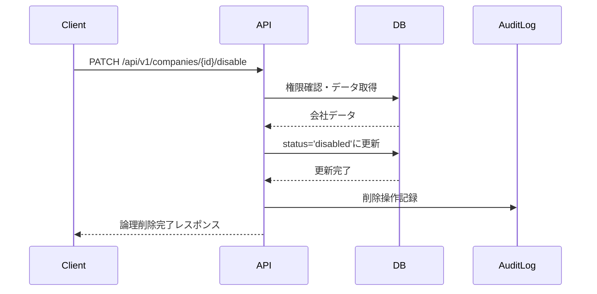
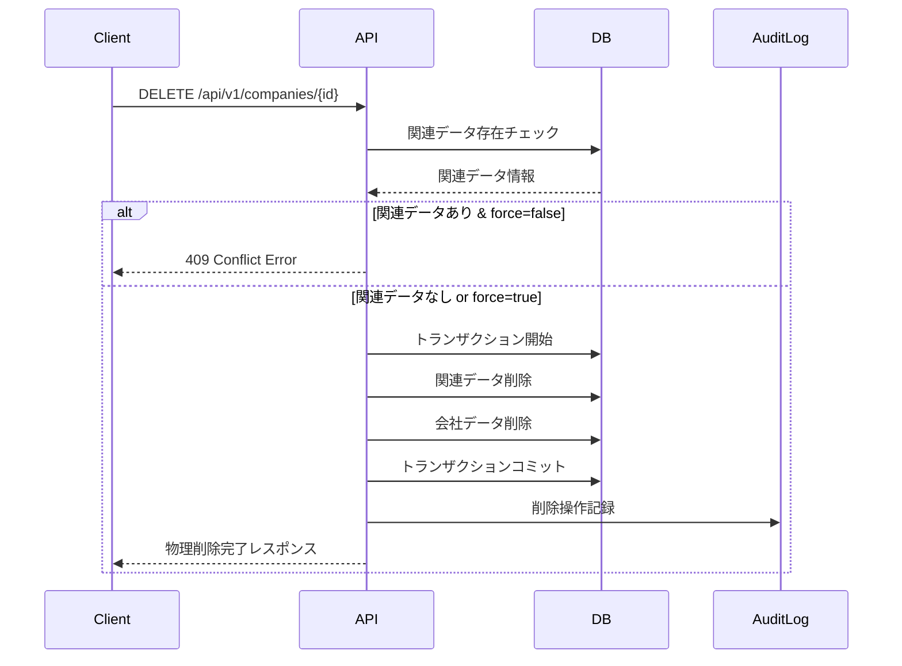

# 勤怠情報提出先削除機能 機能設計

## 1. 機能概要

勤怠情報提出先削除機能は、登録済みの勤怠情報提出先（会社・組織）を削除するためのAPIです。この機能では、物理削除と論理削除の両方をサポートし、削除対象に関連する勤怠データの取り扱いについても適切に処理します。

## 2. API仕様

### 2.1 エンドポイント

#### 2.1.1 論理削除（無効化）
```
PATCH /api/v1/companies/{companyId}/disable
```

#### 2.1.2 物理削除
```
DELETE /api/v1/companies/{companyId}
```

### 2.2 リクエスト形式

#### 2.2.1 論理削除リクエスト
```json
{
  "reason": "所属終了のため",
  "disableDate": "2025-06-30"
}
```

#### 2.2.2 物理削除リクエスト
```
DELETE /api/v1/companies/12345678-1234-1234-1234-123456789abc?force=true
```

### 2.3 パスパラメータ

| パラメータ名 | 型 | 必須 | 説明 |
|------------|---|-----|-----|
| companyId | String | ○ | 削除対象の会社ID（UUID形式） |

### 2.4 リクエストパラメータ

#### 2.4.1 論理削除パラメータ
| パラメータ名 | 型 | 必須 | 説明 |
|------------|---|-----|-----|
| reason | String | × | 削除理由（1文字以上200文字以内） |
| disableDate | String | × | 無効化日（YYYY-MM-DD形式、未指定時は実行日） |

#### 2.4.2 物理削除クエリパラメータ
| パラメータ名 | 型 | 必須 | 説明 |
|------------|---|-----|-----|
| force | Boolean | × | 強制削除フラグ（関連データ存在時の処理） |

### 2.5 レスポンス形式

#### 2.5.1 論理削除成功レスポンス（200 OK）
```json
{
  "status": "success",
  "data": {
    "company": {
      "id": "12345678-1234-1234-1234-123456789abc",
      "companyName": "株式会社サンプル",
      "status": "disabled",
      "disabledAt": "2025-06-08T15:30:00+09:00",
      "disableReason": "所属終了のため"
    }
  }
}
```

#### 2.5.2 物理削除成功レスポンス（200 OK）
```json
{
  "status": "success",
  "data": {
    "message": "勤怠情報提出先が正常に削除されました",
    "deletedCompanyId": "12345678-1234-1234-1234-123456789abc",
    "relatedDataCleanup": {
      "attendanceRecords": 5,
      "userSettings": 1
    }
  }
}
```

#### 2.5.3 関連データ存在エラー（409 Conflict）
```json
{
  "status": "error",
  "error": {
    "code": "RELATED_DATA_EXISTS",
    "message": "この提出先に関連する勤怠データが存在するため削除できません",
    "details": {
      "attendanceRecords": 5,
      "userSettings": 1,
      "suggestion": "論理削除（無効化）を使用するか、force=trueパラメータで強制削除してください"
    }
  }
}
```

#### 2.5.4 データ未存在レスポンス（404 Not Found）
```json
{
  "status": "error",
  "error": {
    "code": "COMPANY_NOT_FOUND",
    "message": "指定された勤怠情報提出先が見つかりません"
  }
}
```

### 2.6 HTTPステータスコード

| ステータスコード | 説明 |
|---------------|-----|
| 200 OK | 削除が正常に完了した |
| 400 Bad Request | リクエストパラメータに不正な値が含まれている |
| 401 Unauthorized | 認証が必要、または認証に失敗した |
| 403 Forbidden | リクエストしたリソースへのアクセス権限がない |
| 404 Not Found | 指定されたリソースが見つからない |
| 409 Conflict | 関連データが存在するため削除できない |
| 500 Internal Server Error | サーバー内部エラー |

## 3. 削除パターン別仕様

### 3.1 論理削除（無効化）

#### 3.1.1 基本仕様
- データベースからの物理削除は行わない
- `status`フィールドを`disabled`に変更
- `disabledAt`フィールドに削除実行日時を記録
- `disableReason`フィールドに削除理由を記録

#### 3.1.2 処理フロー
```typescript
const disableCompany = async (userId: string, companyId: string, params: DisableParams) => {
  // 1. 権限確認
  const company = await CompanyRepository.findByIdAndUserId(companyId, userId);
  if (!company) {
    throw new NotFoundError('指定された勤怠情報提出先が見つかりません');
  }
  
  // 2. 既に無効化済みかチェック
  if (company.status === 'disabled') {
    throw new ConflictError('この提出先は既に無効化されています');
  }
  
  // 3. 論理削除実行
  const disabledCompany = await CompanyRepository.disable(companyId, {
    status: 'disabled',
    disabledAt: new Date(),
    disableReason: params.reason || null,
    updatedAt: new Date()
  });
  
  return disabledCompany;
};
```

### 3.2 物理削除

#### 3.2.1 基本仕様
- データベースからの完全削除
- 関連データの存在チェック
- カスケード削除またはエラー返却
- 削除操作の監査ログ記録

#### 3.2.2 関連データチェック
```typescript
const checkRelatedData = async (companyId: string) => {
  const [attendanceCount, userSettingsCount] = await Promise.all([
    AttendanceRepository.countByCompanyId(companyId),
    UserSettingsRepository.countByCompanyId(companyId)
  ]);
  
  return {
    attendanceRecords: attendanceCount,
    userSettings: userSettingsCount,
    hasRelatedData: attendanceCount > 0 || userSettingsCount > 0
  };
};
```

#### 3.2.3 強制削除処理
```typescript
const forceDeleteCompany = async (userId: string, companyId: string) => {
  return await DatabaseTransaction.execute(async (transaction) => {
    // 1. 関連データの削除
    await UserSettingsRepository.deleteByCompanyId(companyId, transaction);
    await AttendanceRepository.deleteByCompanyId(companyId, transaction);
    
    // 2. 会社データの削除
    await CompanyRepository.delete(companyId, transaction);
    
    // 3. 監査ログの記録
    await AuditLogRepository.create({
      userId,
      action: 'COMPANY_FORCE_DELETE',
      resourceId: companyId,
      timestamp: new Date()
    }, transaction);
  });
};
```

## 4. セキュリティ要件

### 4.1 認証・認可
- **JWT認証**: APIアクセスにはJWTトークンによる認証が必須
- **所有者権限確認**: ユーザーは自身の提出先のみ削除可能
- **削除権限制御**: 物理削除は管理者権限または特定条件下でのみ実行可能

#### 4.1.1 削除権限の詳細制御
```json
{
  "deletePermissions": {
    "logicalDelete": {
      "requiredRole": "user",
      "conditions": ["isOwner"]
    },
    "physicalDelete": {
      "requiredRole": "admin",
      "conditions": ["isOwner", "noActiveAttendance"]
    },
    "forceDelete": {
      "requiredRole": "admin",
      "conditions": ["isOwner", "explicitConfirmation"]
    }
  }
}
```

### 4.2 データ保護
- **削除操作の監査**: 全ての削除操作を監査ログに記録
- **復旧可能性**: 論理削除は復旧可能、物理削除は不可逆
- **関連データの整合性**: 削除に伴う関連データの適切な処理

## 5. パフォーマンス要件

### 5.1 応答時間
- **論理削除**: 300ms以内
- **物理削除（関連データなし）**: 500ms以内
- **物理削除（関連データあり）**: 2秒以内

### 5.2 関連データ処理
- **バッチ削除**: 大量の関連データは非同期バッチ処理
- **プログレス通知**: 長時間処理の進捗状況通知

## 6. エラーハンドリング

### 6.1 関連データ存在エラー
```typescript
const handleRelatedDataError = (relatedData: RelatedDataInfo) => {
  return {
    status: 'error',
    error: {
      code: 'RELATED_DATA_EXISTS',
      message: 'この提出先に関連する勤怠データが存在するため削除できません',
      details: {
        ...relatedData,
        suggestion: '論理削除（無効化）を使用するか、force=trueパラメータで強制削除してください'
      }
    }
  };
};
```

### 6.2 権限不足エラー
```typescript
const handlePermissionError = () => {
  return {
    status: 'error',
    error: {
      code: 'INSUFFICIENT_PERMISSION',
      message: 'この操作を実行する権限がありません'
    }
  };
};
```

## 7. 監査・ログ

### 7.1 監査ログ仕様
```typescript
interface AuditLog {
  id: string;
  userId: string;
  action: 'COMPANY_LOGICAL_DELETE' | 'COMPANY_PHYSICAL_DELETE' | 'COMPANY_FORCE_DELETE';
  resourceId: string;
  resourceType: 'Company';
  beforeData?: object;
  afterData?: object;
  reason?: string;
  ipAddress: string;
  userAgent: string;
  timestamp: Date;
}
```

### 7.2 ログ記録処理
```typescript
const recordDeletionAudit = async (
  userId: string,
  action: string,
  companyId: string,
  beforeData: object,
  reason?: string
) => {
  await AuditLogRepository.create({
    userId,
    action,
    resourceId: companyId,
    resourceType: 'Company',
    beforeData,
    reason,
    ipAddress: request.ip,
    userAgent: request.headers['user-agent'],
    timestamp: new Date()
  });
};
```

## 8. 処理フロー

### 8.1 論理削除フロー


### 8.2 物理削除フロー


## 9. テスト戦略

### 9.1 単体テスト
- **削除タイプ別処理**: 論理削除・物理削除の各シナリオ
- **権限制御**: 所有者以外のアクセス拒否確認
- **関連データチェック**: 存在チェックロジックの検証

### 9.2 統合テスト
- **API エンドポイント**: 各削除パターンの統合テスト
- **トランザクション**: データ整合性の確認
- **監査ログ**: ログ記録の確認

### 9.3 パフォーマンステスト
- **大量関連データ**: 多数の関連データがある場合の削除性能
- **同時削除**: 複数ユーザーの同時削除処理

## 10. 依存関係

### 10.1 内部システム依存
- **認証サービス**: JWT認証による本人確認
- **権限管理サービス**: 削除権限の確認
- **勤怠情報サービス**: 関連する勤怠データの確認・削除
- **ユーザー設定サービス**: 関連するユーザー設定の確認・削除
- **監査ログサービス**: 削除操作の記録

### 10.2 外部システム依存
- **通知サービス**: 重要な削除操作の通知送信
- **バックアップサービス**: 削除前のデータバックアップ

## 11. 運用考慮事項

### 11.1 データ復旧
- **論理削除**: 管理画面からの復旧機能提供
- **物理削除**: バックアップからの復旧のみ可能
- **復旧期限**: 論理削除から90日間は復旧可能

### 11.2 定期クリーンアップ
- **論理削除データ**: 90日経過後の自動物理削除
- **監査ログ**: 1年間保持後アーカイブ

## 12. 今後の拡張計画

### 12.1 段階的削除
- **予約削除**: 指定日時での自動削除予約
- **確認期間**: 削除実行前の確認期間設定

### 12.2 削除理由分類
- **定型理由**: よく使用される削除理由の定型文
- **承認フロー**: 特定条件下での削除承認ワークフロー

## 13. 変更履歴

| 日付 | 変更者 | 変更内容 |
|-----|-------|---------|
| 2025/06/08 | カーン | 初版作成 |
