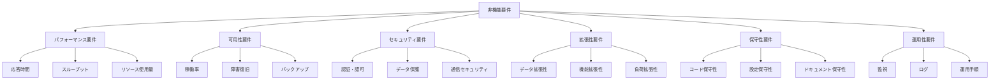

# 非機能要件記載標準

## 1. 概要

### 1.1. 目的
- 非機能要件記載の統一化と標準化
- 機能設計書間の記載範囲・詳細度の格差解消
- システム品質要件の漏れ防止と品質向上

### 1.2. 適用範囲
- 全機能設計書の非機能要件関連記載
- システム横断的な品質要件の統一
- 運用・保守性要件の標準化

### 1.3. 非機能要件分類体系



## 2. 記載レベル分類

### 2.1. Level A（基本要件 - 全機能共通）

#### 2.1.1. 必須記載項目
- **パフォーマンス要件**: 応答時間目標値
- **セキュリティ要件**: 基本認証・認可要件
- **エラーハンドリング**: 基本エラー対応
- **ログ要件**: 基本ログ出力要件

#### 2.1.2. 記載形式
```markdown
## X. 非機能要件

### X.1 パフォーマンス要件
**応答時間**: XXXms以内
**同時処理**: XX リクエスト/秒まで対応

### X.2 セキュリティ要件  
**参照**: セキュリティ要件記載標準 3節（共通基盤要件）
- JWT認証必須
- 役割ベースアクセス制御

### X.3 エラーハンドリング
**参照**: API設計統一ガイドライン 5節（エラーレスポンス）
- 統一エラーフォーマット準拠
- 適切なHTTPステータスコード使用

### X.4 ログ要件
- アクセスログ: 全APIリクエストの記録
- エラーログ: 例外・エラーの詳細記録
```

### 2.2. Level B（標準要件 - 主要機能）

#### 2.2.1. 追加記載項目
- **詳細パフォーマンス要件**: 負荷条件、リソース使用量
- **可用性要件**: 障害対応、復旧手順
- **拡張性考慮事項**: 将来的な拡張可能性
- **テスト戦略**: パフォーマンステスト要件

#### 2.2.2. 記載形式拡張
```markdown
### X.1 パフォーマンス要件
**応答時間**:
- 通常処理: XXXms以内
- 大量データ処理: XXXs以内

**スループット**:
- 同時リクエスト: XX リクエスト/秒
- ピーク時負荷: XX リクエスト/秒

**リソース使用量**:
- メモリ使用量: XXX MB以内
- CPU使用率: XX%以内

### X.5 可用性要件
**稼働率**: XX.X%
**障害復旧**: XX分以内
**バックアップ**: 処理前データの自動保存

### X.6 拡張性考慮事項
**データ拡張性**: XXX件までのデータ対応
**機能拡張性**: 新機能追加時の影響範囲
**負荷拡張性**: スケールアウト対応方針
```

### 2.3. Level C（詳細要件 - 特殊機能）

#### 2.3.1. 追加記載項目
- **運用監視要件**: 詳細監視項目、アラート条件
- **保守性要件**: メンテナンス手順、データ保持期間
- **特殊パフォーマンス要件**: 複雑な処理の性能基準
- **災害対策**: データ保護、復旧戦略

#### 2.3.2. 記載形式拡張
```markdown
### X.7 運用監視要件
**監視項目**:
- XXX処理の実行時間監視
- XXXエラー率の監視
- XXXリソース使用量の監視

**アラート条件**:
- 応答時間がXXXms超過時
- エラー率がXX%超過時
- リソース使用率がXX%超過時

### X.8 保守性要件
**メンテナンス手順**:
- 定期メンテナンス: 月次XXX処理
- データクリーンアップ: XX日経過データの削除
- 設定変更手順: XXX設定の更新方法

**データ保持期間**:
- 操作ログ: XX年間保持
- バックアップデータ: XX日間保持

### X.9 災害対策
**データ保護**:
- バックアップ頻度: 日次
- 復旧ポイント目標(RPO): XX分以内
- 復旧時間目標(RTO): XX時間以内
```

## 3. 機能別記載基準

### 3.1. CRUD機能（Level A適用）

#### 3.1.1. 対象機能
- 勤怠情報取得機能
- 勤怠設定参照機能  
- 提出先取得機能
- その他参照系機能

#### 3.1.2. 必須記載項目
```markdown
## X. 非機能要件

### X.1 パフォーマンス要件
**応答時間**: 500ms以内（Level A基準）
**同時処理**: 100リクエスト/秒まで対応

### X.2 セキュリティ要件
**参照**: セキュリティ要件記載標準 3.1節
- JWT認証必須
- 所有者ベースアクセス制御

### X.3 エラーハンドリング
**参照**: API設計統一ガイドライン 5節
- 統一エラーフォーマット
- 404, 400, 401, 403, 500対応

### X.4 ログ要件
- アクセスログ: リクエスト/レスポンス記録
- エラーログ: 例外発生時の詳細記録
```

### 3.2. 更新機能（Level B適用）

#### 3.2.1. 対象機能
- 勤怠情報登録・更新機能
- 提出先登録・更新機能
- 位置情報登録機能

#### 3.2.2. 必須記載項目
```markdown
## X. 非機能要件

### X.1 パフォーマンス要件
**応答時間**:
- 単純更新: 500ms以内
- 複雑処理: 1秒以内
- バッチ処理: 2秒以内

**同時処理**:
- 同時更新: 楽観的ロック制御
- ユーザー単位制限: 3リクエスト/秒

### X.2 セキュリティ要件
**参照**: セキュリティ要件記載標準 4.1節
- データアクセス制御
- 入力値検証・サニタイゼーション

### X.3 データ整合性要件
- トランザクション管理: ACID特性保証
- 楽観的ロック: 同時更新制御
- データ検証: ビジネスルール適用

### X.4 可用性要件
**データ保護**: 更新前データのバックアップ
**エラー復旧**: 処理失敗時のロールバック

### X.5 拡張性考慮事項
**データ量拡張**: XXX件までの処理対応
**機能拡張**: 新規フィールド追加対応
```

### 3.3. 削除機能（Level C適用）

#### 3.3.1. 対象機能
- 勤怠情報削除機能
- 提出先削除機能
- 大量データ処理機能

#### 3.3.2. 必須記載項目
```markdown
## X. 非機能要件

### X.1 パフォーマンス要件
**応答時間**:
- 論理削除: 300ms以内
- 物理削除（単純）: 500ms以内
- 物理削除（複雑）: 2秒以内

**大量処理**:
- バッチ削除: 非同期処理対応
- プログレス通知: 進捗状況の通知

### X.2 セキュリティ要件
**参照**: セキュリティ要件記載標準 4.3.2節
- 削除権限制御: 管理者・所有者のみ
- 確認手順: 重要データ削除時の追加確認

### X.3 データ整合性要件
- 関連データ処理: カスケード削除・整合性チェック
- トランザクション: 全件削除の原子性保証

### X.4 可用性要件
**データ保護**: 削除前データのバックアップ
**復旧手順**: 誤削除時の復旧方法定義

### X.5 運用監視要件
**監視項目**:
- 削除処理時間の監視
- 削除エラー率の監視
- 異常削除パターンの検出

**アラート条件**:
- 削除処理時間が5秒超過
- 削除エラー率が5%超過
- 短時間大量削除の検出

### X.6 保守性要件
**メンテナンス**:
- 論理削除データの定期物理削除
- 削除ログの保持期間管理（1年間）
- バックアップデータのクリーンアップ

### X.7 災害対策
**バックアップ戦略**: 削除前の必須バックアップ
**復旧戦略**: 段階的復旧手順の定義
```

## 4. パフォーマンス要件基準値

### 4.1. 応答時間基準

| 処理タイプ | Level A | Level B | Level C |
|-----------|---------|---------|---------|
| 単純取得 | 300ms | 300ms | 300ms |
| 複合取得 | 500ms | 500ms | 500ms |
| 単純更新 | 500ms | 500ms | 500ms |
| 複雑更新 | 1秒 | 1秒 | 1秒 |
| バッチ処理 | - | 2秒 | 2秒 |
| 大量処理 | - | - | 5秒 |

### 4.2. スループット基準

| 機能タイプ | 同時リクエスト数 | ピーク時倍率 |
|-----------|----------------|-------------|
| 参照系 | 100リクエスト/秒 | 150% |
| 更新系 | 50リクエスト/秒 | 120% |
| 削除系 | 20リクエスト/秒 | 110% |

### 4.3. リソース使用量基準

| リソース | 通常時 | ピーク時 | 上限値 |
|---------|--------|---------|--------|
| CPU使用率 | 50%以下 | 70%以下 | 85% |
| メモリ使用量 | 70%以下 | 85%以下 | 95% |
| DB接続数 | 50%以下 | 70%以下 | 90% |

## 5. 可用性要件基準

### 5.1. 稼働率基準

| システム分類 | 目標稼働率 | 月間許容ダウンタイム |
|-------------|-----------|-------------------|
| 本番環境 | 99.9% | 43分 |
| ステージング環境 | 99.0% | 7時間 |
| 開発環境 | 95.0% | 36時間 |

### 5.2. 復旧時間基準

| 障害レベル | 復旧時間目標(RTO) | データ損失許容(RPO) |
|-----------|----------------|-------------------|
| 軽微 | 30分以内 | なし |
| 中程度 | 1時間以内 | 15分以内 |
| 重大 | 4時間以内 | 1時間以内 |

## 6. 機能設計書記載フォーマット

### 6.1. Level A機能の標準フォーマット

```markdown
## X. 非機能要件

### X.1 パフォーマンス要件
**応答時間**: [具体的数値]ms以内
**同時処理**: [具体的数値]リクエスト/秒まで対応

### X.2 セキュリティ要件
**参照**: セキュリティ要件記載標準 [該当節番号]
- [機能固有のセキュリティ要件]

### X.3 エラーハンドリング
**参照**: API設計統一ガイドライン 5節
- [機能固有のエラー処理]

### X.4 ログ要件
- アクセスログ: [記録内容]
- エラーログ: [記録内容]
```

### 6.2. Level B機能の標準フォーマット

```markdown
## X. 非機能要件

### X.1 パフォーマンス要件
**応答時間**: [処理パターン別の詳細基準]
**スループット**: [同時処理・ピーク時対応]
**リソース使用量**: [メモリ・CPU使用量基準]

### X.2 セキュリティ要件
**参照**: セキュリティ要件記載標準 [該当節番号]
- [機能固有のセキュリティ要件詳細]

### X.3 データ整合性要件
- [トランザクション制御]
- [同時実行制御]
- [データ検証ルール]

### X.4 可用性要件
**データ保護**: [バックアップ戦略]
**障害復旧**: [復旧手順]

### X.5 拡張性考慮事項
**データ拡張性**: [データ量増加対応]
**機能拡張性**: [新機能追加対応]
**負荷拡張性**: [負荷増加対応]

### X.6 テスト要件
**パフォーマンステスト**: [負荷テスト要件]
**可用性テスト**: [障害テスト要件]
```

### 6.3. Level C機能の標準フォーマット

```markdown
## X. 非機能要件

### X.1-X.6 [Level B の全項目]

### X.7 運用監視要件
**監視項目**: [詳細監視項目リスト]
**アラート条件**: [具体的アラート基準]
**ダッシュボード要件**: [監視画面要件]

### X.8 保守性要件
**メンテナンス手順**: [定期メンテナンス内容]
**データ保持期間**: [データライフサイクル]
**設定管理**: [設定変更手順]

### X.9 災害対策
**バックアップ戦略**: [バックアップ方針]
**復旧戦略**: [災害復旧手順]
**事業継続計画**: [BCP要件]

### X.10 コンプライアンス要件
**法的要件**: [関連法規制への対応]
**監査要件**: [監査ログ・証跡管理]
**プライバシー要件**: [個人情報保護対応]
```

## 7. 記載品質チェックリスト

### 7.1. Level A要件チェック

- [ ] 応答時間基準が数値で明記されている
- [ ] セキュリティ要件が参照形式で記載されている
- [ ] エラーハンドリングが統一フォーマットに準拠
- [ ] ログ要件が具体的に定義されている
- [ ] 記載項目に漏れがない

### 7.2. Level B要件チェック

- [ ] Level A要件がすべて満たされている
- [ ] パフォーマンス要件が詳細化されている
- [ ] 可用性要件が明確に定義されている
- [ ] 拡張性考慮事項が具体的である
- [ ] テスト要件が定義されている

### 7.3. Level C要件チェック

- [ ] Level B要件がすべて満たされている
- [ ] 運用監視要件が詳細に定義されている
- [ ] 保守性要件が具体的である
- [ ] 災害対策が明確に定義されている
- [ ] 特殊要件が適切に文書化されている

## 8. 段階的適用計画

### 8.1. Phase 1: 基本要件統一（Level A）

**対象**: 全機能設計書
**期間**: 2週間
**作業内容**:
- Level A要件の記載統一
- 基準値の適用
- 参照関係の明確化

### 8.2. Phase 2: 標準要件拡張（Level B）

**対象**: 主要機能（登録・更新系）
**期間**: 3週間
**作業内容**:
- Level B要件の詳細化
- パフォーマンステスト要件追加
- 可用性・拡張性要件の記載

### 8.3. Phase 3: 詳細要件整備（Level C）

**対象**: 特殊機能（削除・管理系）
**期間**: 2週間
**作業内容**:
- Level C要件の完全記載
- 運用監視要件の定義
- 災害対策・保守性要件の整備

## 9. 関連ドキュメント

- セキュリティ要件記載標準
- API設計統一ガイドライン
- ドキュメント構造統一標準
- kairos_要件整理
- コンポーネント分割と責務明確化設計書

---

**作成日**: 2025/06/09  
**バージョン**: 1.0  
**次回更新予定**: 2025/07/09（Phase 1完了後の見直し）
